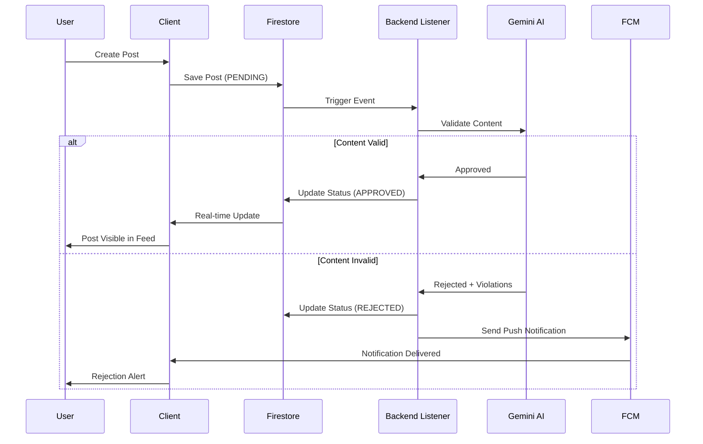
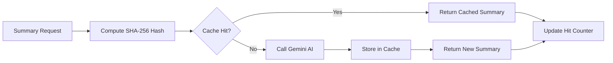
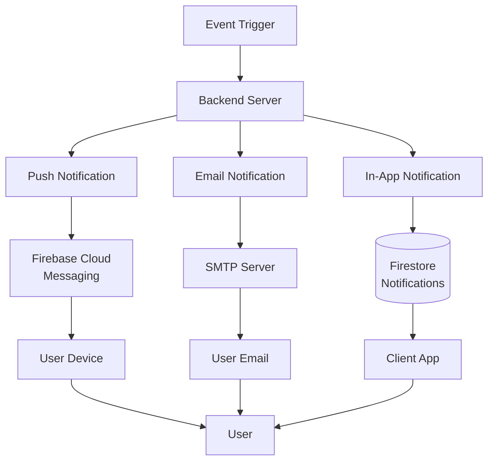
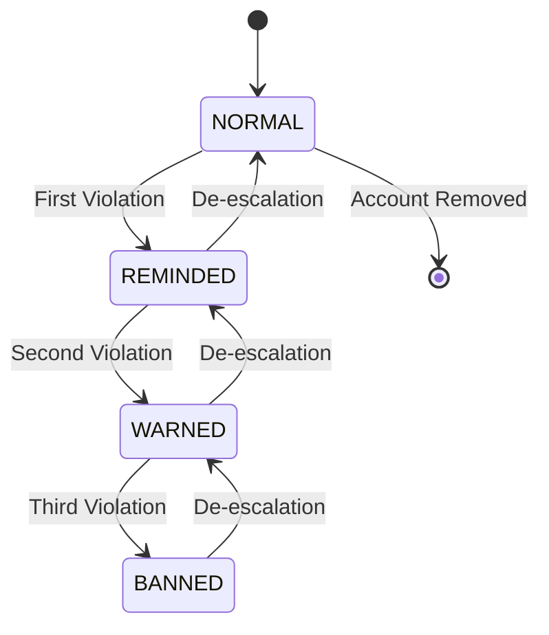
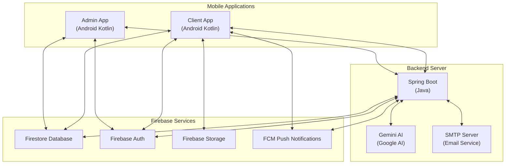
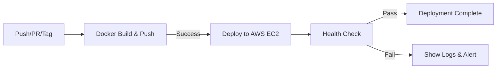

# Forumus - Internal Forum for University Members

A comprehensive mobile forum application ecosystem built with Android Kotlin and Spring Boot, designed specifically for university communities to facilitate academic discussions, content moderation, and real-time communication.

---

## Table of Contents

1. [Project Overview](#project-overview)
2. [Special Features](#special-features)
3. [System Architecture](#system-architecture)
4. [Applications](#applications)
   - [Client Application](#client-application)
   - [Admin Application](#admin-application)
   - [Backend Server](#backend-server)
5. [Technology Stack](#technology-stack)
6. [Documentation](#documentation)
7. [CI/CD Pipeline](#cicd-pipeline)
8. [Firebase Services](#firebase-services)
9. [Testing and Building](#testing-and-building)
10. [License](#license)

---

## Project Overview

Forumus is a multi-platform forum ecosystem consisting of three interconnected applications designed to provide a complete academic community platform. The system enables university students and teachers to create posts, engage in discussions, communicate via direct messaging, and ensures content quality through AI-powered moderation and administrative oversight.

### System Components

| Component | Platform | Description |
|-----------|----------|-------------|
| Client App | Android Kotlin | End-user forum access for students and teachers |
| Admin App | Android Kotlin | Content moderation and user management |
| Backend Server | Spring Boot Java | AI services, email notifications, push notifications |

---

## Special Features

### AI-Powered Content Moderation

Forumus integrates Google Gemini 2.5 Flash, a state-of-the-art large language model, to automatically moderate user-generated content in real-time. This advanced AI system ensures that all posts adhere to community guidelines appropriate for academic environments, protecting the forum from harmful content while maintaining an open platform for scholarly discourse.

**How It Works**: When a user creates a post, it is initially saved to Firestore with a "PENDING" status. A backend listener immediately detects this new post and triggers the AI validation process. The Gemini AI analyzes both the title and content against a comprehensive set of community guidelines specifically designed for university settings. Based on this analysis, the AI returns a validation decision along with specific violation categories if the content is deemed inappropriate.

If the content passes validation, the post status is automatically updated to "APPROVED" and becomes visible in the home feed for all users. If the content violates guidelines, the status is set to "REJECTED," the specific violation types are recorded, and the author receives an immediate push notification explaining why their post was not approved. This entire process occurs within seconds, providing near-instantaneous feedback to users.

**Community Guidelines Enforced**:
- **No Offensive Language**: Detects and prevents hate speech, slurs, and discriminatory language
- **No Personal Attacks**: Identifies harassment, bullying, and targeted abuse toward individuals
- **Appropriate Content**: Filters out explicit, violent, or otherwise inappropriate material
- **Academic Relevance**: Ensures content is suitable for a university student audience
- **Diversity and Inclusion**: Protects against content that marginalizes or excludes groups
- **Topic Relevance**: Validates that posts align with academic and educational discussions

**Benefits**:
- **Proactive Protection**: Prevents harmful content from ever appearing in the feed
- **Consistent Enforcement**: AI applies guidelines uniformly without human bias
- **Immediate Feedback**: Users receive instant notification of policy violations
- **Reduced Administrative Burden**: Automates first-level content moderation
- **Scalable Solution**: Handles high volumes of content without performance degradation
- **Learning System**: AI improves over time as it processes more content

### Intelligent Summary Caching

The platform implements a sophisticated caching mechanism for AI-generated post summaries, dramatically reducing API costs and improving response times. This system uses cryptographic hashing to intelligently determine when cached summaries can be reused versus when new summaries need to be generated.

**Technical Implementation**: When a user requests a summary for a post, the backend first computes a SHA-256 hash of the post's title and content combined. This hash serves as a unique fingerprint of the post's actual content. The system then checks if a cached summary exists for this specific content hash. If a match is found (cache hit), the pre-generated summary is immediately returned, avoiding an expensive API call to Gemini AI. If no match exists (cache miss), the system calls the Gemini AI API to generate a new summary, stores it in the cache along with the content hash, and returns it to the user.

The cache is implemented using Java's ConcurrentHashMap, providing thread-safe access for high-concurrency scenarios. Each cached entry includes not only the summary text but also metadata such as the content hash, generation timestamp, and cache hit count. The system supports time-to-live (TTL) expiration, allowing administrators to configure how long summaries remain valid. When a post is edited, its content hash changes automatically, ensuring that outdated summaries are never served.

**Cache Architecture Features**:
- **SHA-256 Content Hashing**: Cryptographically secure fingerprinting of post content for precise change detection
- **Automatic Invalidation**: Content edits automatically invalidate cached summaries due to hash change
- **Time-to-Live (TTL) Support**: Configurable expiration for cache entries to balance freshness and efficiency
- **Thread-Safe Operation**: ConcurrentHashMap ensures safe concurrent access in multi-threaded environments
- **Cache Hit Tracking**: Detailed metrics on cache effectiveness for monitoring and optimization
- **Memory Efficiency**: Stores only essential data (hash, summary, timestamp) to minimize memory footprint

**Performance and Cost Benefits**:
- **Reduced API Costs**: Cache hits eliminate redundant API calls, saving on Gemini AI usage costs
- **Improved Response Time**: Cached summaries return in milliseconds versus seconds for AI generation
- **Lower Latency**: Users experience near-instant summary delivery on cache hits
- **Bandwidth Savings**: Less data transfer to external AI services
- **Scalability**: System can handle thousands of summary requests with minimal API usage
- **Cost Predictability**: Cache hit rates stabilize API costs over time

**Use Cases**:
- Users frequently view the same popular posts, benefiting from cached summaries
- Summary requests for older, unedited posts always hit cache
- High-traffic posts generate one AI call but serve thousands of cached responses
- Administrators can monitor cache hit rates to optimize TTL settings

### Multi-Channel Notification System

Forumus implements a robust, redundant notification delivery system that ensures users never miss critical updates about their content, account status, or community interactions. By combining three distinct notification channels—in-app notifications, push notifications, and email—the system maximizes delivery reliability and provides users with flexible options for staying informed.

**Architecture Overview**: When a notification-worthy event occurs (such as a new comment, status change, or post approval), the backend notification service simultaneously dispatches notifications through all three channels. Each channel is optimized for its specific purpose: in-app notifications provide persistent history, push notifications deliver real-time alerts, and emails serve as a permanent record and fallback for users who aren't actively using the app.

The in-app notification channel stores notification records directly in Firestore under each user's collection, ensuring a complete, searchable history that persists indefinitely. Push notifications leverage Firebase Cloud Messaging (FCM) to deliver real-time alerts to users' devices, even when the app is in the background or closed. Email notifications use an SMTP service to send professionally formatted HTML emails with detailed information about the event, particularly useful for account status changes where users need comprehensive documentation.

**Notification Channels Explained**:

1. **In-App Notification Center**
   - Persistent storage in Firestore user subcollections
   - Complete notification history accessible anytime
   - Read/unread status tracking
   - Searchable and filterable by type
   - Rich content with deep links to relevant posts or comments
   - Serves as permanent record of all account activities

2. **Push Notifications (FCM)**
   - Real-time delivery to user devices
   - Works even when app is closed or in background
   - Customizable notification sounds and vibration patterns
   - Deep linking to specific content within the app
   - Grouped notifications to avoid overwhelming users
   - Optimal for time-sensitive alerts (new messages, comments)

3. **Email Notifications (SMTP)**
   - Professional HTML-formatted emails
   - Permanent record in user's email inbox
   - Detailed information with violation specifics for moderation actions
   - Works independently of app installation
   - Includes unsubscribe options for non-critical notifications
   - Essential for account status changes and security events

**Supported Event Types**:
- **New Upvotes**: Notify when someone upvotes your post or comment
- **Comments and Replies**: Alert users to new engagement on their content
- **Post Approval**: Confirm when AI or admin approves a submitted post
- **Post Rejection**: Explain why a post violated community guidelines with specific violation categories
- **Account Status Changes**: Inform users of status escalations or de-escalations with detailed explanations
- **Chat Messages**: Real-time delivery of direct messages from other users
- **Post Deletions**: Notify post authors when admins remove their content
- **Administrative Actions**: Keep users informed of any moderator actions affecting their account

**System Benefits**:
- **Delivery Reliability**: Three-channel redundancy ensures critical notifications are received
- **User Preference**: Users can choose their preferred notification method
- **Audit Trail**: Complete notification history in Firestore for accountability
- **Offline Support**: Email and push work even when users aren't actively using the app
- **Transparency**: Detailed explanations for all administrative actions
- **User Engagement**: Real-time alerts keep users engaged with the community

### User Status Escalation System

The forum implements a transparent, fair, and automated user accountability system that balances community safety with opportunities for user rehabilitation. This four-tier status system (NORMAL, REMINDED, WARNED, BANNED) automatically escalates based on policy violations while providing administrators with manual override capabilities for exceptional circumstances.

**System Philosophy**: The escalation system is designed to be educational rather than purely punitive. Each status level serves as a progressively serious warning to users about their behavior, giving them opportunities to correct their actions before facing permanent consequences. The system automatically tracks violations, applies consistent enforcement, and provides clear communication at each stage. Importantly, the system also supports de-escalation, allowing users who demonstrate improved behavior to have their status downgraded back toward NORMAL.

**Automatic Escalation Process**: When a user's post is rejected by the AI moderation system or deleted by an administrator, the backend automatically evaluates their current status and escalates to the next level if warranted. Each escalation triggers dual notifications—both an email with detailed explanation and a push notification—ensuring the user understands why their status changed and what specific content violated guidelines. The system maintains a complete history of all violations and status changes for administrative review and appeals.

**Status Level Descriptions**:

1. **NORMAL** (Level 0)
   - User in good standing with no violations
   - Full access to all forum features
   - No restrictions on posting, commenting, or messaging
   - Starting status for all new users
   - Goal status for all rehabilitation paths

2. **REMINDED** (Level 1)
   - First violation detected; informal warning issued
   - All features remain accessible
   - Notification explains the specific violation and community guidelines
   - User is encouraged to review policies
   - Additional violations will result in escalation to WARNED status
   - Can be de-escalated back to NORMAL through good behavior

3. **WARNED** (Level 2)
   - Second violation; formal warning status
   - User retains posting abilities but is under heightened scrutiny
   - Email includes detailed violation history and consequences of further violations
   - Temporary features may be restricted (e.g., reduced posting frequency)
   - Clear communication that next violation results in BANNED status
   - Can be de-escalated to REMINDED or NORMAL based on improved conduct

4. **BANNED** (Level 3)
   - Third violation or severe single violation; account suspended
   - User cannot access the application (authentication blocked at login)
   - Displays dedicated "Account Banned" screen with violation summary
   - Email includes complete violation history and appeal process information
   - Can only be de-escalated manually by administrators
   - Serves as most severe enforcement action short of permanent deletion

**Escalation Triggers**:
- **AI-Rejected Posts**: Automatic escalation when AI moderation rejects content for guideline violations
- **Admin-Deleted Posts**: Manual escalation when administrators remove posts reported by users
- **Manual Admin Action**: Administrators can directly set status for exceptional circumstances
- **Multiple Minor Violations**: Accumulated minor violations can trigger escalation
- **Severe Single Violations**: Extremely harmful content can skip levels for immediate BANNED status

**Notification and Communication**:
- **Dual Notification**: Every status change sends both email and push notification
- **Detailed Explanations**: Notifications include specific violation types and affected content
- **Violation History**: Users receive summary of all violations leading to current status
- **Appeal Information**: WARNED and BANNED users receive information on appeal processes
- **Guidelines Reference**: All notifications link to complete community guidelines
- **Transparency**: Users always know why their status changed and what content caused it

**De-escalation Path**:
- Users can rehabilitate their status through sustained good behavior
- Administrators can manually de-escalate users who demonstrate improvement
- De-escalation triggers congratulatory email encouraging continued positive participation
- Complete violation history is retained even after de-escalation for future reference
- System supports full path from BANNED back to NORMAL over time

**Administrative Controls**:
- **Manual Status Assignment**: Admins can set any user to any status level
- **Blacklist Management Interface**: Dedicated screen for viewing and managing all non-NORMAL users
- **Status Change History**: Complete audit log of all status changes and reasons
- **Batch Operations**: Admins can filter and manage multiple users efficiently
- **Override AI Decisions**: Admins can reverse automatic escalations for false positives
- **Appeal Review**: Dedicated workflow for reviewing and acting on user appeals

**System Benefits**:
- **Consistent Enforcement**: Automated escalation ensures fair, uniform policy application
- **Transparency**: Users always understand their status and how to improve
- **Rehabilitation Focus**: De-escalation path encourages behavioral improvement
- **Audit Trail**: Complete history of violations and actions for accountability
- **Reduced Administrative Burden**: Automated escalation handles routine violations
- **Community Safety**: Progressive system protects users while allowing for redemption

---

## System Architecture

---

## Applications

### Client Application

**Platform**: Android (Kotlin)  
**Target Audience**: University Students and Teachers  
**Purpose**: Create and consume forum content, engage in discussions, and communicate via direct messaging

#### Basic Features (16)

- **User Registration** - Email/password registration with role selection (Student/Teacher)
- **User Login** - Email/password authentication with form validation
- **Forgot Password** - Password recovery via email with OTP verification
- **Home Feed** - Display list of posts with pull-to-refresh functionality
- **Create Post** - Create new posts with title, content, and media attachments
- **Post Detail** - View full post content with comments and engagement metrics
- **Comments** - Add comments to posts with real-time updates
- **Upvote/Downvote** - Reddit-style voting system for posts and comments
- **User Profile** - View user profile with their posts and comments
- **Edit Profile** - Update display name and avatar
- **Search** - Universal search for posts and users
- **Direct Messaging** - Send text messages to other users
- **Chat List** - View list of conversations with message previews
- **Notifications** - In-app notification center with notification history
- **Settings** - App preferences including theme and account settings
- **Logout** - Sign out from the application

#### Advanced Features (27)

- **OTP Email Verification** - 6-digit OTP verification during registration
- **Remember Me / Auto-Login** - Persistent session with configurable timeout (7 days default)
- **Onboarding Flow** - Multi-slide introduction for first-time users
- **Topic Filtering** - Filter posts by multiple topics via drawer menu
- **AI Topic Suggestions** - AI-powered topic recommendations when creating posts
- **AI Post Summary** - Generate AI summaries of post content and comments
- **AI Content Moderation** - Automatic validation of post content before publishing
- **Location Tagging** - Add GPS location to posts using Google Places API
- **Map Preview** - Custom avatar markers on map previews
- **Multi-Media Posts** - Attach multiple images and videos to posts
- **Image Messages** - Send up to 5 images per chat message
- **Share Post via DM** - Share posts with other users through direct messages
- **Shared Post Preview** - Render clickable post previews in chat messages
- **Infinite Scroll** - Cursor-based pagination for posts and messages
- **Real-time Chat** - Kotlin Flow with Firestore listeners for live updates
- **Push Notifications (FCM)** - Firebase Cloud Messaging for chat and activity alerts
- **Threaded Comments** - Nested reply system with parent-child relationships
- **Role Badges** - Color-coded badges (Student/Teacher/Admin)
- **Dark Mode** - Theme switching with immediate application
- **Expandable Content** - "Show more..." truncation for long posts
- **Save/Bookmark Posts** - Save posts for later access
- **Report Content** - Report posts with violation categories
- **User Status System** - Ban/Warn/Remind system with enforcement
- **Background Upload Worker** - WorkManager for reliable message/image uploads
- **Summary Caching** - Cache AI summaries to reduce API calls
- **Media Viewer** - Fullscreen image/video viewer with zoom and swipe
- **Draft Auto-Save** - Automatic saving of post drafts on exit

**Statistics**: 16 Basic Features | 27 Advanced Features | **43 Total Features**

> **For detailed feature documentation with flow diagrams and screenshots, see**: [`docs/CLIENT_FEATURES.md`](docs/CLIENT_FEATURES.md)

---

### Admin Application

**Platform**: Android (Kotlin)  
**Target Audience**: Forum Administrators and Moderators  
**Purpose**: Content moderation, user management, and platform analytics

#### Basic Features (8)

- **Dashboard** - Central hub displaying key statistics with interactive charts (bar and pie)
- **Navigation Drawer** - Side navigation menu providing access to all major sections
- **Total Users Management** - Paginated user list with search, filter, and detailed user information viewing
- **Total Posts Management** - Post listing with date range filtering and search functionality
- **Post Detail View** - Comprehensive single post view with metadata and engagement statistics
- **Settings** - Application configuration for theme selection (Light/Dark/Auto) and language preferences
- **Localization** - Multi-language support with English and Vietnamese translations
- **Theme Management** - Dynamic theme switching with persistence across sessions

#### Advanced Features (8)

- **Reported Posts Management** - Review and manage user-reported posts with dismiss and delete actions
- **AI Moderation System** - Review AI-analyzed posts with ability to override AI decisions
- **Blacklist Management** - Manage users with warning statuses with status escalation/de-escalation capabilities
- **User Status Escalation** - Automatic status progression system (Normal → Reminded → Warned → Banned)
- **Email Notification Service** - Automated email notifications to users regarding account status changes
- **Push Notification Service** - Real-time push notifications to user devices for post actions and status changes
- **Dashboard Caching System** - Efficient data caching mechanism with 5-minute expiration
- **Topic Management** - Administrative CRUD operations for forum topics/categories

**Statistics**: 8 Basic Features | 8 Advanced Features | **16 Total Features**

> **For detailed feature documentation with flow diagrams and screenshots, see**: [`docs/ADMIN_FEATURES.md`](docs/ADMIN_FEATURES.md)

---

### Backend Server

**Platform**: Spring Boot (Java)  
**Purpose**: AI processing, email delivery, push notifications, and real-time post validation

#### Core Services

**AI Services (Gemini 2.5 Flash)**
- **Post Content Validation** - Automatic moderation with community guidelines enforcement
- **Post Summarization** - Intelligent caching with SHA-256 content hashing
- **Topic Extraction** - AI-powered topic suggestions from post content
- **Q&A Assistance** - General question answering for academic topics

**Email Services (SMTP)**
- **OTP Verification Emails** - 6-digit verification code delivery
- **Welcome Emails** - New user greeting messages
- **Status Notification Emails** - Account status change notifications
- **Escalation Emails** - Warning and ban notifications with violation details

**Notification Services (FCM)**
- **UPVOTE** - User upvoted a post
- **COMMENT** - User commented on a post
- **REPLY** - User replied to a comment
- **POST_REJECTED** - AI or admin rejected a post
- **POST_APPROVED** - Admin approved a post
- **POST_DELETED** - Admin deleted a post
- **STATUS_CHANGED** - Account status changed

**Real-time Processing**
- **Firestore Listeners** - Automatic post validation on creation
- **Status Updates** - Automatic status transitions (PENDING → APPROVED/REJECTED)
- **Notification Triggers** - Automatic notifications on AI rejection

**Caching & Performance**
- **Summary Caching** - SHA-256 content hashing for change detection
- **TTL Support** - Time-to-live expiration for cache entries
- **Cache Hit Tracking** - Monitoring and analytics for cache effectiveness
- **Thread Safety** - ConcurrentHashMap implementation for concurrent access

#### API Endpoints (12)

| Method | Endpoint | Category | Description |
|--------|----------|----------|-------------|
| GET | /api/health | Core | Health check and server status |
| POST | /api/auth/resetPassword | Auth | Admin-only password reset |
| POST | /api/email/send-otp | Email | OTP verification email delivery |
| POST | /api/email/send-welcome | Email | Welcome email for new users |
| POST | /api/email/send-report | Email | Status notification email |
| POST | /api/posts/askGemini | AI | General AI Q&A interaction |
| POST | /api/posts/validatePost | AI | Content moderation and validation |
| POST | /api/posts/summarize | AI | Post summarization with caching |
| POST | /api/posts/getSuggestedTopics | AI | Topic extraction and suggestions |
| POST | /api/notifications | Notifications | Trigger push notification |
| GET | /api/topics/getAll | Topics | Retrieve all forum topics |
| POST | /api/topics/add | Topics | Add new topics to the forum |

> **For detailed API documentation with request/response formats and sequence diagrams, see**: [`docs/BACKEND_ROUTES.md`](docs/BACKEND_ROUTES.md)

---

## Technology Stack

### Client Application

| Category | Technology |
|----------|------------|
| Language | Kotlin |
| Min SDK | 24 (Android 7.0) |
| Target SDK | 36 |
| Architecture | MVVM (Model-View-ViewModel) |
| UI | ViewBinding, DataBinding, Material Design |
| Backend | Firebase (Auth, Firestore, Storage, FCM) |
| Networking | Retrofit, OkHttp, Moshi |
| Image Loading | Coil, Glide |
| Navigation | Jetpack Navigation Component |
| Location | Google Maps SDK, Places API |
| Background Tasks | WorkManager |

### Admin Application

| Category | Technology |
|----------|------------|
| Language | Kotlin |
| Min SDK | 24 (Android 7.0) |
| Target SDK | 36 |
| Architecture | MVVM (Model-View-ViewModel) |
| UI | View Binding, Material Design Components |
| Backend | Firebase (Firestore, Auth, Storage) |
| Networking | Retrofit 2, OkHttp |
| Image Loading | Glide |
| Charts | MPAndroidChart |
| Navigation | Android Jetpack Navigation Component |
| Caching | SharedPreferences, Gson |

### Backend Server

| Category | Technology |
|----------|------------|
| Language | Java 17 |
| Framework | Spring Boot 3.x |
| Build Tool | Gradle |
| AI Service | Google Gemini 2.5 Flash |
| Email | Jakarta Mail (SMTP) |
| Database | Firebase Firestore |
| Authentication | Firebase Admin SDK |
| Push Notifications | Firebase Cloud Messaging |
| Deployment | Docker, AWS EC2 |

---

## Documentation

Comprehensive documentation for all features and workflows is available in the `docs/` directory:

| Document | Description |
|----------|-------------|
| [`CLIENT_FEATURES.md`](docs/CLIENT_FEATURES.md) | Complete client application feature specifications with flow diagrams and screenshots |
| [`ADMIN_FEATURES.md`](docs/ADMIN_FEATURES.md) | Complete admin application feature specifications with flow diagrams and screenshots |
| [`BACKEND_ROUTES.md`](docs/BACKEND_ROUTES.md) | Backend API endpoints, request/response formats, and sequence diagrams |
| [`CROSS_APP_FLOWS.md`](docs/CROSS_APP_FLOWS.md) | End-to-end workflows demonstrating cross-application integration |

### Cross-Application Workflows

The system includes 13 integrated workflows that span multiple applications:

**Phase 1: User Onboarding**
- Registration with OTP Email Verification
- Welcome Email After Verification
- Forgot Password Reset

**Phase 2: Content Creation**
- Post Creation with AI Topic Suggestions
- Post Creation & Automatic AI Validation
- AI Post Summary Generation

**Phase 3: User Interactions**
- Upvote/Comment/Reply Push Notifications
- Chat Message Push Notification
- Share Post via Direct Message

**Phase 4: Content Moderation**
- User Reports Post → Admin Reviews
- Admin AI Override (Approve/Reject Post)
- Admin Deletes Reported Post & User Status Escalation

**Phase 5: User Account Management**
- Admin Updates User Status (Blacklist Management)

> **For detailed workflow diagrams and integration flows, see**: [`docs/CROSS_APP_FLOWS.md`](docs/CROSS_APP_FLOWS.md)

---

## CI/CD Pipeline

The backend server employs a two-stage GitHub Actions workflow for automated building, testing, and deployment.

### Pipeline Architecture

### Workflow 1: Docker Build and Push

**File**: `docs/docker-build.yml`

| Aspect | Details |
|--------|---------|
| Triggers | Push to main/develop, Pull requests, Git tags (v*.*.*) |
| Registry | docker.io/longtoZ/forumus-backend |
| Platform | linux/amd64 |
| Caching | GitHub Actions cache |
| Tags | Branch name, PR reference, semantic version, SHA, latest |

**Process Steps**:
1. Checkout repository
2. Log in to Docker Hub
3. Extract metadata (tags, labels)
4. Set up Docker Buildx
5. Build Docker image
6. Push to Docker Hub registry

### Workflow 2: Deploy to AWS EC2

**File**: `docs/deploy-aws.yml`

| Aspect | Details |
|--------|---------|
| Triggers | After successful Docker build, Manual dispatch |
| Target | AWS EC2 instance |
| Process | Stop containers → Pull image → Start containers → Health check |
| Health Check | GET /api/health (5 retries, 10s interval) |
| Deployment Strategy | Rolling deployment with health verification |

**Required Secrets**:
- EC2_HOST - EC2 instance public IP or hostname
- EC2_USER - SSH username
- EC2_SSH_KEY - Private SSH key for authentication
- DOCKERHUB_USERNAME - Docker Hub username
- DOCKERHUB_TOKEN - Docker Hub access token

**Deployment Process**:
1. Checkout repository
2. SSH into EC2 instance
3. Navigate to project directory (~/forumus-backend)
4. Stop current Docker containers
5. Pull latest Docker image from Docker Hub
6. Rebuild and start containers with docker-compose
7. Wait for container startup (15 seconds)
8. Perform health check at http://localhost:8081/api/health
9. Retry health check up to 5 times with 10-second intervals
10. Display container status and logs
11. Notify deployment status

---

## Firebase Services

### Firestore Database

| Collection | Purpose | Key Fields |
|------------|---------|------------|
| users | User profiles and settings | uid, email, status, role, fcmToken |
| users/{uid}/notifications | User notification history | type, actorId, targetId, isRead |
| posts | Forum posts | post_id, status, reportCount, violation_type |
| reports | User-submitted content reports | postId, nameViolation |
| chats | Direct messaging conversations | participants, lastMessage |
| chats/{chatId}/messages | Chat messages | content, senderId, type, imageUrls |
| topics | Forum categories | name, description |

### Other Firebase Services

| Service | Purpose |
|---------|---------|
| Firebase Authentication | Email/password authentication with Admin SDK integration |
| Firebase Storage | Profile pictures, post media (images/videos), chat attachments |
| Firebase Cloud Messaging | Push notifications with deep linking and background delivery |

---

## Testing and Building

### Testing Commands

| Platform | Command | Purpose |
|----------|---------|---------|
| Mobile Apps | ./gradlew test | Run unit tests |
| Mobile Apps | ./gradlew connectedAndroidTest | Run instrumentation tests |
| Mobile Apps | ./gradlew jacocoTestReport | Generate coverage report |
| Backend | ./gradlew test | Run all tests |
| Backend | ./gradlew test --tests ClassName | Run specific test class |
| Backend | ./gradlew jacocoTestReport | Generate coverage report |

### Building for Production

| Platform | Command | Output |
|----------|---------|--------|
| Client/Admin | ./gradlew assembleRelease | Release APK file |
| Client/Admin | ./gradlew bundleRelease | App Bundle (AAB) for Play Store |
| Backend | ./gradlew bootJar | Executable JAR file |
| Backend | docker build -t forumus-backend:latest . | Docker image |

---

## License

This project is proprietary software developed for university use. All rights reserved.

---

**Developed by**: University Development Team  
**Contact**: support@university.edu  
**Documentation Version**: 1.0.0  
**Last Updated**: January 2026
