# Forumus Admin Application - Features Documentation

## 1. Overview

**Forumus Admin** is an Android-based administration application designed for managing an internal university forum. Developed using **Kotlin** for the Android platform, this application provides administrators with a comprehensive suite of tools to monitor, moderate, and manage forum content and user accounts effectively.

### 1.1 Technology Stack

| Category      | Technology                               |
| ------------- | ---------------------------------------- |
| Language      | Kotlin                                   |
| Platform      | Android (minSdk 24, targetSdk 36)        |
| Architecture  | MVVM (Model-View-ViewModel)              |
| UI            | View Binding, Material Design Components |
| Backend       | Firebase (Firestore, Auth, Storage)      |
| Networking    | Retrofit 2 + OkHttp                      |
| Image Loading | Glide                                    |
| Charts        | MPAndroidChart                           |
| Navigation    | Android Jetpack Navigation Component     |
| Caching       | SharedPreferences + Gson                 |
| Other         | SwipeRefreshLayout, Coroutines           |

---

## 2. Feature Categories

The application features are organized into two categories: Basic Features and Advanced Features.

### 2.1 Basic Features

| #   | Feature                | Description                                                                                                    |
| --- | ---------------------- | -------------------------------------------------------------------------------------------------------------- |
| 1   | Dashboard              | Central hub displaying key statistics, interactive charts (bar and pie), and quick navigation to other modules |
| 2   | Navigation Drawer      | Side navigation menu providing access to all major sections of the application                                 |
| 3   | Total Users Management | Paginated user list with search, filter, and detailed user information viewing capabilities                    |
| 4   | Total Posts Management | Post listing with date range filtering, search functionality, and navigation to post details                   |
| 5   | Post Detail View       | Comprehensive single post view displaying metadata, content, images, and engagement statistics                 |
| 6   | Settings               | Application configuration for theme selection (Light/Dark/Auto) and language preferences (English/Vietnamese)  |
| 7   | Localization           | Multi-language support with English and Vietnamese translations                                                |
| 8   | Theme Management       | Dynamic theme switching with persistence across application sessions                                           |

### 2.2 Advanced Features

| #   | Feature                    | Description                                                                                                     |
| --- | -------------------------- | --------------------------------------------------------------------------------------------------------------- |
| 1   | Reported Posts Management  | Review and manage user-reported posts with dismiss and delete actions, including violation tracking             |
| 2   | AI Moderation System       | Review AI-analyzed posts with ability to override AI decisions (approve/reject)                                 |
| 3   | Blacklist Management       | Manage users with warning statuses (Reminded, Warned, Banned) with status escalation/de-escalation capabilities |
| 4   | User Status Escalation     | Automatic status progression system (Normal → Reminded → Warned → Banned) triggered by content violations       |
| 5   | Email Notification Service | Automated email notifications to users regarding account status changes via REST API                            |
| 6   | Push Notification Service  | Real-time push notifications to user devices for post actions and status changes                                |
| 7   | Dashboard Caching System   | Efficient data caching mechanism with 5-minute expiration to optimize Firebase calls                            |
| 8   | Topic Management           | Administrative CRUD operations for forum topics/categories with post count tracking                             |

---

## 3. Feature Specifications

### Phase 1: Core Features

### 3.1 Dashboard

**Description:**  
The Dashboard serves as the primary interface of the administration application, displaying key statistics, interactive charts, and navigation pathways to other functional modules. It provides administrators with a comprehensive overview of forum activity.

**Key Components:**

- **4 Stat Cards**: Total Users, Total Posts, Blacklisted Users, Reported Posts
- **Bar Chart**: Posts over time (Day/Week/Month views with navigation)
- **Pie Chart**: Posts distribution by topic with dynamic legends
- **Topic Management**: Add, edit, delete topics
- **Pull-to-Refresh**: Manual data refresh with cache invalidation
- **Dashboard Caching**: 5-minute cache for efficient data loading

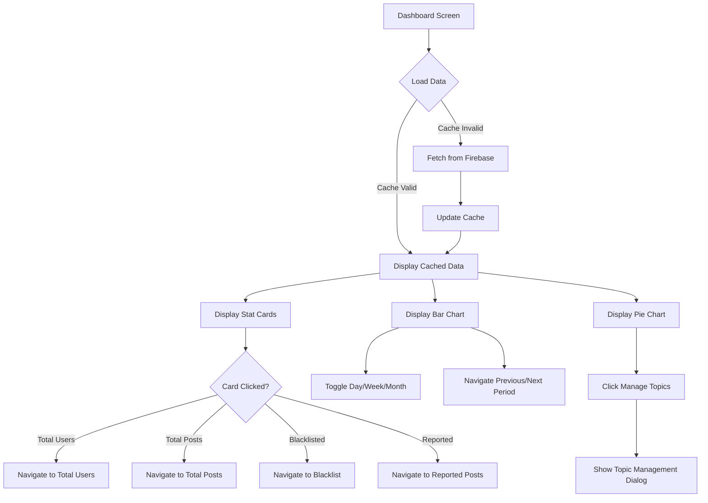
```mermaid
flowchart TD
    A[Dashboard Screen] --> B{Load Data}
    B -->|Cache Valid| C[Display Cached Data]
    B -->|Cache Invalid| D[Fetch from Firebase]
    D --> E[Update Cache]
    E --> C

    C --> F[Display Stat Cards]
    C --> G[Display Bar Chart]
    C --> H[Display Pie Chart]

    F --> I{Card Clicked?}
    I -->|Total Users| J[Navigate to Total Users]
    I -->|Total Posts| K[Navigate to Total Posts]
    I -->|Blacklisted| L[Navigate to Blacklist]
    I -->|Reported| M[Navigate to Reported Posts]

    G --> N[Toggle Day/Week/Month]
    G --> O[Navigate Previous/Next Period]

    H --> P[Click Manage Topics]
    P --> Q[Show Topic Management Dialog]
```

**Related Screens:**

- Total Users Screen (on stat card click)
- Total Posts Screen (on stat card click)
- Blacklist Screen (on stat card click)
- Reported Posts Screen (on stat card click)

**Screenshot Descriptions:**

1. **Dashboard Overview (Light Mode)**: Full dashboard showing all 4 stat cards with numbers, bar chart displaying weekly posts, pie chart with topic distribution, and the side navigation drawer icon
2. **Dashboard Overview (Dark Mode)**: Same view in dark theme
3. **Bar Chart - Day View**: Bar chart showing posts per day in the current week with day labels (Mon-Sun)
4. **Bar Chart - Week View**: Bar chart showing posts per week in the current month
5. **Bar Chart - Month View**: Bar chart showing posts per month in the current year
6. **Pie Chart with Legend**: Topic distribution pie chart with custom legend items below
7. **Pie Chart Segment Selected**: Pie chart with one segment expanded and percentage displayed
8. **Topic Management Dialog**: Dialog showing list of existing topics with edit/delete buttons and add new topic input field
9. **Edit Topic Dialog**: Dialog for editing a topic's name and description
10. **Delete Topic Confirmation**: Confirmation dialog before deleting a topic
11. **Pull-to-Refresh in Progress**: Dashboard with refresh spinner visible

---

### 3.2 Navigation Drawer

**Description:**  
The Navigation Drawer is a side navigation menu that provides access to all major sections of the application. It features a gradient header design consistent with the application branding.

**Menu Items:**

- Dashboard
- AI Moderation
- Settings

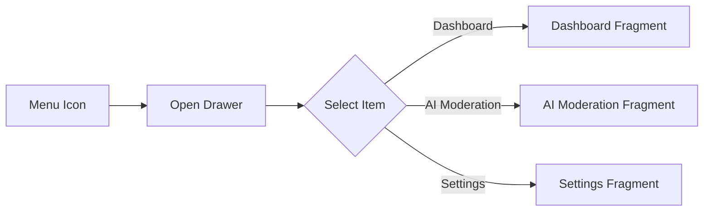
```mermaid
flowchart LR
    A[Menu Icon] --> B[Open Drawer]
    B --> C{Select Item}
    C -->|Dashboard| D[Dashboard Fragment]
    C -->|AI Moderation| E[AI Moderation Fragment]
    C -->|Settings| F[Settings Fragment]
```

**Screenshot Descriptions:**

1. **Navigation Drawer Open**: Side drawer showing gradient header and menu items (Dashboard, AI Moderation, Settings) with icons

---

### 3.3 Total Users Screen

**Description:**  
This screen displays a comprehensive, paginated list of all forum users. It provides search functionality with autocomplete suggestions, filtering capabilities by status and role, and detailed user information viewing through modal dialogs.

**Features:**

- User list with avatar, name, ID, status badge, and role
- Search with autocomplete suggestions
- Filter by status (Normal, Reminded, Warned, Banned) and role (Teacher, Student)
- Pagination (10 users per page)
- User details dialog on row click

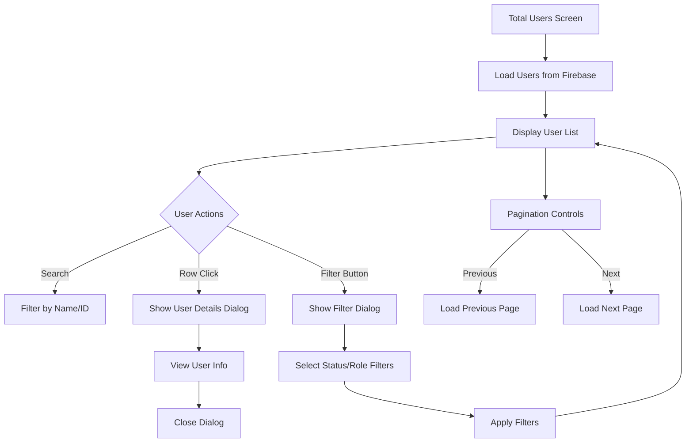
```mermaid
flowchart TD
    A[Total Users Screen] --> B[Load Users from Firebase]
    B --> C[Display User List]

    C --> D{User Actions}
    D -->|Search| E[Filter by Name/ID]
    D -->|Filter Button| F[Show Filter Dialog]
    D -->|Row Click| G[Show User Details Dialog]

    F --> H[Select Status/Role Filters]
    H --> I[Apply Filters]
    I --> C

    G --> J[View User Info]
    J --> K[Close Dialog]

    C --> L[Pagination Controls]
    L -->|Previous| M[Load Previous Page]
    L -->|Next| N[Load Next Page]
```

**Related Screens:**

- Dashboard (navigates back)

**Screenshot Descriptions:**

1. **Total Users List**: List view showing user avatars, names, IDs, status badges, and roles
2. **Search with Autocomplete**: Search field with dropdown showing matching user suggestions
3. **Filter Dialog Open**: Dialog with status checkboxes (Normal, Reminded, Warned, Banned) and role options (Teacher, Student)
4. **Filtered Results**: User list after applying filters with filter indicator visible
5. **User Details Dialog**: Modal showing user avatar, full name, ID, email, role, status, and close button
6. **Pagination Controls**: Bottom pagination showing "Page X of Y" with Previous/Next buttons
7. **Empty Search Results**: Screen showing "No results found" message

---

### 3.4 Total Posts Screen

**Description:**  
This screen presents all forum posts with comprehensive filtering options. Administrators can filter posts by date range (maximum 31 days), search by title, author, or content, and navigate to detailed post views.

**Features:**

- Post cards showing title, author, date, topic tags, AI approval status
- Date range picker (Start Date - End Date, max 31 days)
- Search by title, author, or content
- Pagination (10 posts per page)
- Click to view full post details

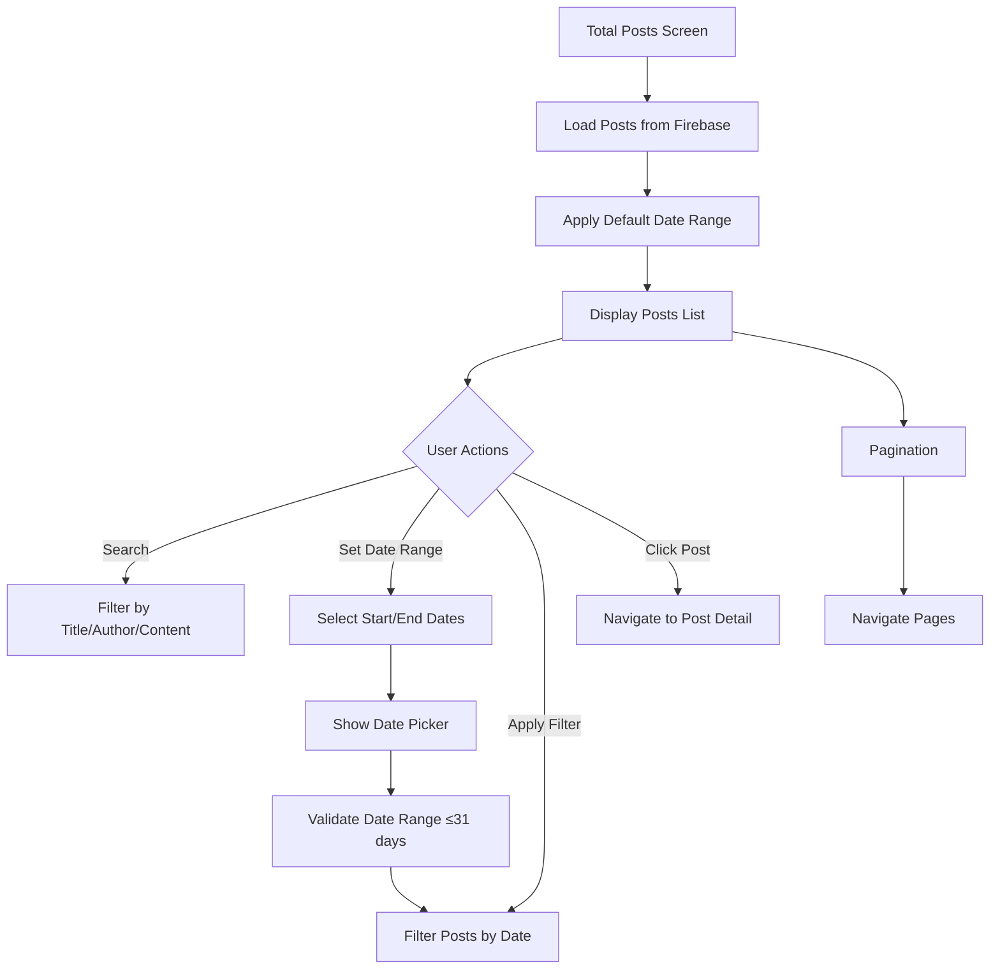
```mermaid
flowchart TD
    A[Total Posts Screen] --> B[Load Posts from Firebase]
    B --> C[Apply Default Date Range]
    C --> D[Display Posts List]

    D --> E{User Actions}
    E -->|Search| F[Filter by Title/Author/Content]
    E -->|Set Date Range| G[Select Start/End Dates]
    E -->|Apply Filter| H[Filter Posts by Date]
    E -->|Click Post| I[Navigate to Post Detail]

    G --> J[Show Date Picker]
    J --> K[Validate Date Range ≤31 days]
    K --> H

    D --> L[Pagination]
    L --> M[Navigate Pages]
```

**Related Screens:**

- Dashboard (navigates back)
- Post Detail Screen (on post click)

**Screenshot Descriptions:**

1. **Total Posts List**: Grid/list of post cards with titles, authors, dates, and topic tags
2. **Date Range Picker**: Two date input fields showing Start Date and End Date with date picker dialogs
3. **Post Card with Tags**: Individual post card showing topic tags (e.g., "Technology", "Education")
4. **AI Approved Badge**: Post card showing green checkmark or "AI Approved" indicator
5. **Search Results**: Filtered post list based on search query
6. **Empty State**: "No posts found" message when no posts match criteria

---

### 3.5 Post Detail Screen

**Description:**  
The Post Detail Screen provides a comprehensive view of an individual post, displaying all associated metadata, full content, attached images, and engagement statistics including upvotes, downvotes, and comments.

**Features:**

- Post title and full content
- Author info (name, ID, avatar)
- Post metadata (date, categories/topics, status)
- Engagement statistics (upvotes, downvotes, comments)
- Report count and violation types (if any)
- Image gallery for posts with images

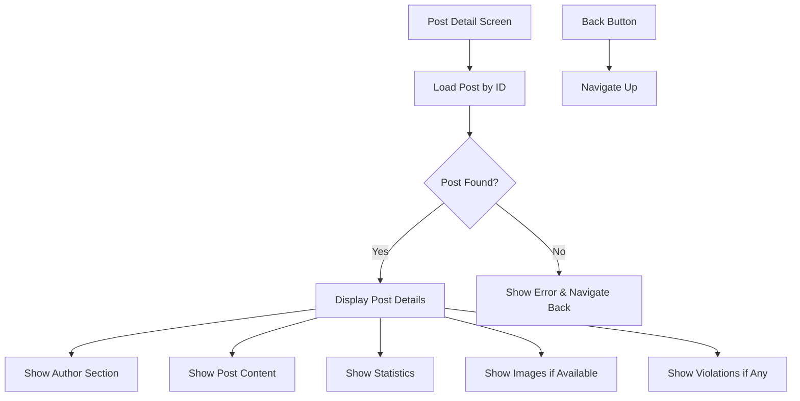
```mermaid
flowchart TD
    A[Post Detail Screen] --> B[Load Post by ID]
    B --> C{Post Found?}
    C -->|Yes| D[Display Post Details]
    C -->|No| E[Show Error & Navigate Back]

    D --> F[Show Author Section]
    D --> G[Show Post Content]
    D --> H[Show Statistics]
    D --> I[Show Images if Available]
    D --> J[Show Violations if Any]

    K[Back Button] --> L[Navigate Up]
```

**Related Screens:**

- Total Posts Screen (navigates back)
- Reported Posts Screen (navigates back)

**Screenshot Descriptions:**

1. **Post Detail Full View**: Complete post detail screen showing title, author with avatar, date, topic breadcrumb
2. **Post Content Section**: Main content area with post text
3. **Statistics Row**: Upvote/downvote/comment counts with icons
4. **Post with Images**: Image gallery section below content
5. **Post with Violations**: Red violation type badges displayed
6. **Reported Post Detail**: Post showing report count badge
7. **Status Indicator**: Post status badge (Approved/Pending/Rejected)

---

### Phase 2: Moderation Features

### 3.6 Reported Posts Screen

**Description:**  
The Reported Posts Screen enables administrators to manage posts that have been flagged by users for potential violations. Administrators can review report details, view violation types, dismiss reports, or delete posts with automatic status escalation for the post author.

**Features:**

- List of reported posts with report count and violation count badges
- Search reported posts
- Sort by reports (Low→High, High→Low) or violations (Low→High, High→Low)
- View violation types on badge click
- View report details (reasons) on badge click
- Dismiss reports (clears all reports for a post)
- Delete post (removes post and escalates author status)

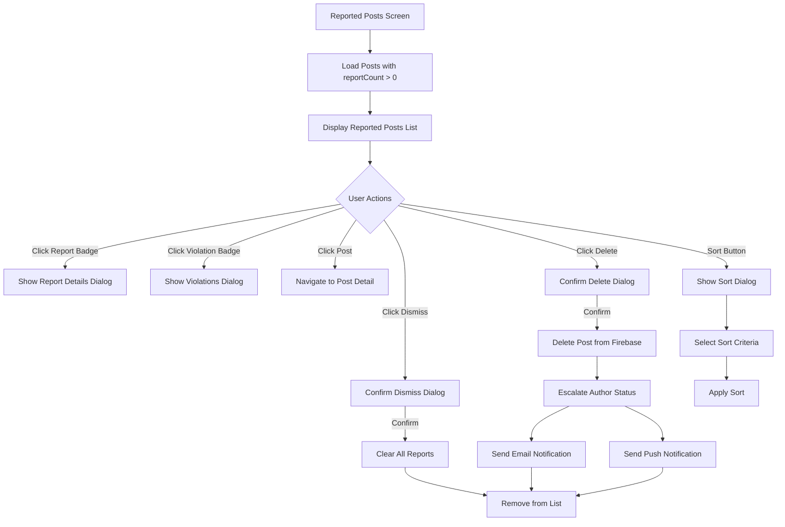
```mermaid
flowchart TD
    A[Reported Posts Screen] --> B[Load Posts with reportCount > 0]
    B --> C[Display Reported Posts List]

    C --> D{User Actions}
    D -->|Click Report Badge| E[Show Report Details Dialog]
    D -->|Click Violation Badge| F[Show Violations Dialog]
    D -->|Click Post| G[Navigate to Post Detail]
    D -->|Click Dismiss| H[Confirm Dismiss Dialog]
    D -->|Click Delete| I[Confirm Delete Dialog]
    D -->|Sort Button| J[Show Sort Dialog]

    H -->|Confirm| K[Clear All Reports]
    K --> L[Remove from List]

    I -->|Confirm| M[Delete Post from Firebase]
    M --> N[Escalate Author Status]
    N --> O[Send Email Notification]
    N --> P[Send Push Notification]
    O --> L
    P --> L

    J --> Q[Select Sort Criteria]
    Q --> R[Apply Sort]
```

**Related Screens:**

- Dashboard (navigates back)
- Post Detail Screen (on post click)

**Screenshot Descriptions:**

1. **Reported Posts List**: List showing posts with red report count badges and orange violation badges
2. **Sort Dialog**: Dialog with "Sort by Reports/Violations" and "Low to High/High to Low" options
3. **Report Details Dialog**: Modal showing list of report reasons from different users
4. **Violations Dialog**: Modal listing all violation types detected on the post
5. **Dismiss Confirmation**: Alert dialog confirming report dismissal
6. **Delete Confirmation**: Alert dialog confirming post deletion with warning
7. **Empty State**: "No reported posts" message when all reports are handled

---

### 3.7 AI Moderation Screen

**Description:**  
The AI Moderation Screen allows administrators to review posts that have been analyzed by the artificial intelligence moderation system. Administrators have the authority to override AI decisions by approving AI-rejected posts or rejecting AI-approved posts, with appropriate notification triggers.

**Features:**

- Two tabs: AI Approved / AI Rejected
- Post cards with AI confidence score, violation types
- Search posts by title or content
- Sort by time (Newest/Oldest first)
- Filter by violation type (dynamic from Firebase)
- Approve/Reject actions with confirmation dialogs
- Status escalation on rejection (sends notifications)

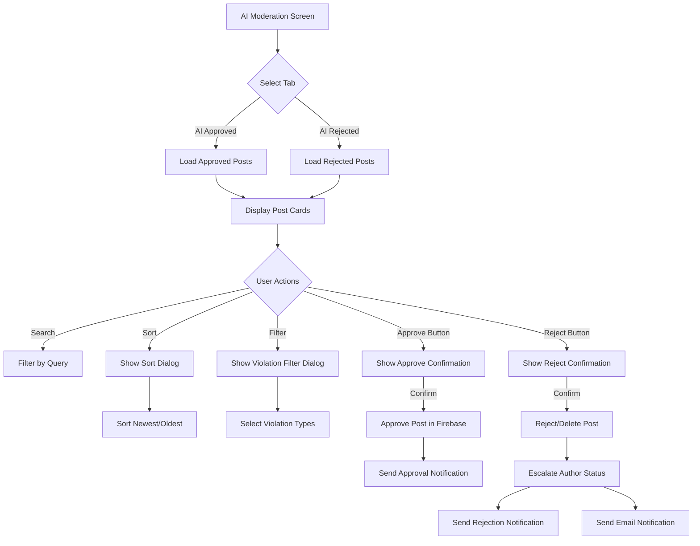
```mermaid
flowchart TD
    A[AI Moderation Screen] --> B{Select Tab}
    B -->|AI Approved| C[Load Approved Posts]
    B -->|AI Rejected| D[Load Rejected Posts]

    C --> E[Display Post Cards]
    D --> E

    E --> F{User Actions}
    F -->|Search| G[Filter by Query]
    F -->|Sort| H[Show Sort Dialog]
    F -->|Filter| I[Show Violation Filter Dialog]
    F -->|Approve Button| J[Show Approve Confirmation]
    F -->|Reject Button| K[Show Reject Confirmation]

    H --> L[Sort Newest/Oldest]
    I --> M[Select Violation Types]

    J -->|Confirm| N[Approve Post in Firebase]
    N --> O[Send Approval Notification]

    K -->|Confirm| P[Reject/Delete Post]
    P --> Q[Escalate Author Status]
    Q --> R[Send Rejection Notification]
    Q --> S[Send Email Notification]
```

**Related Screens:**

- Navigation Drawer (source)

**Screenshot Descriptions:**

1. **AI Approved Tab Active**: List of AI-approved posts with approve tab highlighted
2. **AI Rejected Tab Active**: List of AI-rejected posts with violations displayed
3. **AI Post Card**: Individual card showing title, content preview, violation types, and approve/reject buttons
4. **Sort Dialog**: Time-based sort options (Newest First, Oldest First)
5. **Violation Filter Dialog**: Scrollable list of violation type checkboxes (Toxicity, Spam, etc.)
6. **Approve Confirmation Dialog**: Confirmation for approving an AI-rejected post
7. **Reject Confirmation Dialog**: Confirmation for rejecting an AI-approved post
8. **Empty State - No Posts**: "No posts found" when tab is empty
9. **Loading State**: Circular progress indicator while loading

---

### 3.8 Blacklist Management Screen

**Description:**  
The Blacklist Management Screen provides administrators with tools to manage users who have been flagged with warning statuses (Reminded, Warned, or Banned). It supports status escalation, de-escalation, and complete removal from the blacklist with appropriate email and push notifications.

**Features:**

- List of users with status != Normal
- Status badge showing current level (Reminded, Warned, Banned)
- Search with autocomplete
- Filter by status
- Change user status (escalate/de-escalate)
- Remove from blacklist (set status to Normal)
- Email and push notifications on status change

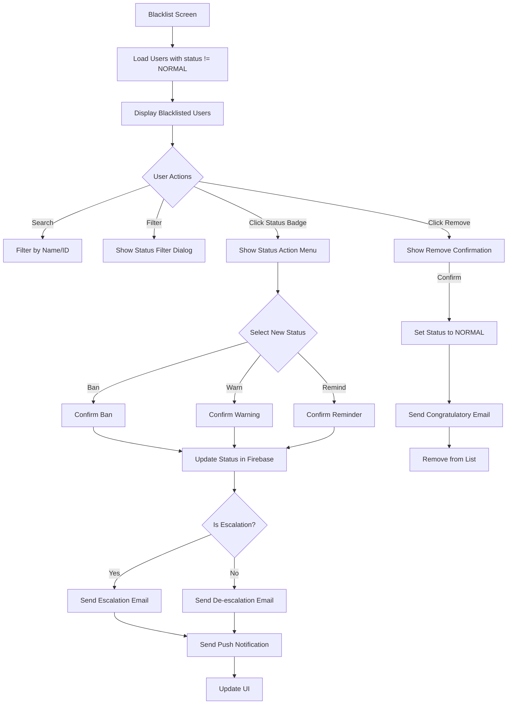
```mermaid
flowchart TD
    A[Blacklist Screen] --> B[Load Users with status != NORMAL]
    B --> C[Display Blacklisted Users]

    C --> D{User Actions}
    D -->|Search| E[Filter by Name/ID]
    D -->|Filter| F[Show Status Filter Dialog]
    D -->|Click Status Badge| G[Show Status Action Menu]
    D -->|Click Remove| H[Show Remove Confirmation]

    G --> I{Select New Status}
    I -->|Ban| J[Confirm Ban]
    I -->|Warn| K[Confirm Warning]
    I -->|Remind| L[Confirm Reminder]

    J --> M[Update Status in Firebase]
    K --> M
    L --> M

    M --> N{Is Escalation?}
    N -->|Yes| O[Send Escalation Email]
    N -->|No| P[Send De-escalation Email]

    O --> Q[Send Push Notification]
    P --> Q
    Q --> R[Update UI]

    H -->|Confirm| S[Set Status to NORMAL]
    S --> T[Send Congratulatory Email]
    T --> U[Remove from List]
```

**Related Screens:**

- Dashboard (navigates back)

**Screenshot Descriptions:**

1. **Blacklist User List**: Users with colored status badges (Red=Banned, Orange=Warned, Yellow=Reminded)
2. **Status Filter Dialog**: Checkboxes for Banned, Warned, Reminded statuses
3. **Status Action Menu**: Popup menu with Ban, Warn, Remind options
4. **Change Status Confirmation**: Alert dialog confirming status change with user name
5. **Remove Confirmation**: Alert confirming removal from blacklist
6. **Search with Autocomplete**: Search field with matching user suggestions
7. **Empty Blacklist**: "No blacklisted users" message when all users are Normal

---

### Phase 3: Settings and Personalization

### 3.9 Settings Screen

**Description:**  
The Settings Screen enables administrators to configure application appearance and language preferences. All settings are persisted using SharedPreferences and applied immediately upon selection.

**Features:**

- **Theme Selection**: Light, Dark, Auto (System)
- **Language Selection**: English, Vietnamese
- Persistence using SharedPreferences
- Immediate application of changes

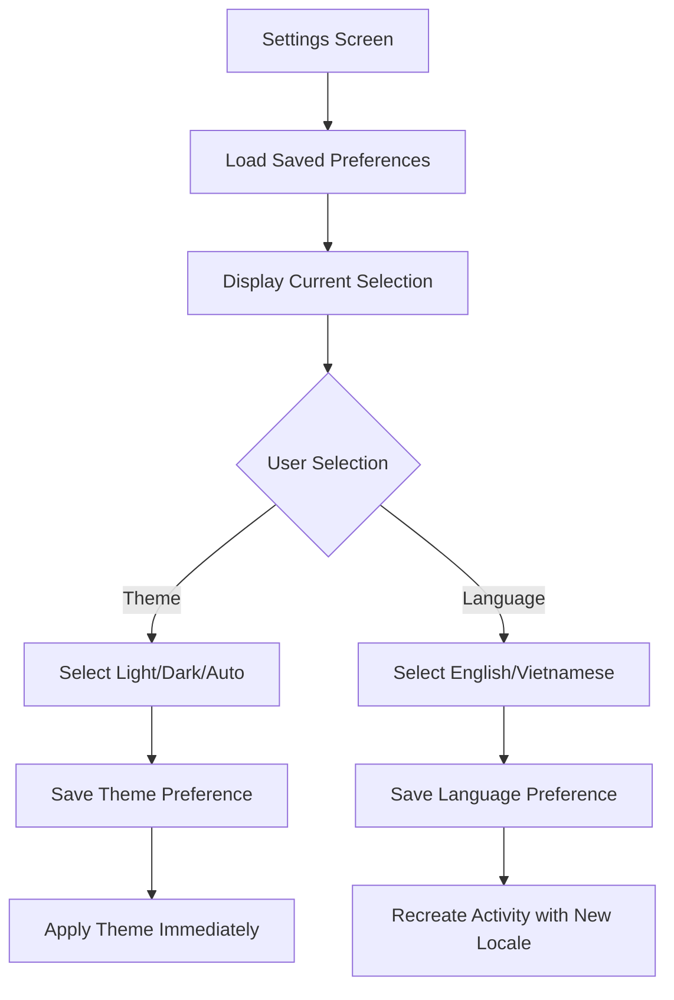
```mermaid
flowchart TD
    A[Settings Screen] --> B[Load Saved Preferences]
    B --> C[Display Current Selection]

    C --> D{User Selection}
    D -->|Theme| E[Select Light/Dark/Auto]
    D -->|Language| F[Select English/Vietnamese]

    E --> G[Save Theme Preference]
    G --> H[Apply Theme Immediately]

    F --> I[Save Language Preference]
    I --> J[Recreate Activity with New Locale]
```

**Related Screens:**

- Navigation Drawer (source)

**Screenshot Descriptions:**

1. **Settings - Light Theme Selected**: Settings screen with Light theme button highlighted/selected
2. **Settings - Dark Theme Selected**: Settings screen with Dark theme button highlighted
3. **Settings - Auto Theme Selected**: Settings screen with Auto theme button highlighted
4. **Settings - English Selected**: Language section with English option selected
5. **Settings - Vietnamese Selected**: Language section with Vietnamese option selected
6. **Settings in Dark Mode**: Entire settings screen displayed in dark theme
7. **Settings in Vietnamese**: Entire settings screen with Vietnamese labels

---

### Phase 4: Services and Background Features

### 3.10 Email Notification Service

**Description:**  
The Email Notification Service is responsible for sending automated email notifications to users regarding their account status changes. Communication is handled via an external REST API using Retrofit.

**Email Types:**

- **Escalation Email**: When status increases (Normal→Reminded→Warned→Banned)
- **De-escalation Email**: Congratulatory message when status improves
- Includes user name, new status, and optional list of reported posts

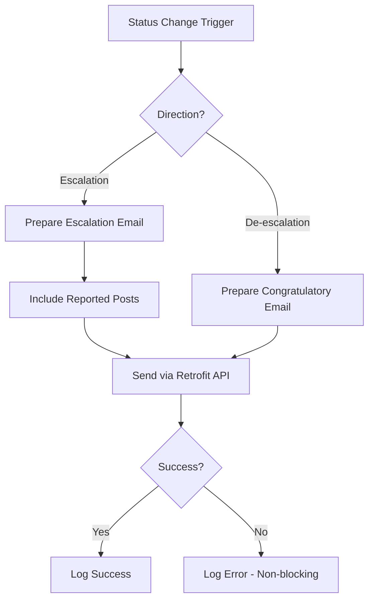
```mermaid
flowchart TD
    A[Status Change Trigger] --> B{Direction?}
    B -->|Escalation| C[Prepare Escalation Email]
    B -->|De-escalation| D[Prepare Congratulatory Email]

    C --> E[Include Reported Posts]
    E --> F[Send via Retrofit API]

    D --> F

    F --> G{Success?}
    G -->|Yes| H[Log Success]
    G -->|No| I[Log Error - Non-blocking]
```

**Screenshot Descriptions:**

1. _(No UI - backend service)_

---

### 3.11 Push Notification Service

**Description:**  
The Push Notification Service delivers real-time push notifications to user devices regarding administrative actions. Notifications are triggered via an external REST API and delivered through Firebase Cloud Messaging (FCM).

**Notification Types:**

- `POST_DELETED`: When admin/AI deletes user's post
- `POST_APPROVED`: When admin/AI approves user's post
- `POST_REJECTED`: When admin/AI rejects user's post
- `STATUS_CHANGED`: When user account status changes

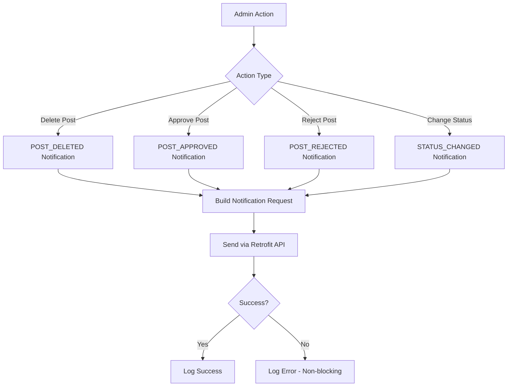
```mermaid
flowchart TD
    A[Admin Action] --> B{Action Type}
    B -->|Delete Post| C[POST_DELETED Notification]
    B -->|Approve Post| D[POST_APPROVED Notification]
    B -->|Reject Post| E[POST_REJECTED Notification]
    B -->|Change Status| F[STATUS_CHANGED Notification]

    C --> G[Build Notification Request]
    D --> G
    E --> G
    F --> G

    G --> H[Send via Retrofit API]
    H --> I{Success?}
    I -->|Yes| J[Log Success]
    I -->|No| K[Log Error - Non-blocking]
```

**Screenshot Descriptions:**

1. _(No UI - backend service, but user app receives notifications)_

---

### 3.12 User Status Escalation Service

**Description:**  
The User Status Escalation Service automatically escalates user account status when their posts are deleted, whether by AI rejection or administrative action. This service ensures consistent enforcement of community guidelines.

**Status Escalation Order:**

| Level | Status   | Description            |
| ----- | -------- | ---------------------- |
| 0     | NORMAL   | User in good standing  |
| 1     | REMINDED | First warning issued   |
| 2     | WARNED   | Serious warning issued |
| 3     | BANNED   | Account suspended      |

**Features:**

- Automatic status level calculation
- Firebase Firestore update
- Triggers email notification
- Triggers push notification
- Returns detailed escalation result

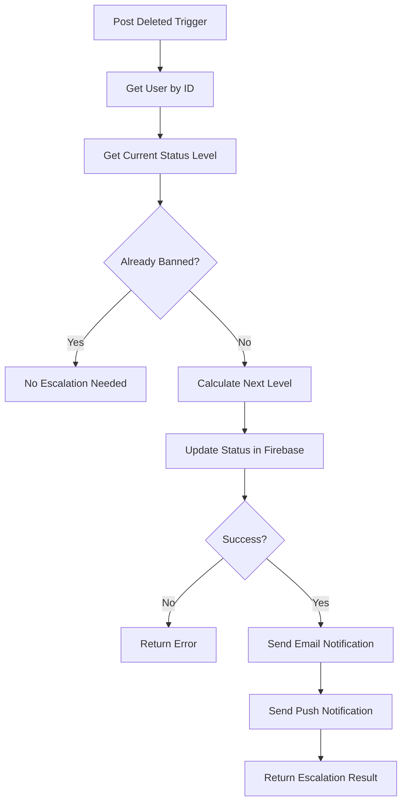
```mermaid
flowchart TD
    A[Post Deleted Trigger] --> B[Get User by ID]
    B --> C[Get Current Status Level]
    C --> D{Already Banned?}
    D -->|Yes| E[No Escalation Needed]
    D -->|No| F[Calculate Next Level]

    F --> G[Update Status in Firebase]
    G --> H{Success?}
    H -->|No| I[Return Error]
    H -->|Yes| J[Send Email Notification]
    J --> K[Send Push Notification]
    K --> L[Return Escalation Result]
```

**Screenshot Descriptions:**

1. _(No direct UI - integrated into delete/reject actions)_

---

### 3.13 Dashboard Caching System

**Description:**  
The Dashboard Caching System implements an efficient caching mechanism for dashboard data to minimize Firebase database calls and enhance application responsiveness.

**Cached Data:**

- Dashboard statistics (4 stat card values)
- Posts data (for bar charts)
- Topics data (for pie chart)

**Cache Configuration:**

- Expiration: 5 minutes
- Storage: SharedPreferences with Gson serialization
- Manual invalidation on pull-to-refresh

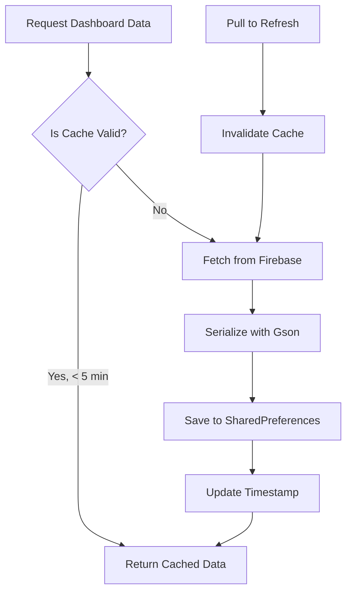
```mermaid
flowchart TD
    A[Request Dashboard Data] --> B{Is Cache Valid?}
    B -->|Yes, < 5 min| C[Return Cached Data]
    B -->|No| D[Fetch from Firebase]
    D --> E[Serialize with Gson]
    E --> F[Save to SharedPreferences]
    F --> G[Update Timestamp]
    G --> C

    H[Pull to Refresh] --> I[Invalidate Cache]
    I --> D
```

**Screenshot Descriptions:**

1. _(Transparent to user - shows cached vs fresh data load timing)_

---

### 3.14 Topic Management

**Description:**  
The Topic Management feature provides administrators with comprehensive CRUD (Create, Read, Update, Delete) operations for managing forum topics and categories. Topics are used to organize posts and are displayed in charts, filters, and post metadata throughout the application. This feature is accessible directly from the Dashboard screen.

**Key Components:**

- **Topic List Display**: View all existing topics with names, descriptions, and post counts
- **Add Topic**: Create new topics with validation for duplicate names
- **Edit Topic**: Modify topic names and descriptions
- **Delete Topic**: Remove topics with cascade handling for associated posts
- **Post Count Tracking**: Real-time display of posts associated with each topic
- **Validation**: Prevent duplicate topic names and empty fields

**Features:**

- Access via "Manage Topics" button on Dashboard (below pie chart)
- Topic list with name, description, and post count display
- Add new topic with name and description fields
- Edit existing topic information
- Delete topic with confirmation dialog
- Post count badge for each topic
- Input validation (no duplicates, required fields)
- Real-time sync with Firebase Firestore
- Automatic pie chart update after changes

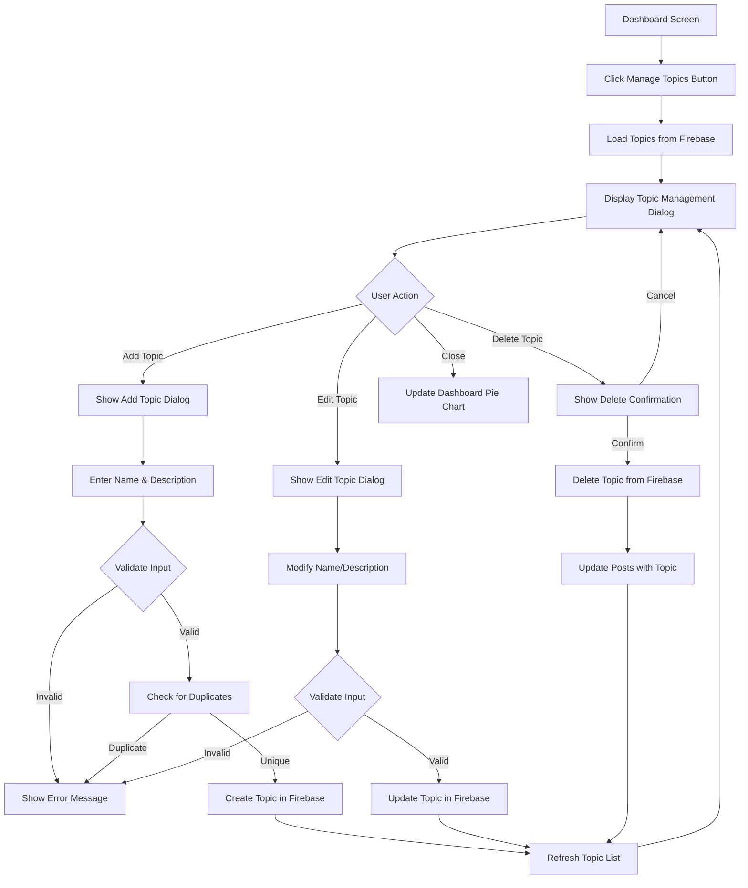
```mermaid
flowchart TD
    A[Dashboard Screen] --> B[Click Manage Topics Button]
    B --> C[Load Topics from Firebase]
    C --> D[Display Topic Management Dialog]
    
    D --> E{User Action}
    
    E -->|Add Topic| F[Show Add Topic Dialog]
    F --> G[Enter Name & Description]
    G --> H{Validate Input}
    H -->|Valid| I[Check for Duplicates]
    H -->|Invalid| J[Show Error Message]
    I -->|Unique| K[Create Topic in Firebase]
    I -->|Duplicate| J
    K --> L[Refresh Topic List]
    
    E -->|Edit Topic| M[Show Edit Topic Dialog]
    M --> N[Modify Name/Description]
    N --> O{Validate Input}
    O -->|Valid| P[Update Topic in Firebase]
    O -->|Invalid| J
    P --> L
    
    E -->|Delete Topic| Q[Show Delete Confirmation]
    Q -->|Confirm| R[Delete Topic from Firebase]
    Q -->|Cancel| D
    R --> S[Update Posts with Topic]
    S --> L
    
    E -->|Close| T[Update Dashboard Pie Chart]
    
    L --> D
```

**Related Screens:**

- Dashboard (source and return)
- Total Posts Screen (topics used in filters)
- Post Detail Screen (topics displayed as tags)
- AI Moderation Screen (topics shown in post cards)

**Data Structure:**

**Topic Document (Firestore):**
```
{
  "id": "auto-generated",
  "name": "Technology",
  "description": "Posts about technology and innovation",
  "createdAt": Timestamp,
  "updatedAt": Timestamp
}
```

**Business Rules:**

1. **Topic Name Uniqueness**: No two topics can have the same name (case-insensitive)
2. **Required Fields**: Both name and description are mandatory
3. **Cascade Behavior**: When a topic is deleted, posts with that topic remain but topic reference is removed
4. **Post Count**: Calculated dynamically by counting posts with matching topic
5. **Character Limits**: 
   - Name: 3-50 characters
   - Description: 10-200 characters

**Operations:**

**1. View Topics List:**
- Displays all topics in a scrollable list/dialog
- Shows topic name, description snippet, and post count badge
- Sorted by creation date (newest first) or alphabetically

**2. Add New Topic:**
- Opens dialog with two text input fields (Name, Description)
- Validates inputs before submission
- Checks for duplicate names in Firestore
- Creates new document in `topics` collection
- Refreshes topic list and pie chart

**3. Edit Topic:**
- Opens pre-filled dialog with current topic data
- Allows modification of name and description
- Re-validates inputs including duplicate check (excluding current topic)
- Updates Firestore document
- Refreshes displays

**4. Delete Topic:**
- Shows confirmation dialog with topic name and post count
- Warning message if topic has associated posts
- Deletes topic document from Firestore
- Option to reassign posts to another topic (advanced implementation)
- Refreshes topic list and pie chart

**Screenshot Descriptions:**

1. **Topic Management Dialog - List View**: Dialog showing scrollable list of topics with names, descriptions, post count badges (e.g., "15 posts"), edit/delete icons for each row, and "Add New Topic" button at bottom
2. **Add Topic Dialog**: Modal with two text fields labeled "Topic Name" and "Topic Description", Cancel and Add buttons, input field borders in primary color
3. **Add Topic - Validation Error**: Same dialog showing red error text "Topic name already exists" or "Name is required" below name field
4. **Edit Topic Dialog**: Pre-filled dialog with existing topic data, "Edit Topic" title, Update and Cancel buttons
5. **Delete Topic Confirmation**: Alert dialog with title "Delete Topic?", message showing topic name and warning "This topic has 12 posts. Continue?", Cancel and Delete buttons (red)
6. **Topic List with Post Counts**: Each topic row showing badge with number like "8 posts" in a colored pill/chip
7. **Empty Topics State**: Dialog showing "No topics yet. Create your first topic!" message with illustration
8. **Topic Successfully Added Toast**: Toast/Snackbar notification "Topic added successfully" at bottom of screen
9. **Topic List After Deletion**: Updated list with deleted topic removed and pie chart refreshed in background
10. **Long Topic List Scrolling**: Dialog with 10+ topics demonstrating scroll behavior

**Integration Points:**

1. **Dashboard Pie Chart**: 
   - Fetches topics for chart segments
   - Updates automatically when topics change
   - Shows post distribution by topic

2. **Post Filters**:
   - Total Posts Screen uses topics for filtering
   - AI Moderation Screen shows topics on post cards
   - Reported Posts display topic tags

3. **Post Creation/Editing** (Client App):
   - Users select from available topics when creating posts
   - Topic dropdown populated from this collection

4. **Analytics**:
   - Dashboard statistics include topic-based metrics
   - Bar chart can be filtered by topic (future enhancement)

**Error Handling:**

- **Duplicate Topic Name**: "A topic with this name already exists"
- **Empty Fields**: "Topic name and description are required"
- **Firebase Error**: "Failed to save topic. Please try again"
- **Delete Failure**: "Cannot delete topic. Please try again"
- **Network Error**: "No internet connection. Changes will sync when online"

**Performance Considerations:**

- Topics are cached with dashboard data (5-minute expiration)
- Maximum 50 topics recommended for optimal pie chart display
- Lazy loading for topic lists with 20+ items
- Debounced validation for duplicate name checking

---

## Libraries & Dependencies Summary

| Library              | Version    | Purpose                 |
| -------------------- | ---------- | ----------------------- |
| Firebase Firestore   | BOM 34.6.0 | Database                |
| Firebase Auth        | BOM 34.6.0 | Authentication          |
| Firebase Storage     | BOM 34.6.0 | File storage            |
| MPAndroidChart       | 3.1.0      | Bar & Pie charts        |
| Glide                | 4.16.0     | Image loading & caching |
| Retrofit             | 2.9.0      | REST API calls          |
| OkHttp               | 4.11.0     | HTTP client             |
| Gson                 | 2.10.1     | JSON serialization      |
| SwipeRefreshLayout   | 1.1.0      | Pull-to-refresh         |
| Navigation Component | Jetpack    | Fragment navigation     |
| Material Design      | 3.x        | UI components           |

---

## Localization

The app supports **2 languages**:

- English (default)
- Vietnamese (vi)

All user-facing strings are externalized in:

- `res/values/strings.xml` (English)
- `res/values-vi/strings.xml` (Vietnamese)

---

## Phase 5: Data Layer & Architecture

### 14. Data Models

**Description:**  
Core data structures used throughout the application for type-safe data handling.

#### User Models

| Model             | Fields                                                | Purpose                     |
| ----------------- | ----------------------------------------------------- | --------------------------- |
| `FirestoreUser`   | email, fullName, profilePictureUrl, role, uid, status | Raw Firestore user document |
| `User`            | id, name, avatarUrl, status, role                     | UI display model            |
| `BlacklistedUser` | id, name, avatarUrl, status, uid                      | Blacklist-specific model    |
| `UserSuggestion`  | id, name, displayText                                 | Autocomplete suggestions    |

#### Post Models

| Model           | Fields                                                                                                                                                                                            | Purpose                     |
| --------------- | ------------------------------------------------------------------------------------------------------------------------------------------------------------------------------------------------- | --------------------------- |
| `FirestorePost` | authorId, authorName, author_avatar_url, comment_count, content, createdAt, downvote_count, image_link, post_id, reportCount, status, title, topic, uid, upvote_count, video_link, violation_type | Raw Firestore post document |
| `Post`          | id, title, author, date, description, tags, isAiApproved                                                                                                                                          | UI display model            |
| `ReportedPost`  | id, title, author, authorId, date, categories, description, fullContent, violationCount, reportCount, violationTypes                                                                              | Reported posts screen model |

#### Status and Enumeration Types

| Enum            | Values                           | Description                             |
| --------------- | -------------------------------- | --------------------------------------- |
| UserStatus      | NORMAL, REMINDED, WARNED, BANNED | Represents user account standing levels |
| UserStatusLevel | NORMAL, REMINDED, WARNED, BANNED | Status level with string value mapping  |

#### AI Moderation Models

| Model                 | Fields                                                | Purpose                   |
| --------------------- | ----------------------------------------------------- | ------------------------- |
| `AiModerationResult`  | postData, isApproved, confidenceScore, violationTypes | AI analysis result        |
| `AiModerationRequest` | postId, title, content                                | Request to AI service     |
| `Violation`           | violation (ID), name, description                     | Violation type definition |

#### Notification Models

| Model                        | Fields                                                                                                | Purpose                   |
| ---------------------------- | ----------------------------------------------------------------------------------------------------- | ------------------------- |
| `NotificationTriggerRequest` | type, actorId, actorName, targetId, targetUserId, previewText, originalPostTitle, originalPostContent | Push notification payload |
| `NotificationType`           | POST_DELETED, POST_APPROVED, STATUS_CHANGED, POST_REJECTED                                            | Notification categories   |
| `ReportEmailRequest`         | recipientEmail, userName, userStatus, reportedPosts                                                   | Email API payload         |

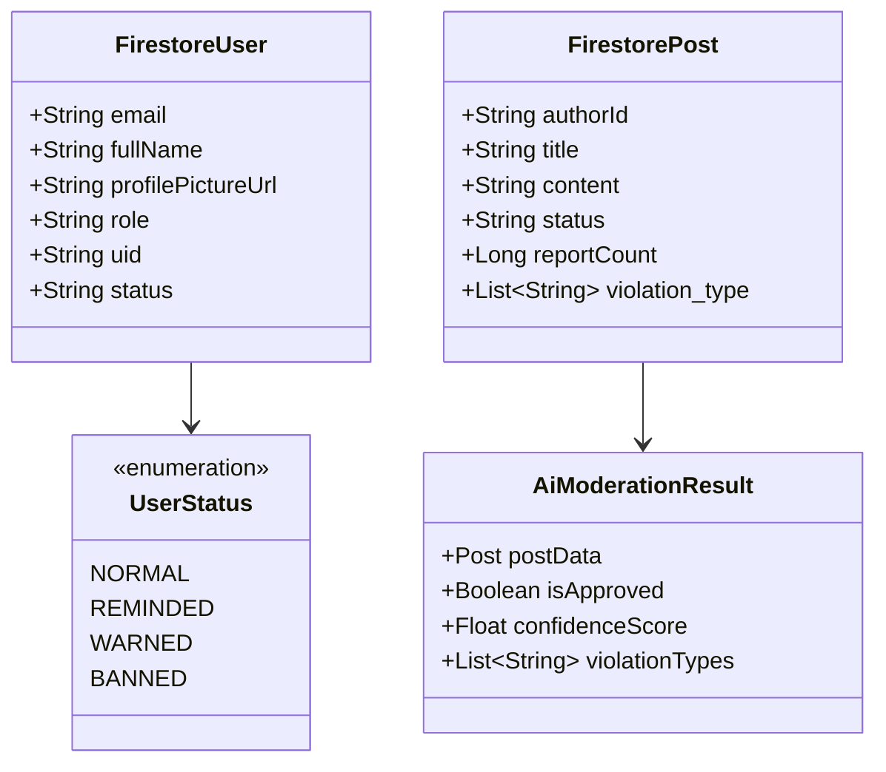
```mermaid
classDiagram
    class FirestoreUser {
        +String email
        +String fullName
        +String profilePictureUrl
        +String role
        +String uid
        +String status
    }

    class UserStatus {
        <<enumeration>>
        NORMAL
        REMINDED
        WARNED
        BANNED
    }

    class FirestorePost {
        +String authorId
        +String title
        +String content
        +String status
        +Long reportCount
        +List~String~ violation_type
    }

    class AiModerationResult {
        +Post postData
        +Boolean isApproved
        +Float confidenceScore
        +List~String~ violationTypes
    }

    FirestoreUser --> UserStatus
    FirestorePost --> AiModerationResult
```

---

### 15. Repository Layer

**Description:**  
Data access layer abstracting Firebase Firestore operations with caching support.

#### Repositories

| Repository               | Collection | Key Methods                                                                  |
| ------------------------ | ---------- | ---------------------------------------------------------------------------- |
| `UserRepository`         | users      | getAllUsers(), getBlacklistedUsers(), getUserById(), updateUserStatus()      |
| `PostRepository`         | posts      | getAllPosts(), getPaginatedPosts(), deletePost(), getPostsByViolationTypes() |
| `TopicRepository`        | topics     | getAllTopics(), addTopic(), updateTopic(), deleteTopic()                     |
| `ReportRepository`       | reports    | getReportsForPost(), dismissReportsForPost()                                 |
| `ViolationRepository`    | violations | getAllViolations()                                                           |
| `AiModerationRepository` | posts      | getApprovedPosts(), getRejectedPosts(), overrideModerationDecision()         |

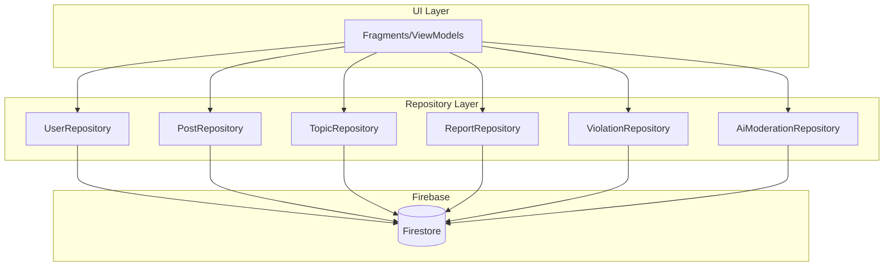
```mermaid
flowchart TD
    subgraph UI Layer
        A[Fragments/ViewModels]
    end

    subgraph Repository Layer
        B[UserRepository]
        C[PostRepository]
        D[TopicRepository]
        E[ReportRepository]
        F[ViolationRepository]
        G[AiModerationRepository]
    end

    subgraph Firebase
        H[(Firestore)]
    end

    A --> B
    A --> C
    A --> D
    A --> E
    A --> F
    A --> G

    B --> H
    C --> H
    D --> H
    E --> H
    F --> H
    G --> H
```

#### Caching Strategy

The repository layer implements an in-memory caching strategy to optimize performance:

| Parameter            | Value                        | Description                        |
| -------------------- | ---------------------------- | ---------------------------------- |
| Cache Expiration     | 5 minutes                    | Duration before cache invalidation |
| Cache Storage        | In-memory variable           | Temporary storage for fetched data |
| Timestamp Tracking   | System milliseconds          | Used to determine cache validity   |
| Invalidation Trigger | Manual refresh or expiration | When cache is cleared              |

---

### 16. API Integration (Retrofit)

**Description:**  
REST API client for external services (email notifications, push notifications).

#### API Services

| Service                  | Base URL        | Endpoints                  |
| ------------------------ | --------------- | -------------------------- |
| `EmailApiService`        | External server | POST /send-report-email    |
| `NotificationApiService` | External server | POST /trigger-notification |

#### Retrofit Configuration

The REST API client is configured with the following parameters:

| Configuration   | Value                    | Description                        |
| --------------- | ------------------------ | ---------------------------------- |
| Base URL        | External server endpoint | API server address                 |
| HTTP Client     | OkHttpClient             | Underlying HTTP client             |
| Logging         | HttpLoggingInterceptor   | Request/response logging           |
| Connect Timeout | 30 seconds               | Connection establishment timeout   |
| Read Timeout    | 30 seconds               | Data reading timeout               |
| Converter       | GsonConverterFactory     | JSON serialization/deserialization |

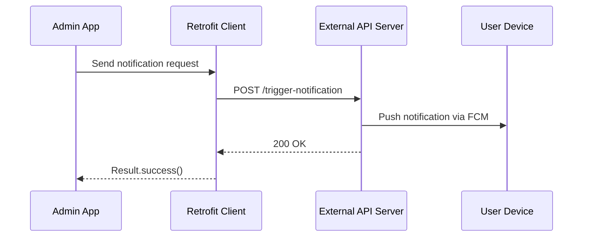
```mermaid
sequenceDiagram
    participant App as Admin App
    participant Retrofit as Retrofit Client
    participant API as External API Server
    participant User as User Device

    App->>Retrofit: Send notification request
    Retrofit->>API: POST /trigger-notification
    API->>User: Push notification via FCM
    API-->>Retrofit: 200 OK
    Retrofit-->>App: Result.success()
```

---

### 17. UI Components & Adapters

**Description:**  
Reusable RecyclerView adapters and UI components.

#### RecyclerView Adapters

| Adapter                   | Purpose                    | Item Layout                      |
| ------------------------- | -------------------------- | -------------------------------- |
| `TotalUsersAdapter`       | Display user list          | item_total_user.xml              |
| `TotalPostsAdapter`       | Display post list          | item_total_post.xml              |
| `BlacklistAdapter`        | Display blacklisted users  | item_blacklist_user.xml          |
| `ReportedPostsAdapter`    | Display reported posts     | item_reported_post_card.xml      |
| `AiPostsAdapter`          | Display AI-moderated posts | item_ai_post_card.xml            |
| `ManageTopicsAdapter`     | Topic management list      | item_manage_topic.xml            |
| `UserAutoCompleteAdapter` | Search autocomplete        | item_autocomplete_suggestion.xml |

#### Custom Components

| Component     | Purpose                                          |
| ------------- | ------------------------------------------------ |
| `StatCard`    | Dashboard statistic card with icon, label, value |
| Custom Legend | Pie chart legend items                           |
| Status Badge  | Colored badge for user status                    |
| Tag Chips     | Topic/category tag display                       |

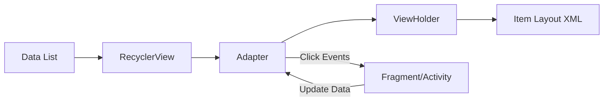
```mermaid
flowchart LR
    A[Data List] --> B[RecyclerView]
    B --> C[Adapter]
    C --> D[ViewHolder]
    D --> E[Item Layout XML]

    C -->|Click Events| F[Fragment/Activity]
    F -->|Update Data| C
```

---

### 18. App Architecture (MVVM)

**Description:**  
Model-View-ViewModel architecture pattern implementation.

#### Architecture Components

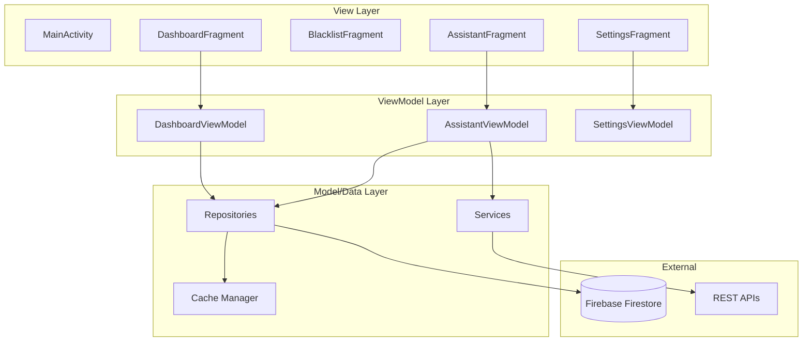
```mermaid
flowchart TB
    subgraph View Layer
        A[MainActivity]
        B[DashboardFragment]
        C[BlacklistFragment]
        D[SettingsFragment]
        E[AssistantFragment]
    end

    subgraph ViewModel Layer
        F[DashboardViewModel]
        G[AssistantViewModel]
        H[SettingsViewModel]
    end

    subgraph Model/Data Layer
        I[Repositories]
        J[Services]
        K[Cache Manager]
    end

    subgraph External
        L[(Firebase Firestore)]
        M[REST APIs]
    end

    B --> F
    E --> G
    D --> H

    F --> I
    G --> I
    G --> J

    I --> L
    J --> M
    I --> K
```

#### State Management

The application uses immutable state classes to manage UI state. Each ViewModel maintains a LiveData object containing the current state.

**AI Moderation State Properties:**

| Property             | Type              | Description                                |
| -------------------- | ----------------- | ------------------------------------------ |
| currentTab           | TabType           | Currently selected tab (Approved/Rejected) |
| allPosts             | List              | Complete list of posts                     |
| filteredPosts        | List              | Posts after applying filters               |
| searchQuery          | String            | Current search query                       |
| sortOrder            | SortOrder         | Current sort order (Newest/Oldest)         |
| selectedViolationIds | Set               | Selected violation type filters            |
| isLoading            | Boolean           | Loading state indicator                    |
| error                | String (nullable) | Error message if any                       |

#### Lifecycle-Aware Coroutines

The application implements lifecycle-aware coroutine launching to ensure safe UI updates:

| Aspect         | Implementation                                    |
| -------------- | ------------------------------------------------- |
| Scope          | viewLifecycleOwner.lifecycleScope                 |
| Safety Check   | Verify fragment is still added before UI updates  |
| Binding Check  | Verify binding is not null before accessing views |
| Error Handling | Try-catch blocks for exception handling           |

---

## Phase 6: Screen-by-Screen UI Layouts

### Layout Files Reference

| Screen         | Layout File                 | Key Components                                    |
| -------------- | --------------------------- | ------------------------------------------------- |
| Main Activity  | activity_main.xml           | DrawerLayout, NavigationView, NavHostFragment     |
| Dashboard      | fragment_dashboard.xml      | SwipeRefreshLayout, StatCards, BarChart, PieChart |
| Blacklist      | fragment_blacklist.xml      | SearchView, RecyclerView, Pagination              |
| AI Moderation  | fragment_ai_moderation.xml  | TabLayout, RecyclerView, FilterButtons            |
| Settings       | fragment_settings.xml       | Theme buttons, Language buttons                   |
| Total Posts    | fragment_total_posts.xml    | DatePickers, SearchView, RecyclerView             |
| Total Users    | fragment_total_users.xml    | SearchView, FilterButton, RecyclerView            |
| Post Detail    | fragment_post_detail.xml    | ScrollView, Author section, Content, Statistics   |
| Reported Posts | fragment_reported_posts.xml | SearchView, SortButton, RecyclerView              |

### Dialog Layouts

| Dialog            | Layout File                  | Purpose                     |
| ----------------- | ---------------------------- | --------------------------- |
| Manage Topics     | dialog_manage_topics.xml     | CRUD for topics             |
| Edit Topic        | dialog_edit_topic.xml        | Edit topic name/description |
| Topic Description | dialog_topic_description.xml | Add topic with description  |
| Sort Options      | dialog_sort.xml              | Sort by reports/violations  |
| Sort Time         | dialog_sort_time.xml         | Sort by newest/oldest       |
| Filter Status     | dialog_filter_status.xml     | Filter by user status       |
| Filter Users      | dialog_filter_users.xml      | Filter by status & role     |
| Filter Violation  | dialog_filter_violation.xml  | Filter by violation type    |
| User Details      | dialog_user_details.xml      | View user information       |
| Report Details    | dialog_report_details.xml    | View report reasons         |
| Violations        | dialog_violations.xml        | View violation types        |

---

## Summary Statistics

| Metric                | Count                   |
| --------------------- | ----------------------- |
| Total Screens         | 7 main screens          |
| Total Dialogs         | 11 dialogs              |
| RecyclerView Adapters | 7 adapters              |
| Repositories          | 6 repositories          |
| Services              | 4 services              |
| Data Models           | 15+ models              |
| Layout Files          | 34 layouts              |
| Supported Languages   | 2 (English, Vietnamese) |
| Theme Modes           | 3 (Light, Dark, Auto)   |

---

_Document generated for Forumus Admin App v1.0_  
_Last updated: January 2026_
