# Forumus Backend API Documentation

**Internal Forum for University Members**  
Spring Boot Backend for Android Kotlin Mobile Application

---

## Table of Contents

1. [API Endpoints Reference](#api-endpoints-reference)
2. [Phase 1: Core Features](#phase-1-core-features)
3. [Phase 2: Email Services](#phase-2-email-services)
4. [Phase 3: Post Management and AI Features](#phase-3-post-management-and-ai-features)
5. [Phase 4: Notification System](#phase-4-notification-system)
6. [Phase 5: Topic Management and Real-time Listeners](#phase-5-topic-management-and-real-time-listeners)
7. [System Architecture](#system-architecture)
8. [Technology Stack](#technology-stack)

---

## API Endpoints Reference

The following table provides a comprehensive overview of all available API endpoints in the Forumus Backend system.

| No. | Feature | Method | Endpoint | Category | Description |
|-----|---------|--------|----------|----------|-------------|
| 1 | Health Check | GET | `/api/health` | Core | Verifies server operational status |
| 2 | Password Reset | POST | `/api/auth/resetPassword` | Authentication | Resets user password via Firebase Auth (admin only) |
| 3 | Send OTP Email | POST | `/api/email/send-otp` | Email | Sends OTP verification code to user email |
| 4 | Send Welcome Email | POST | `/api/email/send-welcome` | Email | Sends welcome email after account verification |
| 5 | Send Report Email | POST | `/api/email/send-report` | Email | Sends account status notification email |
| 6 | Ask Gemini AI | POST | `/api/posts/askGemini` | AI | General Q&A interaction with Gemini AI |
| 7 | Validate Post | POST | `/api/posts/validatePost` | AI | AI-powered content moderation for posts |
| 8 | Summarize Post | POST | `/api/posts/summarize` | AI | Generates AI summary with intelligent caching |
| 9 | Get Suggested Topics | POST | `/api/posts/getSuggestedTopics` | AI | Extracts relevant topics using AI analysis |
| 10 | Trigger Notification | POST | `/api/notifications` | Notifications | Sends push notification and stores in Firestore |
| 11 | Get All Topics | GET | `/api/topics/getAll` | Topics | Retrieves all forum topics from cache |
| 12 | Add Topics | POST | `/api/topics/add` | Topics | Adds new topics to the forum |

---

## Phase 1: Core Features

### 1. Health Check

**Endpoint:** `GET /api/health`

**Description:**  
A health check endpoint to verify that the Forumus Backend server is running and operational. This endpoint is used for monitoring, load balancer health probes, and deployment verification.

**Response Structure:**

| Field | Type | Description |
|-------|------|-------------|
| status | String | Server status indicator (UP) |
| message | String | Human-readable status message |

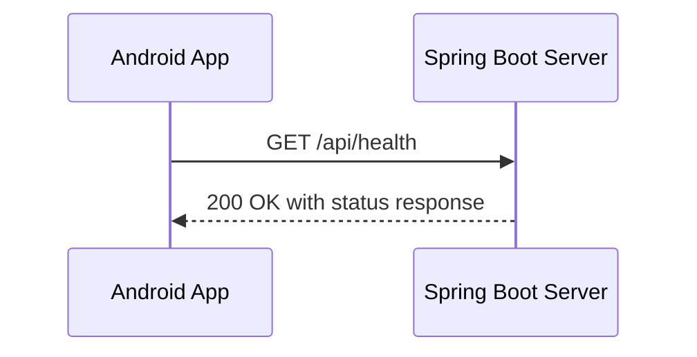

---

### 2. Authentication - Password Reset

**Endpoint:** `POST /api/auth/resetPassword`

**Description:**  
Allows administrators to reset a user's password in Firebase Authentication. This is a secure endpoint that requires a secret admin key for authorization.

**Request Parameters:**

| Field | Type | Required | Description |
|-------|------|----------|-------------|
| email | String | Yes | User's email address |
| newPassword | String | Yes | New password to set |
| secretKey | String | Yes | Admin secret key for authorization |

**Response Parameters:**

| Field | Type | Description |
|-------|------|-------------|
| success | Boolean | Operation result status |
| message | String | Result message or error description |

**Security Requirements:**
- Requires valid secretKey matching server configuration
- Returns 403 Forbidden if secret key is invalid
- Returns 400 Bad Request if email or password is missing

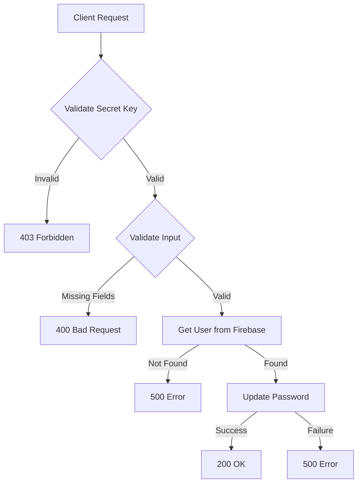

---

## Phase 2: Email Services

### 3. Send OTP Email

**Endpoint:** `POST /api/email/send-otp`

**Description:**  
Sends a One-Time Password (OTP) verification email to a user during registration or account verification. The email contains a styled HTML template with the OTP code.

**Request Parameters:**

| Field | Type | Required | Description |
|-------|------|----------|-------------|
| recipientEmail | String | Yes | Recipient's email address |
| otpCode | String | Yes | OTP code to send |

**Response Parameters:**

| Field | Type | Description |
|-------|------|-------------|
| success | Boolean | Email delivery status |
| message | String | Result message |

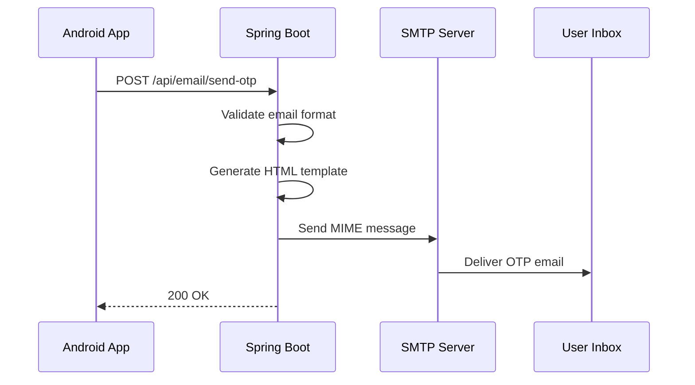

---

### 4. Send Welcome Email

**Endpoint:** `POST /api/email/send-welcome`

**Description:**  
Sends a welcome email to new users after successful account verification. This email welcomes users to the Forumus community and provides information about getting started.

**Request Parameters:**

| Field | Type | Required | Description |
|-------|------|----------|-------------|
| recipientEmail | String | Yes | Recipient's email address |
| userName | String | Yes | User's display name |

**Response Parameters:**

| Field | Type | Description |
|-------|------|-------------|
| success | Boolean | Email delivery status |
| message | String | Result message |

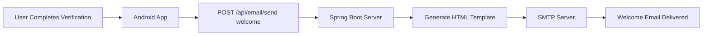

---

### 5. Send Report Email

**Endpoint:** `POST /api/email/send-report`

**Description:**  
Sends an account status report email when a user's account status changes. This email includes details about reported posts and the reason for the status change.

**Request Parameters:**

| Field | Type | Required | Description |
|-------|------|----------|-------------|
| recipientEmail | String | Yes | Recipient's email address |
| userName | String | Yes | User's display name |
| userStatus | String | Yes | New account status |
| reportedPosts | Array | No | List of reported posts with title and reason |

**User Status Values:**

| Status | Description |
|--------|-------------|
| ACTIVE | Normal account status |
| WARNING | Account has received a warning |
| RESTRICTED | Account has limited functionality |
| BANNED | Account is suspended |

**Response Parameters:**

| Field | Type | Description |
|-------|------|-------------|
| success | Boolean | Email delivery status |
| message | String | Result message |

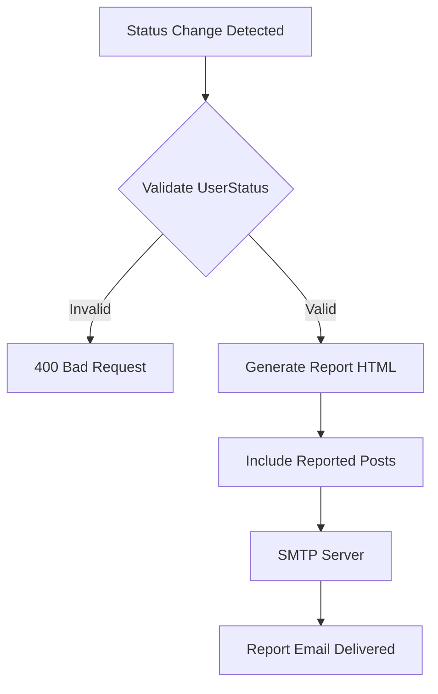

---

### Email Service Architecture

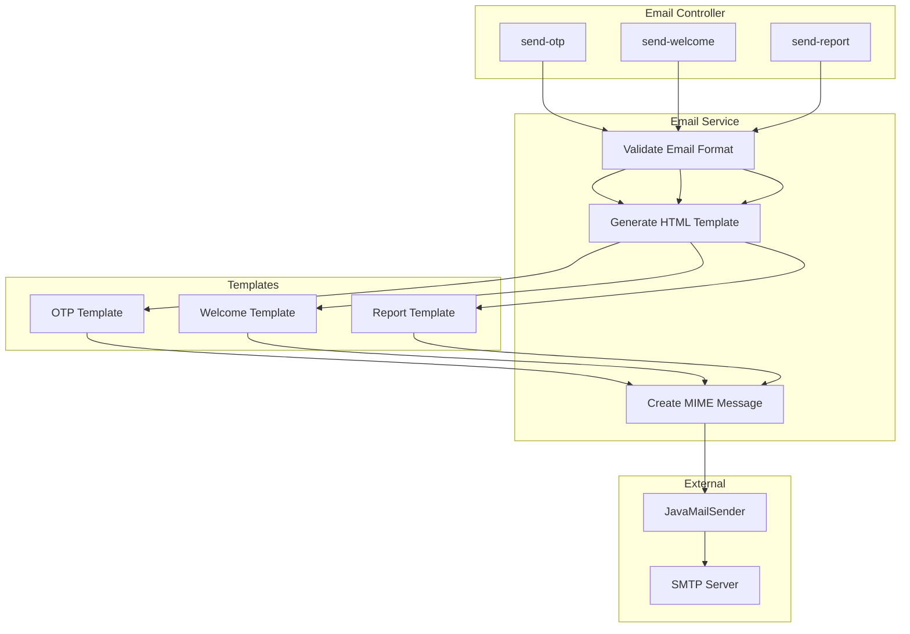

---

## Phase 3: Post Management and AI Features

This phase covers AI-powered features using the Google Gemini 2.5 Flash model for content moderation, summarization, and topic suggestion.

### 6. Ask Gemini AI

**Endpoint:** `POST /api/posts/askGemini`

**Description:**  
A general-purpose endpoint for interaction with Gemini AI. Sends a question or prompt to the AI and returns the response. The AI is configured as a helpful assistant for an academic forum.

**Request Parameters:**

| Field | Type | Required | Description |
|-------|------|----------|-------------|
| (body) | String | Yes | Plain text question or prompt |

**Response Parameters:**

| Field | Type | Description |
|-------|------|-------------|
| response | String | AI-generated response |

**AI System Configuration:**
The AI operates with the following system instruction: "You are a helpful assistant for an academic forum. You should help ensure that posts adhere to community guidelines suitable for university students. You should answer in the language of the user's prompt."

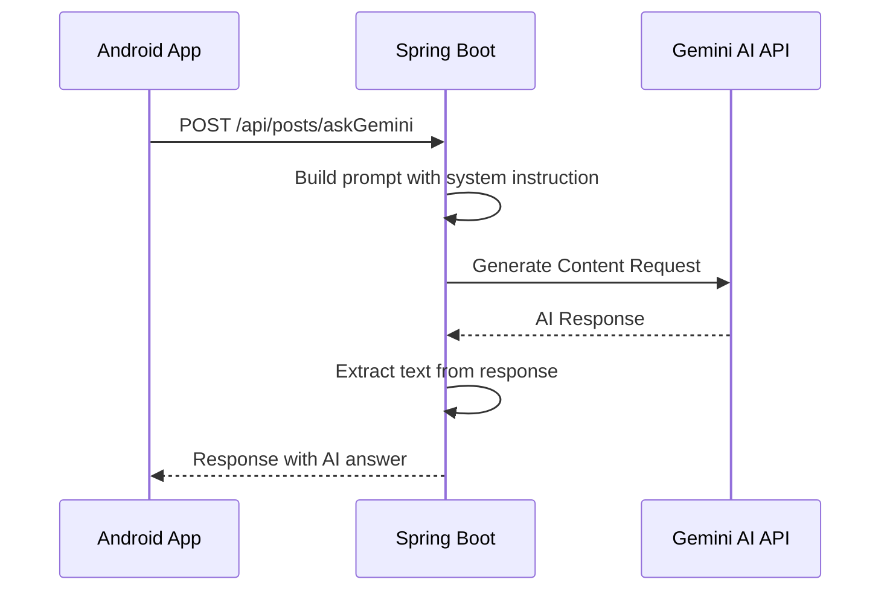

---

### 7. Post Validation (AI Content Moderation)

**Endpoint:** `POST /api/posts/validatePost`

**Description:**  
Validates a forum post using AI to ensure adherence to community guidelines. The system fetches the post from Firestore, sends it to Gemini AI for analysis, and automatically updates the post status. If rejected, a push notification is sent to the author.

**Request Parameters:**

| Field | Type | Required | Description |
|-------|------|----------|-------------|
| postId | String | Yes | ID of the post to validate |

**Response Parameters:**

| Field | Type | Description |
|-------|------|-------------|
| valid | Boolean | Validation result |
| message | String | Rejection reasons if invalid, empty if valid |

**Validation Criteria:**
- No offensive language or hate speech
- No personal attacks
- No inappropriate content
- Suitable for university students
- Respects diversity and inclusion
- Relevant to academic topics

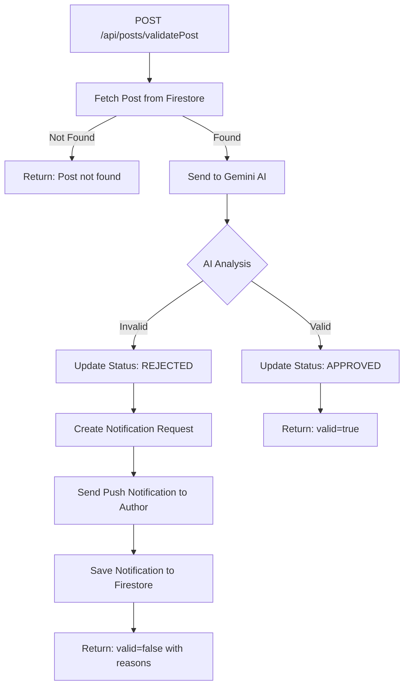

**Automatic Post Listener:**  
Posts are also validated automatically when added to Firestore with PENDING status via a real-time listener.

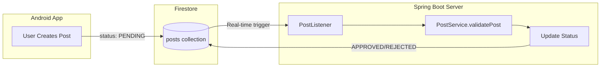

---

### 8. Post Summarization (AI-Powered with Caching)

**Endpoint:** `POST /api/posts/summarize`

**Description:**  
Generates a concise AI-powered summary (2-3 sentences, maximum 100 words) of a forum post. The system implements intelligent caching using content hashing to detect changes and only regenerates summaries when content is modified.

**Request Parameters:**

| Field | Type | Required | Description |
|-------|------|----------|-------------|
| postId | String | Yes | ID of the post to summarize |

**Response Parameters (Success):**

| Field | Type | Description |
|-------|------|-------------|
| success | Boolean | Operation status |
| summary | String | Generated summary text |
| fromCache | Boolean | Whether summary was retrieved from cache |
| contentHash | String | Hash of post content for cache validation |
| generatedAt | Long | Timestamp of summary generation |

**Response Parameters (Error):**

| Field | Type | Description |
|-------|------|-------------|
| success | Boolean | false |
| message | String | Error description |

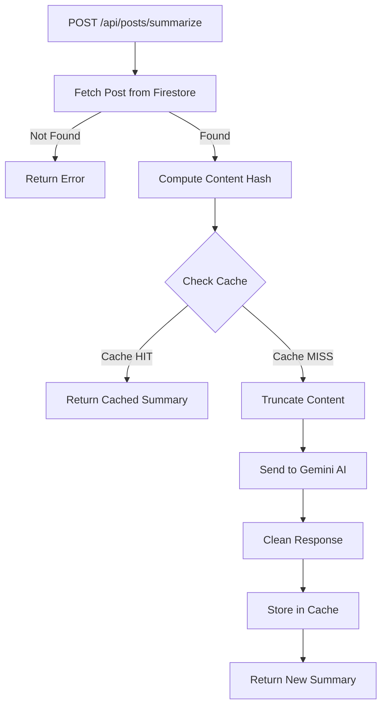

**Caching Features:**

| Feature | Description |
|---------|-------------|
| Content Hash | SHA-256 hash of title and content to detect changes |
| TTL Support | Time-to-live for cache entries |
| Hit Tracking | Tracks cache hits for monitoring |
| Thread Safety | Uses ConcurrentHashMap |
| Auto-invalidation | Cache invalidates when content changes |

---

### 9. Get Suggested Topics (AI Topic Extraction)

**Endpoint:** `POST /api/posts/getSuggestedTopics`

**Description:**  
Uses Gemini AI to analyze a post's title and content, then suggests up to 3 relevant topics from existing topics in the database.

**Request Parameters:**

| Field | Type | Required | Description |
|-------|------|----------|-------------|
| title | String | Yes | Post title |
| content | String | Yes | Post content |

**Response Parameters (Success):**

| Field | Type | Description |
|-------|------|-------------|
| success | Boolean | Operation status |
| topics | Array | List of matched TopicResponse objects |

**TopicResponse Structure:**

| Field | Type | Description |
|-------|------|-------------|
| topicId | String | Unique topic identifier |
| name | String | Topic display name |
| description | String | Topic description |

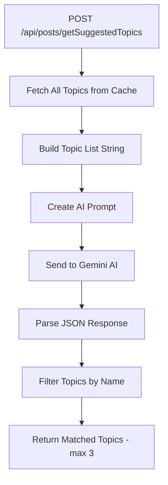

---

### Post Service Architecture

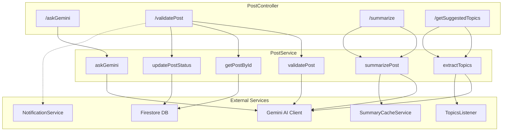

---

## Phase 4: Notification System

This phase covers the push notification infrastructure using Firebase Cloud Messaging (FCM) for real-time user notifications with Firestore persistence.

### 10. Trigger Notification

**Endpoint:** `POST /api/notifications`

**Description:**  
Triggers a push notification to a specific user. The system stores the notification in Firestore under the user's notifications subcollection and sends a push notification via FCM if the user has a valid FCM token.

**Request Parameters:**

| Field | Type | Required | Description |
|-------|------|----------|-------------|
| type | String | Yes | Notification type (see types below) |
| actorId | String | No | ID of user who triggered the action |
| actorName | String | No | Display name of actor |
| targetId | String | No | Post ID or Comment ID |
| targetUserId | String | Yes | User to receive notification |
| previewText | String | No | Preview snippet of content |
| originalPostTitle | String | No | For rejection notifications |
| originalPostContent | String | No | For rejection notifications |
| rejectionReason | String | No | Reason for post rejection |

**Response:**
- Success: "Notification triggered successfully"
- Error: "Failed to trigger notification"

---

### Notification Types

| Type | Title | Body Template | Use Case |
|------|-------|---------------|----------|
| UPVOTE | New Upvote | {actor} upvoted your post: {preview} | User upvotes a post |
| COMMENT | New Comment | {actor} commented on your post: {preview} | User comments on a post |
| REPLY | New Reply | {actor} replied to your comment: {preview} | User replies to a comment |
| POST_REJECTED | Post Rejected | {previewText} | AI rejects a post |
| POST_APPROVED | Post Approved | {previewText} | AI approves a post |
| POST_DELETED | Post Removed | {previewText} | Admin removes a post |
| STATUS_CHANGED | Account Status Update | {previewText} | User account status changes |

**Trigger Sources:**

| Type | Trigger Source | Auto-Generated |
|------|----------------|----------------|
| UPVOTE | Android App | No |
| COMMENT | Android App | No |
| REPLY | Android App | No |
| POST_REJECTED | PostListener / PostController | Yes |
| POST_APPROVED | PostController | Yes |
| POST_DELETED | Admin Action | No |
| STATUS_CHANGED | Admin Action | No |

---

### Notification Flow

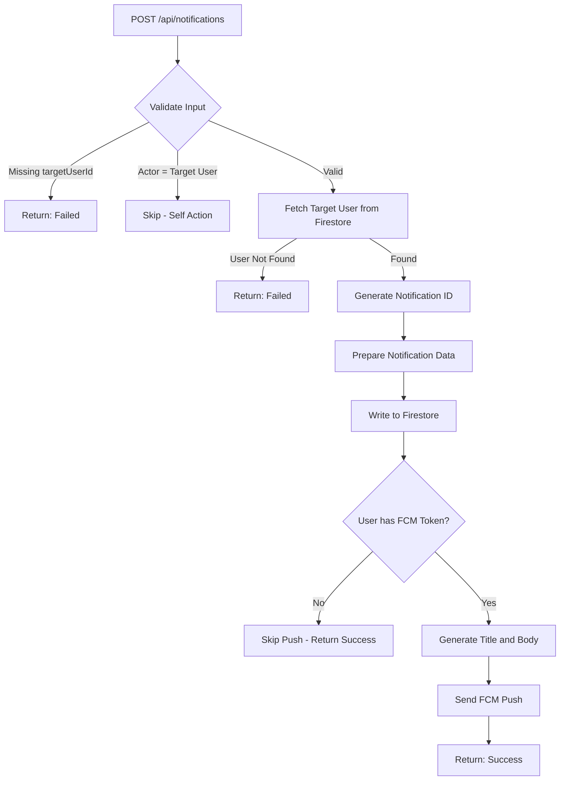

---

### Notification Data Structure (Firestore)

**Path:** `users/{targetUserId}/notifications/{notificationId}`

| Field | Type | Description |
|-------|------|-------------|
| id | String | Unique notification identifier |
| type | String | Notification type |
| actorId | String | User who triggered the action |
| actorName | String | Display name of actor |
| targetId | String | Post ID or Comment ID |
| previewText | String | Content preview snippet |
| createdAt | Timestamp | Creation timestamp |
| isRead | Boolean | Read status |
| originalPostTitle | String | Optional - for rejections |
| originalPostContent | String | Optional - for rejections |
| rejectionReason | String | Optional - for rejections |

---

### FCM Push Notification Payload Structure

| Field | Path | Description |
|-------|------|-------------|
| token | root | User's FCM token |
| title | notification | Notification title |
| body | notification | Notification body text |
| type | data | general_notification |
| notificationId | data | UUID of notification |
| targetId | data | Post/Comment ID for deep link |
| click_action | data | FLUTTER_NOTIFICATION_CLICK |

---

### Integration with Post Validation

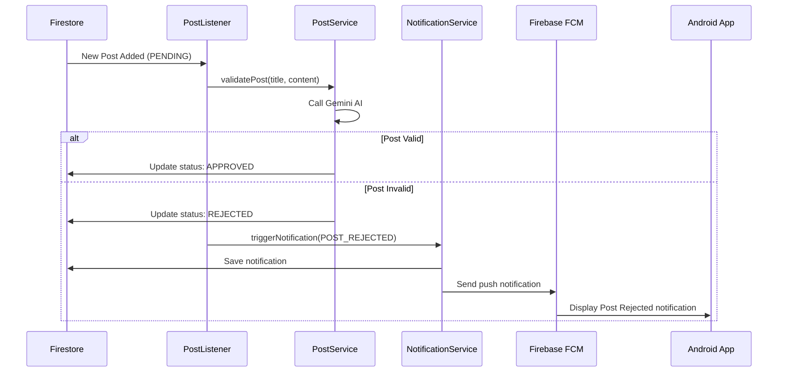

---

### Notification Service Architecture

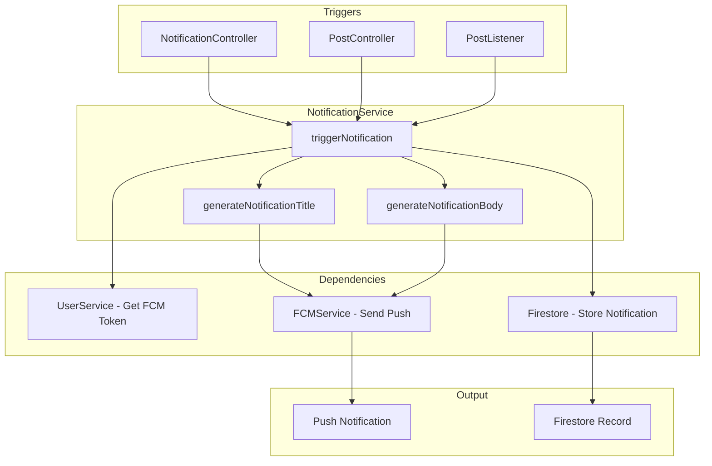

---

### Self-Action Prevention

The notification system skips notifications when a user performs an action on their own content.

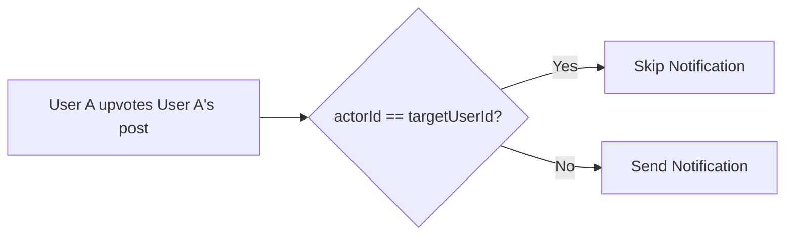

---

## Phase 5: Topic Management and Real-time Listeners

This phase covers topic management APIs and real-time Firestore listeners for automatic post validation and topic caching.

### 11. Get All Topics

**Endpoint:** `GET /api/topics/getAll`

**Description:**  
Retrieves all available forum topics from the in-memory cache. Topics are pre-loaded at server startup and kept synchronized with Firestore via a real-time listener.

**Response Parameters (Success):**

| Field | Type | Description |
|-------|------|-------------|
| success | Boolean | Operation status |
| topics | Array | List of TopicResponse objects |

**TopicResponse Structure:**

| Field | Type | Description |
|-------|------|-------------|
| topicId | String | Unique topic identifier |
| name | String | Topic display name |
| description | String | Topic description |

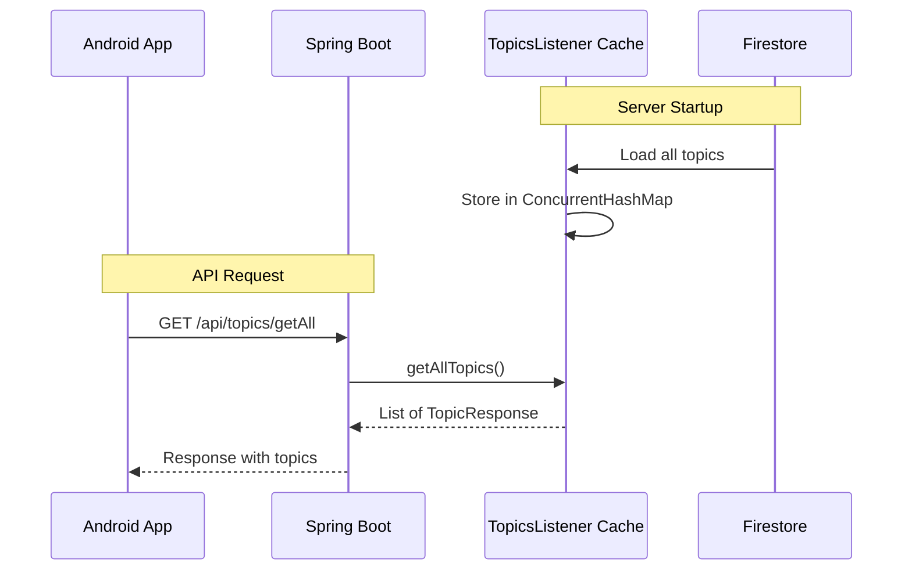

---

### 12. Add Topics

**Endpoint:** `POST /api/topics/add`

**Description:**  
Adds one or more new topics to the forum. Topics are stored in Firestore with auto-generated IDs based on the topic name (lowercase with underscores).

**Request Parameters:**
Array of topic objects:

| Field | Type | Required | Description |
|-------|------|----------|-------------|
| name | String | Yes | Topic display name |
| description | String | No | Topic description |

**Response Parameters:**

| Field | Type | Description |
|-------|------|-------------|
| success | Boolean | Operation status |

**Topic ID Generation:**
- Input: "Machine Learning"
- Output: "machine_learning"

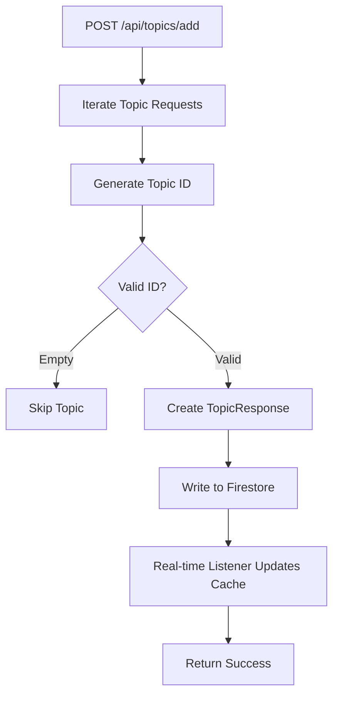

---

### Real-time Topics Listener

**Component:** TopicsListener

**Description:**  
A Spring component that maintains an in-memory cache of all topics, synchronized with Firestore in real-time.

**Features:**

| Feature | Description |
|---------|-------------|
| Fast Startup | Pre-loads all topics into cache |
| Real-time Sync | Listens for ADDED, MODIFIED, REMOVED events |
| Thread-safe | Uses ConcurrentHashMap |
| Zero Latency | API calls served from memory |

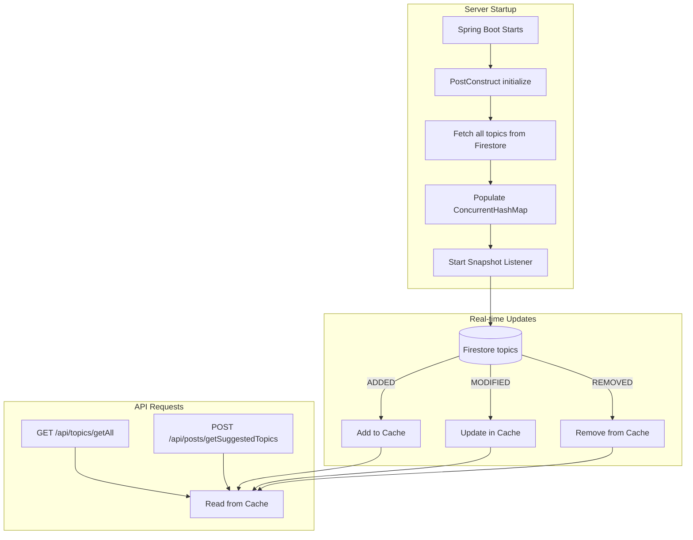

---

### Real-time Post Listener

**Component:** PostListener

**Description:**  
A Spring component that listens for new posts in Firestore and automatically triggers AI validation for posts with PENDING status.

**Features:**

| Feature | Description |
|---------|-------------|
| Auto-validation | New PENDING posts are automatically validated |
| Auto-notification | Rejected posts trigger user notifications |
| Skip Initial | Ignores existing posts on startup |
| Status Update | Automatically updates post status |

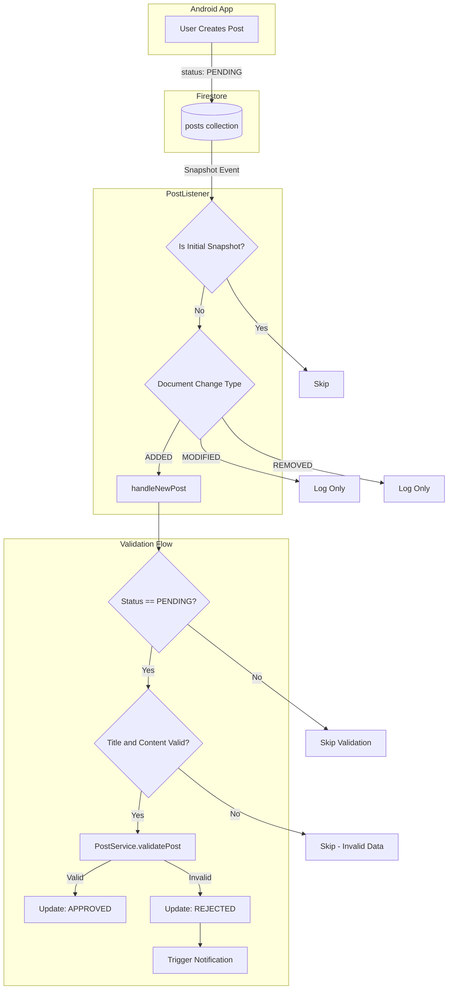

**Lifecycle:**

```mermaid
sequenceDiagram
    participant Spring as Spring Boot
    participant Listener as PostListener
    participant Firestore as Firestore
    participant PostSvc as PostService
    participant NotifSvc as NotificationService

    Note over Spring,Listener: Server Startup
    Spring->>Listener: PostConstruct startListening()
    Listener->>Firestore: addSnapshotListener(posts)
    Firestore-->>Listener: Initial snapshot (skipped)

    Note over Firestore,NotifSvc: New Post Created
    Firestore->>Listener: DocumentChange (ADDED)
    Listener->>Listener: handleNewPost()
    Listener->>PostSvc: validatePost(title, content)
    PostSvc-->>Listener: ValidationResponse

    alt Valid Post
        Listener->>PostSvc: updatePostStatus(APPROVED)
    else Invalid Post
        Listener->>PostSvc: updatePostStatus(REJECTED)
        Listener->>NotifSvc: triggerNotification(POST_REJECTED)
    end

    Note over Spring,Listener: Server Shutdown
    Spring->>Listener: PreDestroy stopListening()
    Listener->>Firestore: Remove listener
```

---

### Real-time Listeners Summary

| Listener | Collection | Purpose |
|----------|------------|---------|
| TopicsListener | topics | Cache topics for fast access |
| PostListener | posts | Auto-validate new PENDING posts |

---

## System Architecture

```mermaid
flowchart TB
    subgraph "Android Kotlin App"
        A1[Authentication]
        A2[Post Management]
        A3[Notifications]
        A4[Topics]
    end

    subgraph "Spring Boot Backend"
        subgraph "Controllers"
            B1[AuthController]
            B2[EmailController]
            B3[PostController]
            B4[NotificationController]
            B5[TopicController]
            B6[HealthController]
        end

        subgraph "Services"
            C1[EmailService]
            C2[PostService]
            C3[NotificationService]
            C4[TopicService]
            C5[FCMService]
            C6[UserService]
            C7[SummaryCacheService]
        end

        subgraph "Real-time Listeners"
            D1[PostListener]
            D2[TopicsListener]
        end
    end

    subgraph "External Services"
        E1[Firebase Auth]
        E2[Firestore DB]
        E3[Firebase FCM]
        E4[Gemini AI API]
        E5[SMTP Server]
    end

    A1 --> B1 --> E1
    A1 --> B2 --> C1 --> E5
    A2 --> B3 --> C2 --> E4
    A3 --> B4 --> C3 --> E3
    A4 --> B5 --> C4

    C2 --> C7
    C2 --> E2
    C3 --> C5
    C3 --> C6
    C4 --> D2

    D1 --> C2
    D1 --> C3
    D2 --> E2

    E2 --> D1
    E2 --> D2
```

---

## Technology Stack

| Component | Technology |
|-----------|------------|
| Backend Framework | Spring Boot 3.x |
| Language | Java 17+ |
| Database | Firebase Firestore |
| Authentication | Firebase Auth |
| Push Notifications | Firebase Cloud Messaging (FCM) |
| AI/ML | Google Gemini 2.5 Flash |
| Email | JavaMailSender (SMTP) |
| Caching | In-memory (ConcurrentHashMap) |
| Containerization | Docker |

---

**Document Version:** 1.0  
**Last Updated:** January 2026
