# Forumus Client Application - Features Documentation

## Project Overview

**Forumus** is an Internal Forum application for university members built using **Android Kotlin**. The application provides a platform for students and teachers to share posts, engage in discussions, and communicate through direct messaging.

---

## Feature Categories

### Basic Features

These are the fundamental features required for core app functionality:

| # | Feature | Description |
|---|---------|-------------|
| 1 | **User Registration** | Email/password registration with role selection (Student/Teacher) |
| 2 | **User Login** | Email/password authentication with form validation |
| 3 | **Forgot Password** | Password recovery via email |
| 4 | **Home Feed** | Display list of posts with pull-to-refresh |
| 5 | **Create Post** | Create new posts with title and content |
| 6 | **Post Detail** | View full post content |
| 7 | **Comments** | Add comments to posts |
| 8 | **Upvote/Downvote** | Vote on posts and comments |
| 9 | **User Profile** | View user profile with their posts and comments |
| 10 | **Edit Profile** | Update display name and avatar |
| 11 | **Search** | Search for posts and users |
| 12 | **Direct Messaging** | Send text messages to other users |
| 13 | **Chat List** | View list of conversations |
| 14 | **Notifications** | In-app notification center |
| 15 | **Settings** | App preferences and account settings |
| 16 | **Logout** | Sign out from the application |

---

### Advanced Features

These are enhanced features that provide additional value and sophistication:

| # | Feature | Description |
|---|---------|-------------|
| 1 | **OTP Email Verification** | 6-digit OTP verification during registration |
| 2 | **Remember Me / Auto-Login** | Persistent session with configurable timeout (7 days default) |
| 3 | **Onboarding Flow** | Multi-slide introduction for first-time users |
| 4 | **Topic Filtering** | Filter posts by multiple topics via drawer menu |
| 5 | **AI Topic Suggestions** | AI-powered topic recommendations when creating posts |
| 6 | **AI Post Summary** | Generate AI summaries of post content and comments |
| 7 | **AI Content Moderation** | Automatic validation of post content before publishing |
| 8 | **Location Tagging** | Add GPS location to posts using Google Places API |
| 9 | **Map Preview** | Custom avatar markers on map previews |
| 10 | **Multi-Media Posts** | Attach multiple images and videos to posts |
| 11 | **Image Messages** | Send up to 5 images per chat message |
| 12 | **Share Post via DM** | Share posts with other users through direct messages |
| 13 | **Shared Post Preview** | Render clickable post previews in chat messages |
| 14 | **Infinite Scroll** | Cursor-based pagination for posts and messages |
| 15 | **Real-time Chat** | Kotlin Flow with Firestore listeners for live updates |
| 16 | **Push Notifications (FCM)** | Firebase Cloud Messaging for chat and activity alerts |
| 17 | **Threaded Comments** | Nested reply system with parent-child relationships |
| 18 | **Role Badges** | Color-coded badges (Student/Teacher/Admin) |
| 19 | **Dark Mode** | Theme switching with immediate application |
| 20 | **Expandable Content** | "Show more..." truncation for long posts |
| 21 | **Save/Bookmark Posts** | Save posts for later access |
| 22 | **Report Content** | Report posts with violation categories |
| 23 | **User Status System** | Ban/Warn/Remind system with enforcement |
| 24 | **Background Upload Worker** | WorkManager for reliable message/image uploads |
| 25 | **Summary Caching** | Cache AI summaries to reduce API calls |
| 26 | **Media Viewer** | Fullscreen image/video viewer with zoom and swipe |
| 27 | **Draft Auto-Save** | Automatic saving of post drafts on exit |

---

### Feature Statistics

| Category | Count |
|----------|-------|
| **Basic Features** | 16 |
| **Advanced Features** | 27 |
| **Total Features** | 43 |

---

## Technology Stack

### Core Technologies
| Category | Technology |
|----------|------------|
| **Language** | Kotlin |
| **Min SDK** | 24 (Android 7.0) |
| **Target SDK** | 36 |
| **Architecture** | MVVM (Model-View-ViewModel) |
| **UI Binding** | ViewBinding & DataBinding |

### Libraries & Frameworks

| Category | Libraries |
|----------|-----------|
| **Backend** | Firebase Auth, Firestore, Firebase Storage, FCM |
| **Networking** | Retrofit, OkHttp, Moshi |
| **Image Loading** | Coil, Glide |
| **Navigation** | Jetpack Navigation Component with Safe Args |
| **Lifecycle** | ViewModel, LiveData, Coroutines |
| **Location** | Google Maps SDK, Places API |
| **Background Tasks** | WorkManager |
| **UI Components** | Material Design, SwipeRefreshLayout, CircleImageView |

---

## Features Documentation

---

## Phase 1: Authentication & Onboarding Features

### 1.1 Splash Screen

**Name:** Splash Screen  
**Short Description:** The initial loading screen displayed when the app launches. It handles theme initialization and auto-login validation before navigating users to the appropriate screen.

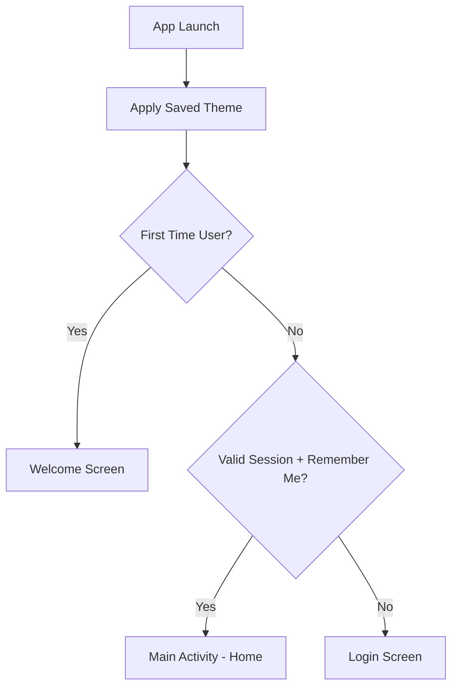
```mermaid
flowchart TD
    A[App Launch] --> B[Apply Saved Theme]
    B --> C{First Time User?}
    C -->|Yes| D[Welcome Screen]
    C -->|No| E{Valid Session + Remember Me?}
    E -->|Yes| F[Main Activity - Home]
    E -->|No| G[Login Screen]
```

**Related App Screens:**
- Welcome Activity (first-time users)
- Login Activity (returning users without session)
- Main Activity (users with valid session)

**Screenshot Description:**
- `splash_screen.png`: App logo centered on branded background with loading indicator

---

### 1.2 Onboarding Flow

**Name:** Onboarding / Welcome Flow  
**Short Description:** A multi-slide introduction for first-time users explaining app features, followed by navigation to registration or login.

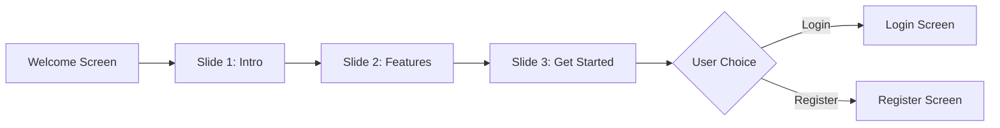
```mermaid
flowchart LR
    A[Welcome Screen] --> B[Slide 1: Intro]
    B --> C[Slide 2: Features]
    C --> D[Slide 3: Get Started]
    D --> E{User Choice}
    E -->|Login| F[Login Screen]
    E -->|Register| G[Register Screen]
```

**Related App Screens:**
- Welcome Activity
- Slide Activity
- Login Activity
- Register Activity

**Screenshot Descriptions:**
- `onboarding_welcome.png`: Welcome screen with app introduction and Get Started button
- `onboarding_slide_1.png`: First slide explaining community features
- `onboarding_slide_2.png`: Second slide explaining post and discussions
- `onboarding_slide_3.png`: Final slide with login/register options

---

### 1.3 User Registration

**Name:** User Registration  
**Short Description:** New user registration with email validation, password requirements, role selection (Student/Teacher), and OTP email verification.

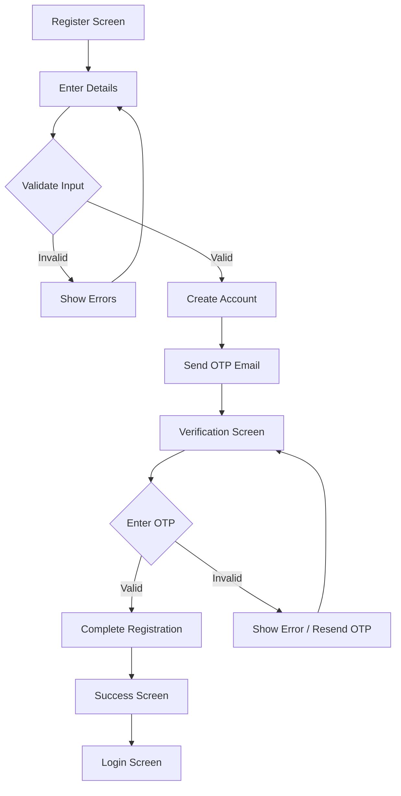
```mermaid
flowchart TD
    A[Register Screen] --> B[Enter Details]
    B --> C{Validate Input}
    C -->|Invalid| D[Show Errors]
    D --> B
    C -->|Valid| E[Create Account]
    E --> F[Send OTP Email]
    
    F --> G[Verification Screen]
    G --> H{Enter OTP}
    H -->|Valid| I[Complete Registration]
    I --> J[Success Screen]
    J --> K[Login Screen]
    
    H -->|Invalid| L[Show Error / Resend OTP]
    L --> G
```

**Related App Screens:**
- Register Activity
- Verification Activity
- Success Activity
- Login Activity

**Screenshot Descriptions:**
- `register_form.png`: Registration form with email, password, full name, and role selection
- `register_validation.png`: Form with validation error messages displayed
- `otp_verification.png`: OTP code entry screen with 6-digit input fields
- `registration_success.png`: Success screen with confirmation message and proceed button

---

### 1.4 User Login

**Name:** User Login  
**Short Description:** Authentication screen with email/password login, "Remember Me" functionality for persistent sessions, and forgot password navigation.

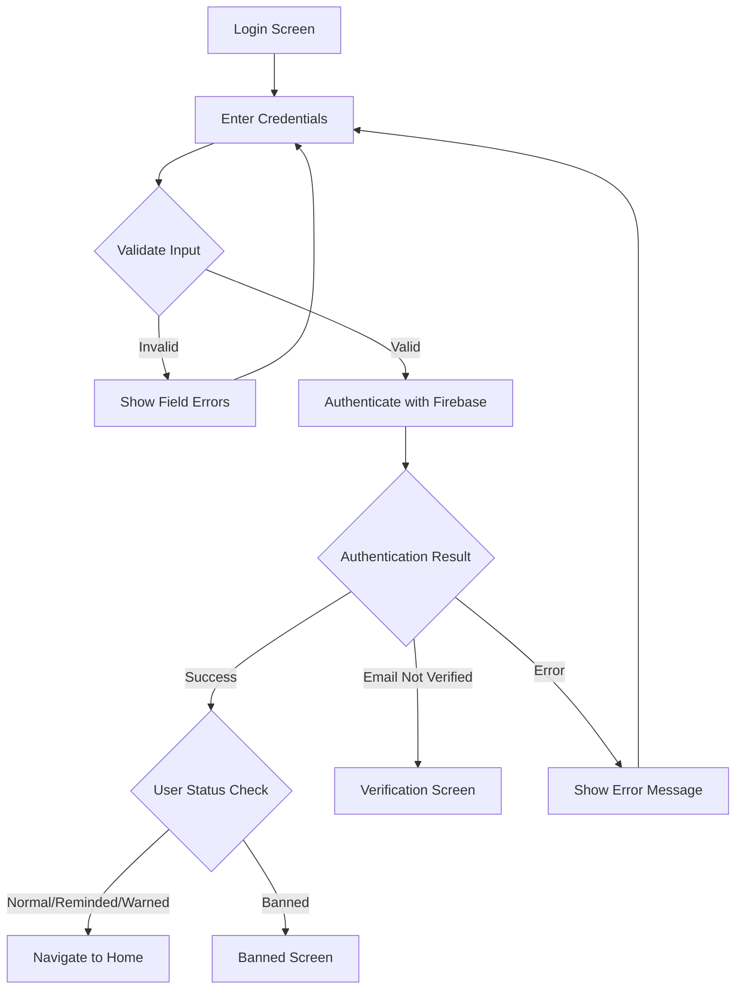
```mermaid
flowchart TD
    A[Login Screen] --> B[Enter Credentials]
    B --> C{Validate Input}
    C -->|Invalid| D[Show Field Errors]
    D --> B
    C -->|Valid| E[Authenticate with Firebase]
    E --> F{Authentication Result}
    F -->|Success| G{User Status Check}
    G -->|Normal/Reminded/Warned| H[Navigate to Home]
    G -->|Banned| I[Banned Screen]
    F -->|Email Not Verified| J[Verification Screen]
    F -->|Error| K[Show Error Message]
    K --> B
```

**Related App Screens:**
- Login Activity
- Main Activity (Home)
- Banned Activity
- Verification Activity
- Forgot Password Activity

**Screenshot Descriptions:**
- `login_screen.png`: Login form with email, password fields, Remember Me checkbox
- `login_error.png`: Login screen showing authentication error
- `banned_screen.png`: Screen displayed for banned users with ban reason

---

### 1.5 Forgot Password

**Name:** Forgot Password  
**Short Description:** Password recovery flow using email verification and OTP-based reset mechanism.

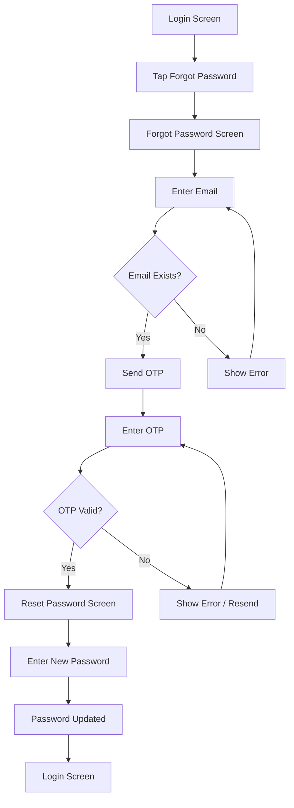
```mermaid
flowchart TD
    A[Login Screen] --> B[Tap Forgot Password]
    B --> C[Forgot Password Screen]
    C --> D[Enter Email]
    D --> E{Email Exists?}
    E -->|Yes| F[Send OTP]
    F --> G[Enter OTP]
    G --> H{OTP Valid?}
    H -->|Yes| I[Reset Password Screen]
    I --> J[Enter New Password]
    J --> K[Password Updated]
    K --> L[Login Screen]
    H -->|No| M[Show Error / Resend]
    M --> G
    E -->|No| N[Show Error]
    N --> D
```

**Related App Screens:**
- Forgot Password Activity
- Reset Password Activity
- Login Activity

**Screenshot Descriptions:**
- `forgot_password.png`: Email entry screen for password recovery
- `reset_password.png`: New password entry screen with confirmation field

---

## Phase 2: Home Feed & Post Features

### 2.1 Home Feed

**Name:** Home Feed  
**Short Description:** Main feed displaying approved posts with infinite scrolling, pull-to-refresh, topic filtering via drawer menu, and quick access to create posts.

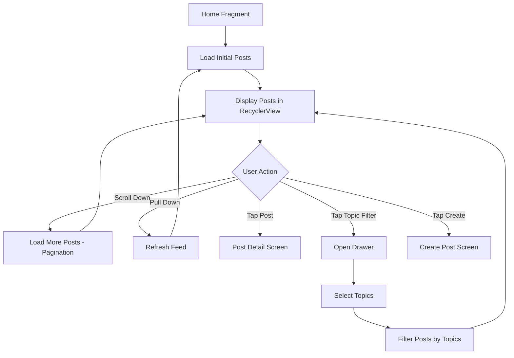
```mermaid
flowchart TD
    A[Home Fragment] --> B[Load Initial Posts]
    B --> C[Display Posts in RecyclerView]
    C --> D{User Action}
    D -->|Scroll Down| E[Load More Posts - Pagination]
    E --> C
    D -->|Pull Down| F[Refresh Feed]
    F --> B
    D -->|Tap Post| G[Post Detail Screen]
    D -->|Tap Topic Filter| H[Open Drawer]
    H --> I[Select Topics]
    I --> J[Filter Posts by Topics]
    J --> C
    D -->|Tap Create| K[Create Post Screen]
```

**Related App Screens:**
- Home Fragment
- Post Detail Fragment
- Create Post Fragment
- Settings Fragment
- Profile Fragment
- Search Fragment

**Screenshot Descriptions:**
- `home_feed.png`: Main feed showing list of posts with author info, content preview, vote counts
- `home_feed_loading.png`: Feed with loading indicator while fetching more posts
- `drawer_topics.png`: Side drawer showing topic filter options with selection checkboxes
- `home_empty.png`: Empty state when no posts match selected filters

---

### 2.2 Post Item Display

**Name:** Post Card  
**Short Description:** Individual post card displaying author information (avatar, name, role badge), creation timestamp, title, content with media (images/videos), topics, location, vote/comment counts, and action buttons.

**Related App Screens:**
- Home Fragment
- Profile Fragment
- Saved Posts Fragment
- Post Detail Fragment

**Screenshot Descriptions:**
- `post_card_text.png`: Text-only post with title, content, author info, and engagement stats
- `post_card_with_images.png`: Post with image gallery showing 1-4 images
- `post_card_with_video.png`: Post with video thumbnail and play indicator
- `post_card_with_location.png`: Post showing location tag with map preview option

---

### 2.3 Post Voting System

**Name:** Upvote/Downvote System  
**Short Description:** Reddit-style voting mechanism allowing users to upvote or downvote posts and comments with real-time count updates.

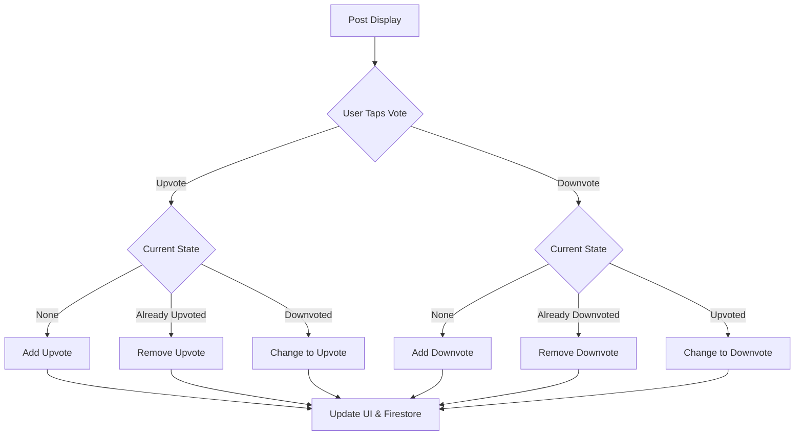
```mermaid
flowchart TD
    A[Post Display] --> B{User Taps Vote}
    B -->|Upvote| C{Current State}
    B -->|Downvote| D{Current State}
    C -->|None| E[Add Upvote]
    C -->|Already Upvoted| F[Remove Upvote]
    C -->|Downvoted| G[Change to Upvote]
    D -->|None| H[Add Downvote]
    D -->|Already Downvoted| I[Remove Downvote]
    D -->|Upvoted| J[Change to Downvote]
    E --> K[Update UI & Firestore]
    F --> K
    G --> K
    H --> K
    I --> K
    J --> K
```

**Related App Screens:**
- Home Fragment
- Post Detail Fragment
- Profile Fragment

**Screenshot Descriptions:**
- `voting_neutral.png`: Post with no user vote showing default vote buttons
- `voting_upvoted.png`: Post showing highlighted upvote state with increased count
- `voting_downvoted.png`: Post showing highlighted downvote state

---

### 2.4 Create Post

**Name:** Create Post  
**Short Description:** Full-featured post creation with title, content, multi-media attachments (images/videos), topic selection with AI suggestions, location tagging with Google Places integration, and auto-save draft functionality.

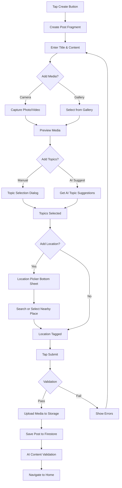
```mermaid
flowchart TD
    A[Tap Create Button] --> B[Create Post Fragment]
    B --> C[Enter Title & Content]
    C --> D{Add Media?}
    D -->|Camera| E[Capture Photo/Video]
    D -->|Gallery| F[Select from Gallery]
    E --> G[Preview Media]
    F --> G
    G --> H{Add Topics?}
    H -->|Manual| I[Topic Selection Dialog]
    H -->|AI Suggest| J[Get AI Topic Suggestions]
    I --> K[Topics Selected]
    J --> K
    K --> L{Add Location?}
    L -->|Yes| M[Location Picker Bottom Sheet]
    M --> N[Search or Select Nearby Place]
    N --> O[Location Tagged]
    L -->|No| O
    O --> P[Tap Submit]
    P --> Q{Validation}
    Q -->|Pass| R[Upload Media to Storage]
    R --> S[Save Post to Firestore]
    S --> T[AI Content Validation]
    T --> U[Navigate to Home]
    Q -->|Fail| V[Show Errors]
    V --> C
```

**Related App Screens:**
- Create Post Fragment
- Location Picker Bottom Sheet
- Topic Selection Dialog
- Home Fragment

**Screenshot Descriptions:**
- `create_post_empty.png`: Empty post creation form with all input fields
- `create_post_with_content.png`: Form filled with title, content, and attached media
- `create_post_topic_selection.png`: Topic selection dialog with checkbox list
- `create_post_ai_topics.png`: AI-suggested topics displayed as chips
- `create_post_location_picker.png`: Bottom sheet with location search and nearby places
- `create_post_map_preview.png`: Map preview dialog showing selected location

---

### 2.5 Post Detail & Comments

**Name:** Post Detail with Comments  
**Short Description:** Full post view with complete content, media viewer, and threaded comment system supporting replies, voting, and nested discussions.

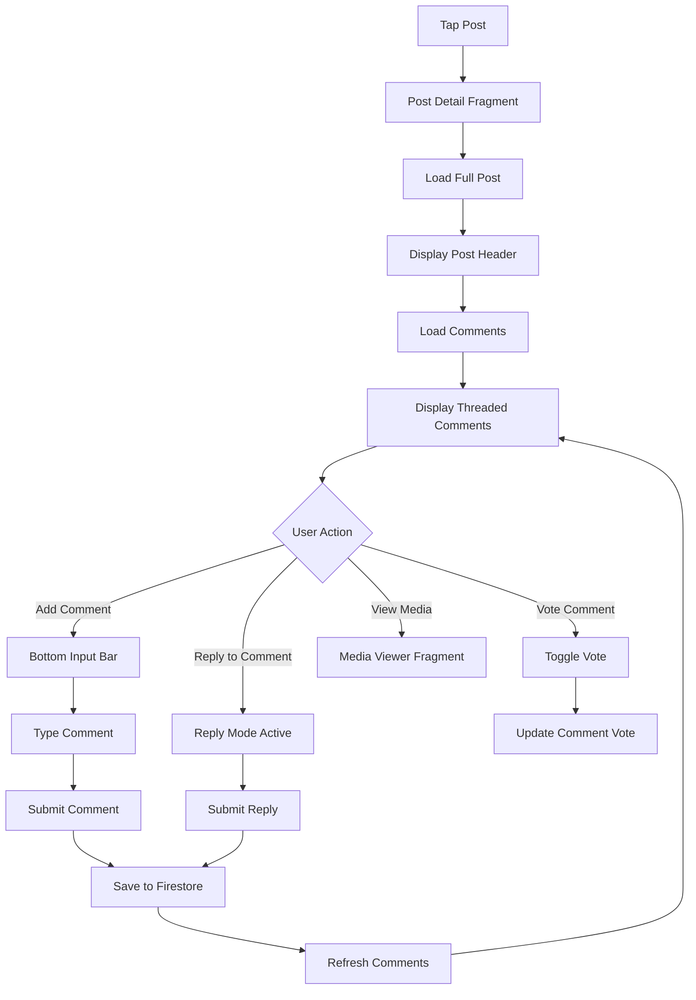
```mermaid
flowchart TD
    A[Tap Post] --> B[Post Detail Fragment]
    B --> C[Load Full Post]
    C --> D[Display Post Header]
    D --> E[Load Comments]
    E --> F[Display Threaded Comments]
    F --> G{User Action}
    G -->|Add Comment| H[Bottom Input Bar]
    H --> I[Type Comment]
    I --> J[Submit Comment]
    J --> K[Save to Firestore]
    K --> L[Refresh Comments]
    L --> F
    G -->|Reply to Comment| M[Reply Mode Active]
    M --> N[Submit Reply]
    N --> K
    G -->|Vote Comment| O[Toggle Vote]
    O --> P[Update Comment Vote]
    G -->|View Media| Q[Media Viewer Fragment]
```

**Related App Screens:**
- Post Detail Fragment
- Media Viewer Fragment
- Profile Fragment (tap author)

**Screenshot Descriptions:**
- `post_detail_full.png`: Complete post view with all content and media
- `post_detail_comments.png`: Comment section showing threaded discussions
- `post_detail_reply.png`: Reply mode active with reply-to indicator
- `post_detail_input.png`: Bottom input bar focused for comment entry

---

### 2.6 AI Post Summary

**Name:** AI Post Summary  
**Short Description:** AI-powered feature that generates concise summaries of post content and comments, accessible via the post menu.

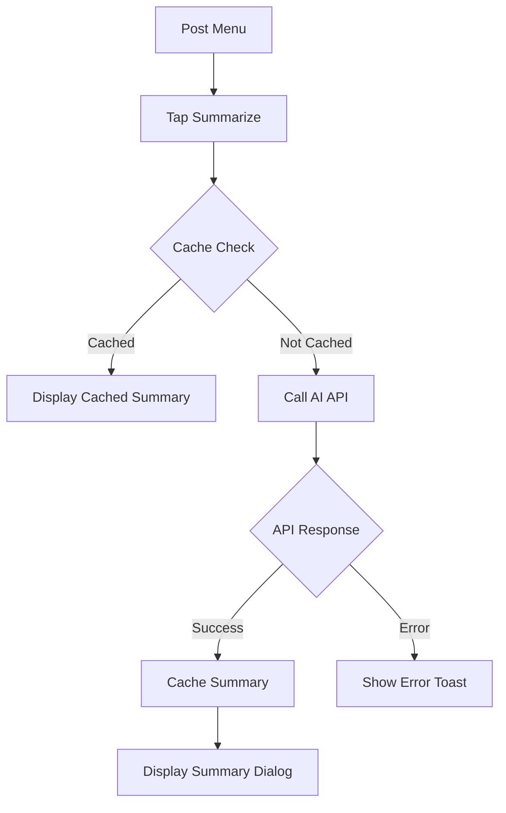
```mermaid
flowchart TD
    A[Post Menu] --> B[Tap Summarize]
    B --> C{Cache Check}
    C -->|Cached| D[Display Cached Summary]
    C -->|Not Cached| E[Call AI API]
    E --> F{API Response}
    F -->|Success| G[Cache Summary]
    G --> H[Display Summary Dialog]
    F -->|Error| I[Show Error Toast]
```

**Related App Screens:**
- Home Fragment
- Post Detail Fragment

**Screenshot Descriptions:**
- `post_menu_summarize.png`: Post context menu showing Summarize option
- `summary_loading.png`: Loading indicator while generating summary
- `summary_dialog.png`: Bottom sheet dialog displaying AI-generated summary

---

### 2.7 Save Posts

**Name:** Save Posts  
**Short Description:** Bookmark feature allowing users to save posts for later access, viewable from the Settings screen.

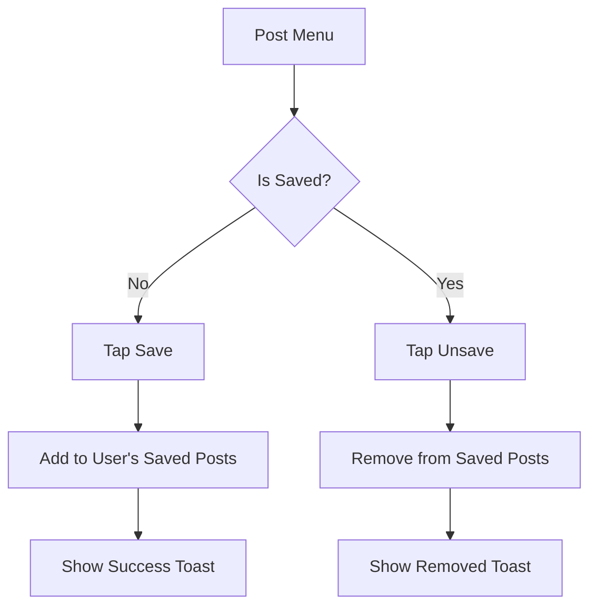
```mermaid
flowchart TD
    A[Post Menu] --> B{Is Saved?}
    B -->|No| C[Tap Save]
    C --> D[Add to User's Saved Posts]
    D --> E[Show Success Toast]
    B -->|Yes| F[Tap Unsave]
    F --> G[Remove from Saved Posts]
    G --> H[Show Removed Toast]
```

**Related App Screens:**
- Home Fragment (save action)
- Post Detail Fragment (save action)
- Saved Posts Fragment (view saved)
- Settings Fragment (navigate to saved)

**Screenshot Descriptions:**
- `save_post_option.png`: Post menu with Save/Unsave option
- `saved_posts_list.png`: Saved posts screen showing bookmarked posts
- `saved_posts_empty.png`: Empty state when no posts are saved

---

### 2.8 Report Post

**Name:** Report Post  
**Short Description:** Content moderation feature allowing users to report posts that violate community guidelines, with violation category selection.

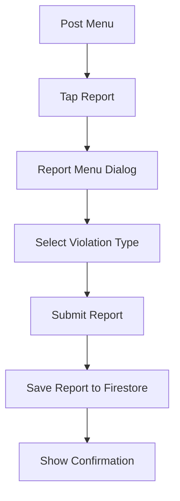
```mermaid
flowchart TD
    A[Post Menu] --> B[Tap Report]
    B --> C[Report Menu Dialog]
    C --> D[Select Violation Type]
    D --> E[Submit Report]
    E --> F[Save Report to Firestore]
    F --> G[Show Confirmation]
```

**Related App Screens:**
- Home Fragment
- Post Detail Fragment
- Profile Fragment

**Screenshot Descriptions:**
- `report_menu.png`: Report dialog with violation category options
- `report_confirmation.png`: Confirmation toast after successful report

---

### 2.9 Share Post

**Name:** Share Post  
**Short Description:** Share posts with other users via direct messages. Generates a shareable link that recipients can tap to view the post.

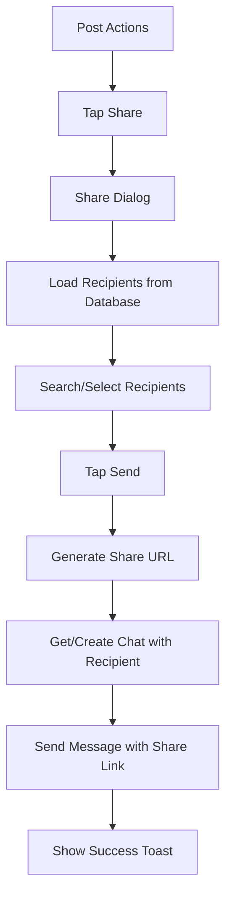
```mermaid
flowchart TD
    A[Post Actions] --> B[Tap Share]
    B --> C[Share Dialog]
    C --> D[Load Recipients from Database]
    D --> E[Search/Select Recipients]
    E --> F[Tap Send]
    F --> G[Generate Share URL]
    G --> H[Get/Create Chat with Recipient]
    H --> I[Send Message with Share Link]
    I --> J[Show Success Toast]
```

**Related App Screens:**
- Home Fragment
- Post Detail Fragment
- Share Post Dialog
- Conversation Fragment (receiver side)

**Screenshot Descriptions:**
- `share_dialog.png`: Share dialog with recipient search and selection
- `share_recipient_selected.png`: Dialog with selected recipients highlighted
- `share_in_chat.png`: Chat message showing shared post preview

---

## Phase 3: Search & Discovery Features

### 3.1 Universal Search

**Name:** Universal Search  
**Short Description:** Unified search functionality to find posts and users with tabbed interface, search history, and filter suggestions.

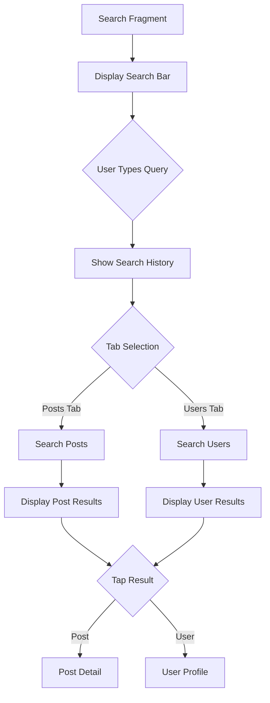
```mermaid
flowchart TD
    A[Search Fragment] --> B[Display Search Bar]
    B --> C{User Types Query}
    C --> D[Show Search History]
    D --> E{Tab Selection}
    E -->|Posts Tab| F[Search Posts]
    E -->|Users Tab| G[Search Users]
    F --> H[Display Post Results]
    G --> I[Display User Results]
    H --> J{Tap Result}
    I --> J
    J -->|Post| K[Post Detail]
    J -->|User| L[User Profile]
```

**Related App Screens:**
- Search Fragment
- Post Detail Fragment
- Profile Fragment

**Screenshot Descriptions:**
- `search_empty.png`: Search screen with empty state and search history
- `search_posts_results.png`: Search results showing matching posts
- `search_users_results.png`: Search results showing matching users
- `search_no_results.png`: Empty results state with no matches message

---

### 3.2 Topic Filtering

**Name:** Topic Filtering  
**Short Description:** Filter posts by topics using the drawer menu with multi-select capability and trending topics display.

**Related App Screens:**
- Home Fragment
- Drawer Menu

**Screenshot Descriptions:**
- `topic_filter_drawer.png`: Drawer showing all available topics with icons
- `topic_selected.png`: Drawer with selected topics highlighted
- `filtered_feed.png`: Home feed showing only posts from selected topics

---

## Phase 4: Profile & User Features

### 4.1 User Profile

**Name:** User Profile  
**Short Description:** Profile screen displaying user information (avatar, name, email, role, status), with tabs to view user's posts and replies/comments.

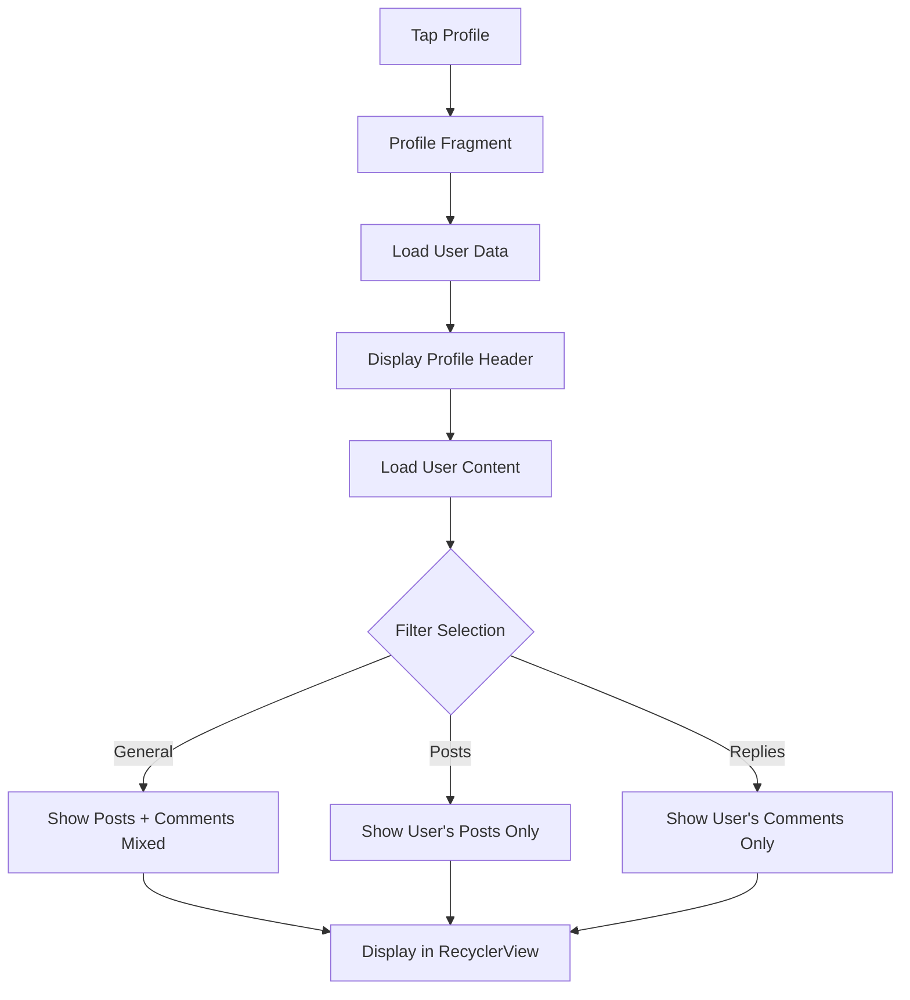
```mermaid
flowchart TD
    A[Tap Profile] --> B[Profile Fragment]
    B --> C[Load User Data]
    C --> D[Display Profile Header]
    D --> E[Load User Content]
    E --> F{Filter Selection}
    F -->|General| G[Show Posts + Comments Mixed]
    F -->|Posts| H[Show User's Posts Only]
    F -->|Replies| I[Show User's Comments Only]
    G --> J[Display in RecyclerView]
    H --> J
    I --> J
```

**Related App Screens:**
- Profile Fragment
- Post Detail Fragment
- Settings Fragment (own profile)

**Screenshot Descriptions:**
- `profile_own.png`: Current user's profile with edit options visible
- `profile_other.png`: Another user's profile view
- `profile_posts_tab.png`: Profile showing posts filter active
- `profile_replies_tab.png`: Profile showing replies/comments filter active

---

### 4.2 Edit Profile

**Name:** Edit Profile  
**Short Description:** Profile editing screen allowing users to update their display name and profile picture.

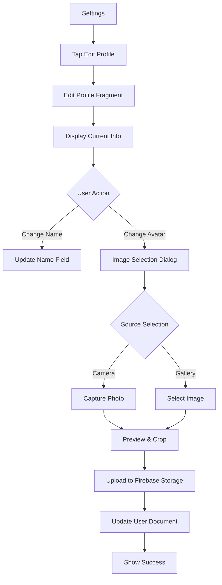
```mermaid
flowchart TD
    A[Settings] --> B[Tap Edit Profile]
    B --> C[Edit Profile Fragment]
    C --> D[Display Current Info]
    D --> E{User Action}
    E -->|Change Name| F[Update Name Field]
    E -->|Change Avatar| G[Image Selection Dialog]
    G --> H{Source Selection}
    H -->|Camera| I[Capture Photo]
    H -->|Gallery| J[Select Image]
    I --> K[Preview & Crop]
    J --> K
    K --> L[Upload to Firebase Storage]
    L --> M[Update User Document]
    M --> N[Show Success]
```

**Related App Screens:**
- Settings Fragment
- Edit Profile Fragment

**Screenshot Descriptions:**
- `edit_profile.png`: Edit profile form with current avatar and name
- `edit_profile_avatar_dialog.png`: Dialog for selecting avatar source (camera/gallery)
- `edit_profile_saving.png`: Loading state while saving changes

---

## Phase 5: Messaging & Chat Features

### 5.1 Chat List

**Name:** Chat List  
**Short Description:** List of all user conversations with real-time updates, displaying last message preview, timestamp, and unread indicator.

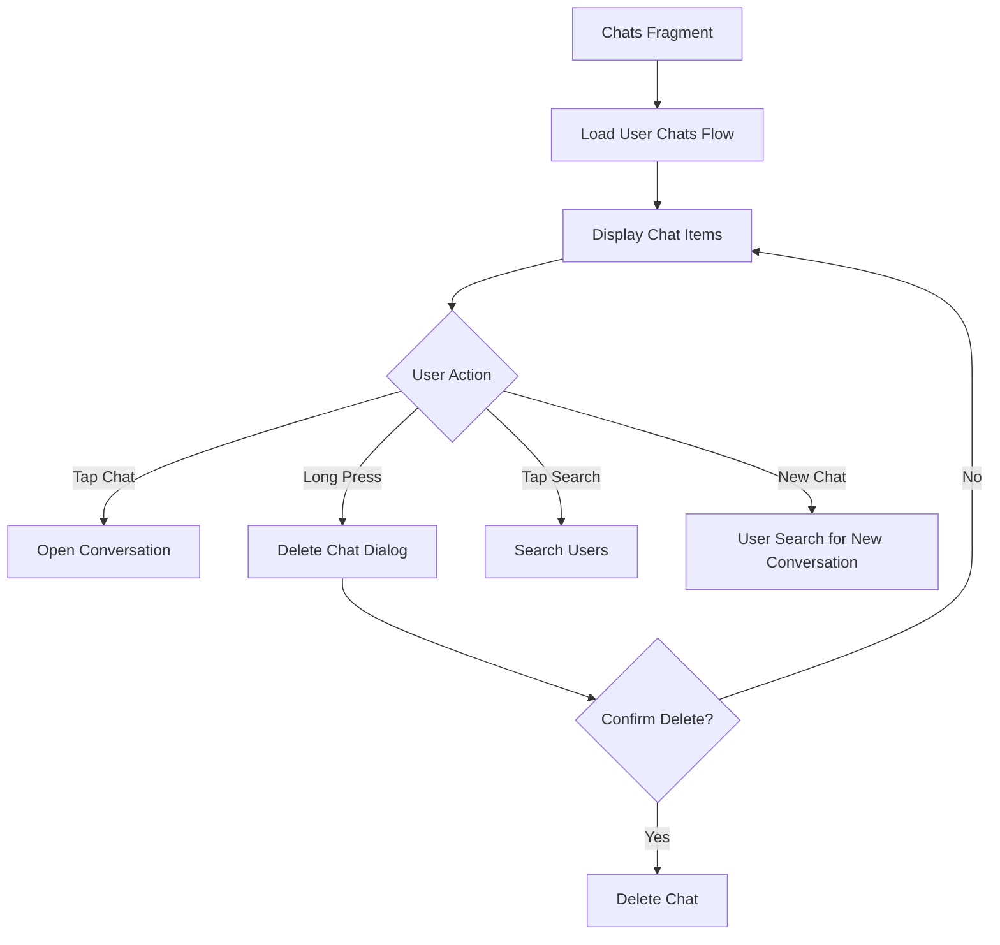
```mermaid
flowchart TD
    A[Chats Fragment] --> B[Load User Chats Flow]
    B --> C[Display Chat Items]
    C --> D{User Action}
    D -->|Tap Chat| E[Open Conversation]
    D -->|Long Press| F[Delete Chat Dialog]
    D -->|Tap Search| G[Search Users]
    D -->|New Chat| H[User Search for New Conversation]
    F --> I{Confirm Delete?}
    I -->|Yes| J[Delete Chat]
    I -->|No| C
```

**Related App Screens:**
- Chats Fragment
- Conversation Fragment
- User Search (within Chats)

**Screenshot Descriptions:**
- `chat_list.png`: List of conversations with last message previews
- `chat_list_unread.png`: Chat list showing unread indicators
- `chat_delete_dialog.png`: Confirmation dialog for chat deletion
- `chat_list_empty.png`: Empty state when user has no conversations

---

### 5.2 Conversation / Direct Messaging

**Name:** Conversation Screen  
**Short Description:** Real-time messaging interface supporting text messages, image attachments (up to 5 per message), message deletion, and shared post preview rendering.

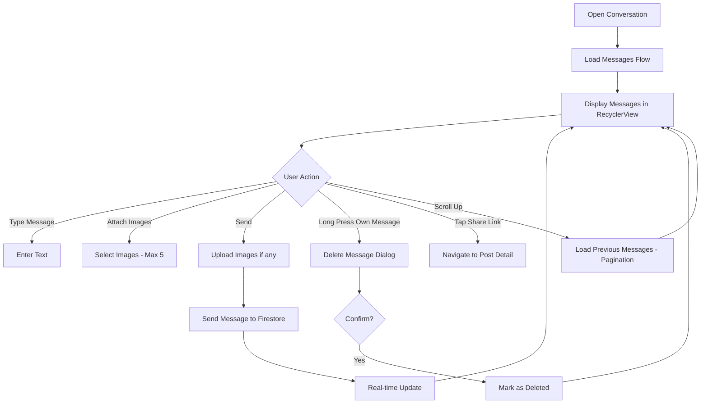
```mermaid
flowchart TD
    A[Open Conversation] --> B[Load Messages Flow]
    B --> C[Display Messages in RecyclerView]
    C --> D{User Action}
    D -->|Type Message| E[Enter Text]
    D -->|Attach Images| F[Select Images - Max 5]
    D -->|Send| G[Upload Images if any]
    G --> H[Send Message to Firestore]
    H --> I[Real-time Update]
    I --> C
    D -->|Long Press Own Message| J[Delete Message Dialog]
    J --> K{Confirm?}
    K -->|Yes| L[Mark as Deleted]
    L --> C
    D -->|Tap Share Link| M[Navigate to Post Detail]
    D -->|Scroll Up| N[Load Previous Messages - Pagination]
    N --> C
```

**Related App Screens:**
- Conversation Fragment
- Image Selection Dialog
- Post Detail Fragment (from shared link)
- Media Viewer Fragment

**Screenshot Descriptions:**
- `conversation.png`: Chat conversation showing sent and received messages
- `conversation_images.png`: Messages with image attachments
- `conversation_image_preview.png`: Image preview before sending
- `conversation_shared_post.png`: Message containing shared post preview card
- `conversation_delete_dialog.png`: Delete message confirmation
- `conversation_deleted.png`: Deleted message placeholder

---

### 5.3 Push Notifications

**Name:** Push Notifications  
**Short Description:** Firebase Cloud Messaging integration for real-time notifications on new messages, comments, votes, and post status updates.

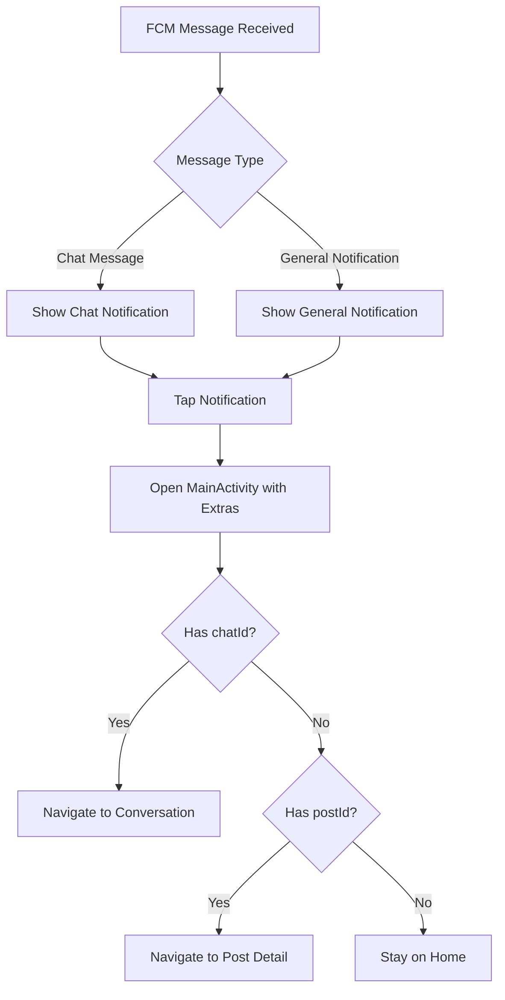
```mermaid
flowchart TD
    A[FCM Message Received] --> B{Message Type}
    B -->|Chat Message| C[Show Chat Notification]
    B -->|General Notification| D[Show General Notification]
    C --> E[Tap Notification]
    D --> E
    E --> F[Open MainActivity with Extras]
    F --> G{Has chatId?}
    G -->|Yes| H[Navigate to Conversation]
    G -->|No| I{Has postId?}
    I -->|Yes| J[Navigate to Post Detail]
    I -->|No| K[Stay on Home]
```

**Related App Screens:**
- System Notification Tray
- Conversation Fragment
- Post Detail Fragment

**Screenshot Descriptions:**
- `notification_chat.png`: System notification for new chat message
- `notification_post.png`: System notification for post activity (comment, vote)

---

## Phase 6: Notifications & Alerts Features

### 6.1 In-App Notifications

**Name:** Notification Center  
**Short Description:** Centralized notification screen displaying upvotes, comments, replies, post status updates (approved/rejected), with read/unread status and mark-all-as-read functionality.

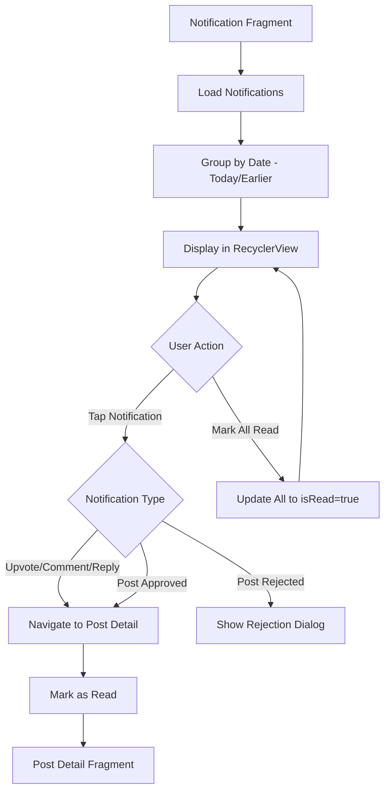
```mermaid
flowchart TD
    A[Notification Fragment] --> B[Load Notifications]
    B --> C[Group by Date - Today/Earlier]
    C --> D[Display in RecyclerView]
    D --> E{User Action}
    E -->|Tap Notification| F{Notification Type}
    F -->|Upvote/Comment/Reply| G[Navigate to Post Detail]
    F -->|Post Rejected| H[Show Rejection Dialog]
    F -->|Post Approved| G
    E -->|Mark All Read| I[Update All to isRead=true]
    I --> D
    G --> J[Mark as Read]
    J --> K[Post Detail Fragment]
```

**Related App Screens:**
- Notification Fragment
- Post Detail Fragment
- Rejection Reason Dialog

**Screenshot Descriptions:**
- `notifications_list.png`: Notification list with various notification types
- `notifications_unread.png`: Notifications with unread indicators
- `notification_rejection_dialog.png`: Dialog showing post rejection reason
- `notifications_empty.png`: Empty state when no notifications

---

## Phase 7: Settings & Preferences Features

### 7.1 Settings Screen

**Name:** Settings  
**Short Description:** Central settings hub with user profile card, preference toggles (dark mode, notifications), and navigation to various app sections.

**Related App Screens:**
- Settings Fragment
- Edit Profile Fragment
- Saved Posts Fragment
- Help Center Fragment
- Community Guidelines Fragment
- About Fragment

**Screenshot Descriptions:**
- `settings_main.png`: Main settings screen with all options visible
- `settings_dark_mode.png`: Settings with dark mode toggle enabled

---

### 7.2 Dark Mode / Theme Switching

**Name:** Dark Mode  
**Short Description:** Theme switching capability with dark/light mode toggle, persisted preferences, and immediate application without app restart.

```mermaid
flowchart TD
    A[Settings] --> B[Toggle Dark Mode Switch]
    B --> C[Save Preference to SharedPreferences]
    C --> D[Apply AppCompatDelegate Mode]
    D --> E[Update Status Bar Appearance]
    E --> F[UI Refreshes with New Theme]
```

**Related App Screens:**
- Settings Fragment
- All screens (theme applies globally)

**Screenshot Descriptions:**
- `light_mode_home.png`: Home feed in light theme
- `dark_mode_home.png`: Home feed in dark theme
- `dark_mode_settings.png`: Settings screen in dark theme

---

### 7.3 Notification Preferences

**Name:** Notification Preferences  
**Short Description:** Toggle controls for push notifications and email notifications with persisted preferences.

**Related App Screens:**
- Settings Fragment

**Screenshot Descriptions:**
- `notification_settings.png`: Notification toggles section in settings

---

### 7.4 Help Center

**Name:** Help Center  
**Short Description:** FAQ and help topics section with expandable categories for user assistance.

**Related App Screens:**
- Help Center Fragment

**Screenshot Descriptions:**
- `help_center.png`: Help center with expandable FAQ sections

---

### 7.5 Community Guidelines

**Name:** Community Guidelines  
**Short Description:** Display of community rules and content policies for user reference.

**Related App Screens:**
- Community Guidelines Fragment

**Screenshot Descriptions:**
- `community_guidelines.png`: Guidelines screen with policy sections

---

### 7.6 About Forumus

**Name:** About  
**Short Description:** App information screen displaying version, development team credits, and app description.

**Related App Screens:**
- About Fragment

**Screenshot Descriptions:**
- `about_screen.png`: About screen with app info and credits

---

## Phase 8: Media & Content Features

### 8.1 Media Viewer

**Name:** Fullscreen Media Viewer  
**Short Description:** Full-screen image/video viewer with swipe gestures for navigation, zoom functionality, and pager-style interface for multiple media items.

```mermaid
flowchart TD
    A[Tap Media in Post/Message] --> B[Media Viewer Fragment]
    B --> C[Display Media at Position]
    C --> D{User Gesture}
    D -->|Swipe Left/Right| E[Navigate to Next/Previous]
    D -->|Pinch Zoom| F[Zoom Image]
    D -->|Tap| G[Toggle UI Visibility]
    D -->|Back| H[Close Viewer]
```

**Related App Screens:**
- Media Viewer Fragment
- Post Detail Fragment (source)
- Conversation Fragment (source)

**Screenshot Descriptions:**
- `media_viewer_image.png`: Fullscreen image view
- `media_viewer_multiple.png`: Media viewer showing pagination dots
- `media_viewer_zoomed.png`: Image in zoomed state

---

### 8.2 Fullscreen Image Activity

**Name:** Fullscreen Image  
**Short Description:** Dedicated activity for viewing images in fullscreen from chat conversations with swipe navigation.

**Related App Screens:**
- Fullscreen Image Activity
- Conversation Fragment (source)

**Screenshot Descriptions:**
- `fullscreen_image.png`: Single image in fullscreen mode

---

## Phase 9: Background & System Features

### 9.1 WorkManager Message Queue

**Name:** Offline Message Queue  
**Short Description:** Background worker ensuring messages are sent reliably, queuing messages when offline and processing when connection is restored.

```mermaid
flowchart TD
    A[Send Message Action] --> B{Network Available?}
    B -->|Yes| C[Send Immediately]
    B -->|No| D[Queue with WorkManager]
    D --> E[SendMessageWorker]
    E --> F{Retry Logic}
    F -->|Success| G[Message Sent]
    F -->|Fail| H[Retry with Backoff]
    H --> F
```

**Related App Screens:**
- Conversation Fragment (transparent to user)

**Screenshot Descriptions:**
- `message_pending.png`: Message showing pending/sending indicator

---

### 9.2 Session Management

**Name:** Session Management  
**Short Description:** Token-based session management with auto-login, session expiry handling, and secure credential storage.

```mermaid
flowchart TD
    A[App Launch] --> B{Valid Session Token?}
    B -->|Yes| C{Remember Me Enabled?}
    C -->|Yes| D{Session Expired?}
    D -->|No| E[Auto Login - Go to Home]
    D -->|Yes| F[Clear Session - Go to Login]
    C -->|No| F
    B -->|No| F
```

**Related App Screens:**
- Splash Activity
- Login Activity
- All authenticated screens

**Screenshot Descriptions:**
- `session_expired.png`: Session expiry prompt

---

## Data Models Summary

| Model | Key Fields | Purpose |
|-------|------------|---------|
| **User** | uid, email, fullName, role (STUDENT/TEACHER/ADMIN), profilePictureUrl, status (NORMAL/REMINDED/WARNED/BANNED), fcmToken | User accounts |
| **Post** | id, authorId, title, content, imageUrls, videoUrls, topicIds, locationName, latitude, longitude, upvoteCount, downvoteCount, commentCount, status, votedUsers | Forum posts |
| **Comment** | id, postId, authorId, content, parentCommentId, replyToUserId, upvoteCount, downvoteCount, votedUsers | Post comments |
| **Message** | id, content, senderId, timestamp, type (TEXT/IMAGE/DELETED), imageUrls | Chat messages |
| **Notification** | id, type, actorId, actorName, targetId, previewText, isRead, rejectionReason | In-app notifications |
| **Topic** | id, name, description, icon, fillColor, postCount | Post categories |
| **Report** | id, postId, authorId, nameViolation, descriptionViolation | Content reports |

---

## API Endpoints (Backend Integration)

| Endpoint | Purpose |
|----------|---------|
| `/reset-password` | Password reset with secret key |
| `/get-suggested-topics` | AI-powered topic suggestions |
| `/send-otp-email` | OTP email delivery |
| `/send-welcome-email` | Welcome email after registration |
| `/notifications/trigger` | Trigger push notification |
| `/validate-post` | AI content validation |
| `/summarize-post` | AI post summarization |

---

## Phase 10: Advanced UI/UX Features

### 10.1 Expandable Post Content

**Name:** Expandable Post Content  
**Short Description:** Long post content is truncated with a "Show more..." indicator. Users can tap to expand/collapse the full content inline within the feed.

```mermaid
flowchart TD
    A[Post Content Rendered] --> B{Line Count > 4?}
    B -->|Yes| C[Show Truncated + 'Show more...']
    B -->|No| D[Show Full Content]
    C --> E{User Taps Content}
    E -->|Yes| F[Toggle Expansion State]
    F --> G{Is Expanded?}
    G -->|Yes| H[Show Full Content]
    G -->|No| C
```

**Related App Screens:**
- Home Fragment
- Profile Fragment
- Saved Posts Fragment

**Screenshot Descriptions:**
- `post_collapsed.png`: Post with truncated content and "Show more..." link
- `post_expanded.png`: Same post with full content visible

---

### 10.2 Role Badges

**Name:** User Role Badges  
**Short Description:** Visual indicators next to author names showing their role (Student, Teacher, Admin) with color-coded badges.

| Role | Color | Usage |
|------|-------|-------|
| Student | Blue | Default university members |
| Teacher | Green | Faculty members |
| Admin | Red | System administrators |

**Related App Screens:**
- All screens displaying user information (Posts, Comments, Profile, Chats)

**Screenshot Descriptions:**
- `role_badge_student.png`: Post author with blue Student badge
- `role_badge_teacher.png`: Post author with green Teacher badge
- `role_badge_admin.png`: Post author with red Admin badge

---

### 10.3 Dynamic Topic Tags

**Name:** Topic Tags with Custom Colors  
**Short Description:** Posts display colored topic tags based on the topic's configured fillColor and fillAlpha values from Firestore.

**Related App Screens:**
- Home Fragment
- Post Detail Fragment
- Profile Fragment

**Screenshot Descriptions:**
- `topic_tags_colorful.png`: Post with multiple colored topic tags
- `topic_tags_single.png`: Post with single topic tag

---

### 10.4 Pull-to-Refresh

**Name:** Swipe Refresh  
**Short Description:** Standard pull-to-refresh pattern implemented across all list screens for manual data refresh.

**Related App Screens:**
- Home Fragment
- Chats Fragment
- Notification Fragment
- Profile Fragment

**Screenshot Descriptions:**
- `pull_to_refresh.png`: Refresh indicator visible while refreshing

---

### 10.5 Infinite Scroll / Pagination

**Name:** Infinite Scroll Pagination  
**Short Description:** Lists automatically load more content when user scrolls near the bottom, implementing Firestore cursor-based pagination.

```mermaid
flowchart TD
    A[User Scrolls Down] --> B{Near Bottom of List?}
    B -->|Yes| C{Is Loading?}
    C -->|No| D[Set Loading = true]
    D --> E[Fetch Next Page with lastDocument]
    E --> F[Append to Existing List]
    F --> G[Set Loading = false]
    C -->|Yes| H[Skip - Already Loading]
    B -->|No| I[Continue Scrolling]
```

**Related App Screens:**
- Home Fragment
- Profile Fragment
- Conversation Fragment (load previous messages)

**Screenshot Descriptions:**
- `loading_more.png`: Loading indicator at bottom of list

---

## Phase 11: Location & Maps Features

### 11.1 Location Picker

**Name:** Location Picker Bottom Sheet  
**Short Description:** Google Places-powered bottom sheet for selecting nearby locations or searching for specific places when creating posts.

```mermaid
flowchart TD
    A[Tap Add Location] --> B[Location Picker Bottom Sheet]
    B --> C{Has Location Permission?}
    C -->|No| D[Request Permission]
    D --> E{Granted?}
    E -->|Yes| F[Fetch Nearby Places]
    E -->|No| G[Show Permission Error]
    C -->|Yes| F
    F --> H[Display Nearby Places List]
    H --> I{User Action}
    I -->|Select Place| J[Enable Add Button]
    J --> K[Tap Add Location]
    K --> L[Return Selected Place]
    I -->|Tap Search| M[Open Place Search]
    I -->|Tap Preview Map| N[Show Map Preview Dialog]
```

**Related App Screens:**
- Create Post Fragment
- Location Picker Bottom Sheet
- Map Preview Dialog

**Screenshot Descriptions:**
- `location_picker.png`: Bottom sheet with nearby places list
- `location_map_preview.png`: Dialog showing selected location on map with custom avatar marker
- `location_search.png`: Google Places Autocomplete search

---

### 11.2 Location Display on Posts

**Name:** Post Location Tag  
**Short Description:** Posts with location show a clickable location tag that opens Google Maps or shows coordinates.

```mermaid
flowchart TD
    A[Post with Location] --> B[Display Location Button]
    B --> C[User Taps Location]
    C --> D{Google Maps Installed?}
    D -->|Yes| E[Open Google Maps App]
    D -->|No| F[Open Maps in Browser]
    E --> G[Show Location with Marker]
    F --> G
```

**Related App Screens:**
- Home Fragment
- Post Detail Fragment

**Screenshot Descriptions:**
- `post_with_location_tag.png`: Post showing location tag
- `location_google_maps.png`: Location opened in Google Maps

---

### 11.3 Custom Map Markers

**Name:** Avatar Map Markers  
**Short Description:** Map previews display custom markers featuring the user's avatar in a pin frame design.

**Related App Screens:**
- Create Post Fragment (map preview)
- Location Picker Bottom Sheet

**Screenshot Descriptions:**
- `custom_avatar_marker.png`: Map showing custom marker with user avatar

---

## Phase 12: Background Processing Features

### 12.1 Message Upload Worker

**Name:** Background Message Worker  
**Short Description:** WorkManager-based background worker for reliable message sending with image uploads, including foreground service notification and completion status.

```mermaid
flowchart TD
    A[Send Message with Images] --> B[Create Work Request]
    B --> C[Enqueue to WorkManager]
    C --> D[Worker Starts]
    D --> E{Has Images?}
    E -->|Yes| F[Show Foreground Notification]
    F --> G[Upload Images to Firebase Storage]
    E -->|No| H[Send Message Directly]
    G --> I[Send Message with URLs]
    H --> J{Result}
    I --> J
    J -->|Success| K[Show Success Notification]
    J -->|Failure| L[Show Failure Notification]
    L --> M{Retry?}
    M -->|Yes| D
    M -->|No| N[Final Failure]
```

**Work Request Configuration:**
- Constraint: Network Required
- Retry Policy: Exponential backoff
- Foreground Service Type: Data Sync

**Related App Screens:**
- Conversation Fragment (triggers worker)
- System Notification (progress & result)

**Screenshot Descriptions:**
- `upload_progress_notification.png`: System notification showing upload progress
- `upload_success_notification.png`: Notification confirming successful send
- `upload_failure_notification.png`: Notification showing upload failure

---

### 12.2 Summary Cache Manager

**Name:** AI Summary Caching  
**Short Description:** Intelligent caching system for AI-generated summaries to reduce API calls and improve performance.

```mermaid
flowchart TD
    A[Request Summary] --> B{Cache Hit?}
    B -->|Yes| C{Cache Valid?}
    C -->|Yes| D[Return Cached Summary]
    C -->|No| E[Call AI API]
    B -->|No| E
    E --> F[Store in Cache]
    F --> G[Return Summary]
```

**Related App Screens:**
- Home Fragment
- Post Detail Fragment

**Screenshot Descriptions:**
- (Invisible to users - backend optimization)

---

## Phase 13: Data Layer Architecture

### 13.1 Repository Pattern

**Name:** Repository Architecture  
**Short Description:** Clean architecture with repositories abstracting Firebase operations from ViewModels.

| Repository | Purpose |
|------------|---------|
| `AuthRepository` | Authentication, registration, OTP verification, password reset |
| `PostRepository` | Post CRUD, voting, topics, AI interactions |
| `CommentRepository` | Comment CRUD, threaded replies, voting |
| `ChatRepository` | Real-time messaging, chat management |
| `UserRepository` | User profiles, search, saved posts |
| `NotificationRepository` | Notification management |
| `ReportRepository` | Content reporting |

---

### 13.2 Real-Time Data with Flows

**Name:** Kotlin Flow Integration  
**Short Description:** Chat messages and conversations use Kotlin Flows with Firestore snapshots for real-time updates.

```mermaid
flowchart LR
    A[Firestore] -->|Snapshot Listener| B[CallbackFlow]
    B -->|Emit Changes| C[ViewModel]
    C -->|LiveData/StateFlow| D[Fragment UI]
    D -->|Display Updates| E[RecyclerView]
```

**Related App Screens:**
- Chats Fragment (chat list updates)
- Conversation Fragment (message updates)

---

### 13.3 Local Storage

**Name:** Preferences & Token Management  
**Short Description:** SharedPreferences-based storage for user settings and session tokens.

| Storage Class | Data Stored |
|--------------|-------------|
| `PreferencesManager` | Dark mode, notifications, first-time flag, remember me |
| `TokenManager` | Session tokens, expiry times, user credentials (encrypted) |

---

## Phase 14: Security Features

### 14.1 Session Expiry

**Name:** Session Token Expiry  
**Short Description:** Configurable session timeout (default 7 days) with automatic logout on expiry.

**Related App Screens:**
- Splash Activity (session check)
- All authenticated screens

**Screenshot Descriptions:**
- `session_expired_dialog.png`: Dialog prompting re-login

---

### 14.2 User Status Enforcement

**Name:** Ban/Warning System  
**Short Description:** Users with status BANNED are redirected to a dedicated banned screen with violation reason.

| Status | Effect |
|--------|--------|
| NORMAL | Full access |
| REMINDED | Access with reminder shown |
| WARNED | Access with warning shown |
| BANNED | Blocked from app, shown ban reason |

```mermaid
flowchart TD
    A[Login Success] --> B{Check User Status}
    B -->|NORMAL| C[Navigate to Home]
    B -->|REMINDED/WARNED| D[Show Status Notification]
    D --> C
    B -->|BANNED| E[Navigate to Banned Screen]
    E --> F[Display Ban Reason]
    F --> G[Logout Option Only]
```

**Related App Screens:**
- Login Activity
- Banned Activity

**Screenshot Descriptions:**
- `banned_screen_full.png`: Full banned screen with violation details

---

### 14.3 Content Moderation

**Name:** Post Validation  
**Short Description:** AI-powered content validation before post publication to detect violations.

```mermaid
flowchart TD
    A[Submit Post] --> B[Upload Media]
    B --> C[Save Post as PENDING]
    C --> D[Call Validate Post API]
    D --> E{Validation Result}
    E -->|APPROVED| F[Update Status to APPROVED]
    F --> G[Visible in Feed]
    E -->|REJECTED| H[Update Status to REJECTED]
    H --> I[Notify User with Reason]
```

**Related App Screens:**
- Create Post Fragment
- Notification Fragment (rejection notification)

**Screenshot Descriptions:**
- `post_pending.png`: Post awaiting moderation
- `post_rejected_notification.png`: Notification showing rejection reason

---

## Implementation Technologies Summary

### Android Jetpack Components
- **ViewModel**: Screen state management with lifecycle awareness
- **LiveData**: Observable data holders for UI updates
- **Navigation Component**: Type-safe navigation with Safe Args
- **WorkManager**: Reliable background task execution
- **ViewBinding/DataBinding**: Type-safe view access

### Firebase Services
- **Firebase Auth**: Email/password authentication
- **Cloud Firestore**: Real-time NoSQL database
- **Firebase Storage**: Media file uploads
- **Firebase Cloud Messaging (FCM)**: Push notifications

### Third-Party Libraries
- **Retrofit + Moshi**: REST API communication with JSON parsing
- **OkHttp**: HTTP client with logging interceptor
- **Coil**: Modern image loading with coroutines
- **Glide**: Image loading for maps and advanced transformations
- **Google Maps SDK**: Map display and markers
- **Google Places API**: Location search and nearby places

---

## Screenshot Checklist

Here's a consolidated checklist of all screenshots to capture:

### Authentication (8 screenshots)
- [ ] `splash_screen.png`
- [ ] `onboarding_welcome.png`
- [ ] `onboarding_slide_1.png`, `onboarding_slide_2.png`, `onboarding_slide_3.png`
- [ ] `register_form.png`, `register_validation.png`
- [ ] `otp_verification.png`
- [ ] `registration_success.png`
- [ ] `login_screen.png`, `login_error.png`
- [ ] `forgot_password.png`, `reset_password.png`
- [ ] `banned_screen.png`

### Home & Posts (18 screenshots)
- [ ] `home_feed.png`, `home_feed_loading.png`, `home_empty.png`
- [ ] `drawer_topics.png`
- [ ] `post_card_text.png`, `post_card_with_images.png`, `post_card_with_video.png`
- [ ] `post_card_with_location.png`
- [ ] `post_collapsed.png`, `post_expanded.png`
- [ ] `voting_neutral.png`, `voting_upvoted.png`, `voting_downvoted.png`
- [ ] `create_post_empty.png`, `create_post_with_content.png`
- [ ] `create_post_topic_selection.png`, `create_post_ai_topics.png`
- [ ] `create_post_location_picker.png`, `create_post_map_preview.png`
- [ ] `post_detail_full.png`, `post_detail_comments.png`, `post_detail_reply.png`
- [ ] `summary_dialog.png`

### Search & Profile (8 screenshots)
- [ ] `search_empty.png`, `search_posts_results.png`, `search_users_results.png`
- [ ] `topic_filter_drawer.png`
- [ ] `profile_own.png`, `profile_other.png`
- [ ] `profile_posts_tab.png`, `profile_replies_tab.png`
- [ ] `edit_profile.png`

### Messaging (10 screenshots)
- [ ] `chat_list.png`, `chat_list_unread.png`, `chat_list_empty.png`
- [ ] `chat_delete_dialog.png`
- [ ] `conversation.png`, `conversation_images.png`
- [ ] `conversation_image_preview.png`
- [ ] `conversation_shared_post.png`
- [ ] `conversation_deleted.png`
- [ ] `share_dialog.png`, `share_recipient_selected.png`

### Notifications & Settings (8 screenshots)
- [ ] `notifications_list.png`, `notifications_empty.png`
- [ ] `notification_rejection_dialog.png`
- [ ] `settings_main.png`
- [ ] `light_mode_home.png`, `dark_mode_home.png`
- [ ] `help_center.png`
- [ ] `community_guidelines.png`
- [ ] `about_screen.png`

### Media & System (4 screenshots)
- [ ] `media_viewer_image.png`, `media_viewer_multiple.png`
- [ ] `upload_progress_notification.png`
- [ ] `notification_chat.png`

---

## Document Version

| Version | Date | Changes |
|---------|------|---------|
| 1.0 | January 2026 | Initial comprehensive documentation |

---

**End of Feature Documentation**
