# Forumus Cross-App Integration Flows

**Demonstrating End-to-End Workflows Across Client, Admin & Backend**

This document describes features that require coordination between multiple applications in the Forumus ecosystem to demonstrate complete functionality.

---

## System Overview

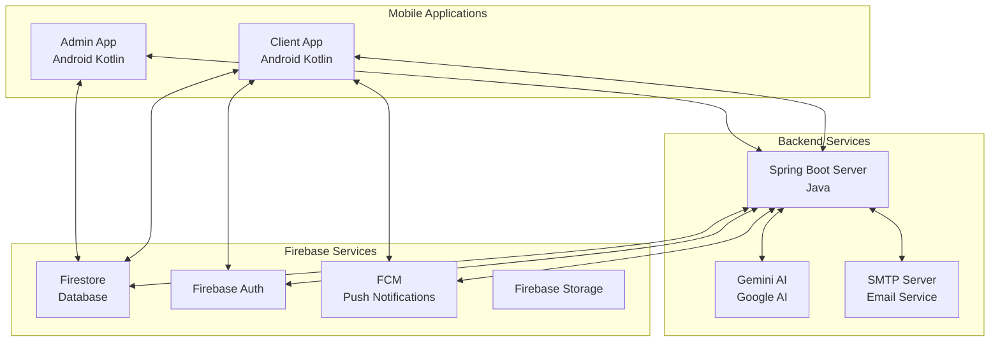

---

## Applications Reference

| App | Technology | Primary Role |
|-----|------------|--------------|
| **Client App** | Android Kotlin | End-user forum access (posts, chat, profile) |
| **Admin App** | Android Kotlin | Content moderation, user management, analytics |
| **Backend Server** | Spring Boot (Java) | AI processing, email delivery, push notifications |

---

## Sequential User Journey

The following flows are organized in the order a typical user would experience them.

# Phase 1: User Onboarding

## Flow 1: Registration with OTP Email Verification

**Apps Involved:** Client → Backend → Email → Client

**Description:**  
New user registers an account, receives OTP via email, and verifies their email address to complete registration.

### Sequence Diagram

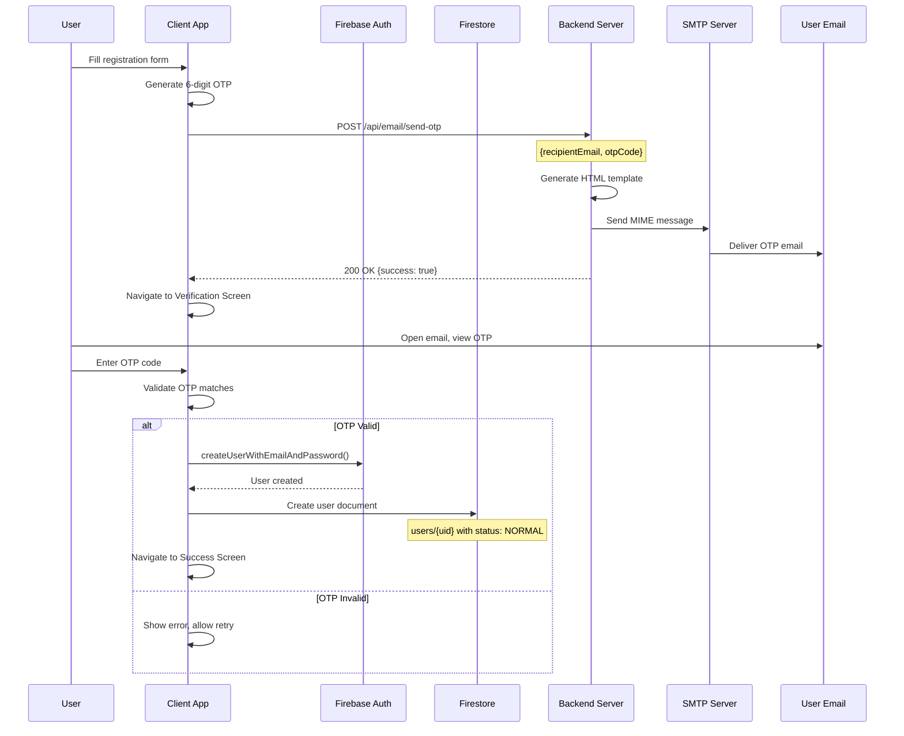

### API Endpoints

| Endpoint | Method | Request Body | Response |
|----------|--------|--------------|----------|
| `/api/email/send-otp` | POST | `{recipientEmail, otpCode}` | `{success, message}` |

### Firestore Changes

| Collection | Document | Action | Fields |
|------------|----------|--------|--------|
| `users` | `{uid}` | CREATE | email, fullName, role, status, profilePictureUrl, fcmToken |

---

## Flow 2: Welcome Email After Verification

**Apps Involved:** Client → Backend → Email

**Description:**  
After successful OTP verification and account creation, the system sends a welcome email to the new user.

### Sequence Diagram

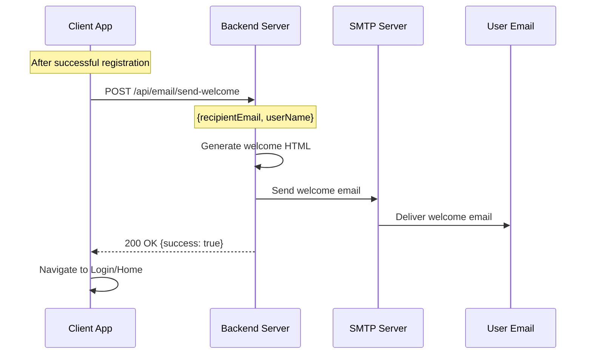

### API Endpoints

| Endpoint | Method | Request Body | Response |
|----------|--------|--------------|----------|
| `/api/email/send-welcome` | POST | `{recipientEmail, userName}` | `{success, message}` |

---

## Flow 3: Forgot Password Reset

**Apps Involved:** Client → Backend → Firebase Auth

**Description:**  
User requests password reset, receives OTP via email, and sets a new password through the backend server.

### Sequence Diagram

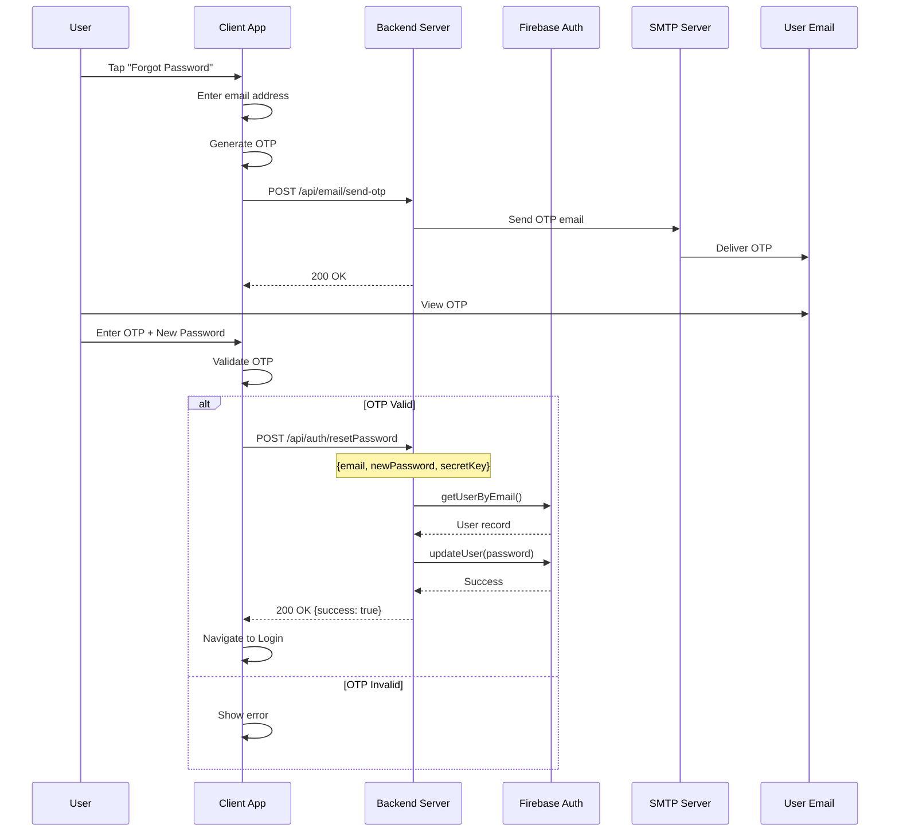

### API Endpoints

| Endpoint | Method | Request Body | Response |
|----------|--------|--------------|----------|
| `/api/email/send-otp` | POST | `{recipientEmail, otpCode}` | `{success, message}` |
| `/api/auth/resetPassword` | POST | `{email, newPassword, secretKey}` | `{success, message}` |

---

# Phase 2: Content Creation

## Flow 4: Post Creation with AI Topic Suggestions

**Apps Involved:** Client → Backend (Gemini AI) → Client

**Description:**  
User creates a new post and requests AI-powered topic suggestions based on the post content.

### Sequence Diagram

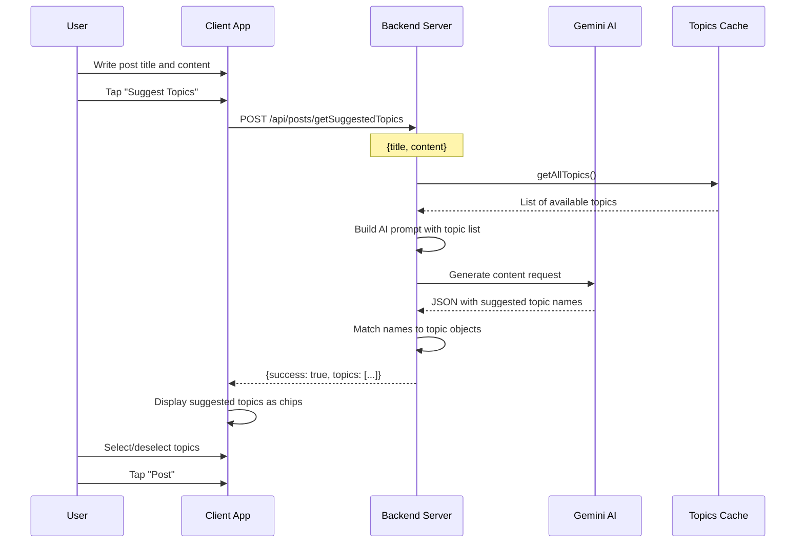

### API Endpoints

| Endpoint | Method | Request Body | Response |
|----------|--------|--------------|----------|
| `/api/posts/getSuggestedTopics` | POST | `{title, content}` | `{success, topics: [{topicId, name, description}]}` |

---

## Flow 5: Post Creation & Automatic AI Validation

**Apps Involved:** Client → Firestore → Backend (Listener + AI) → Client

**Description:**  
User submits a new post. The backend's real-time listener automatically validates the content using AI and updates the post status. If rejected, a push notification is sent to the author.

### Sequence Diagram

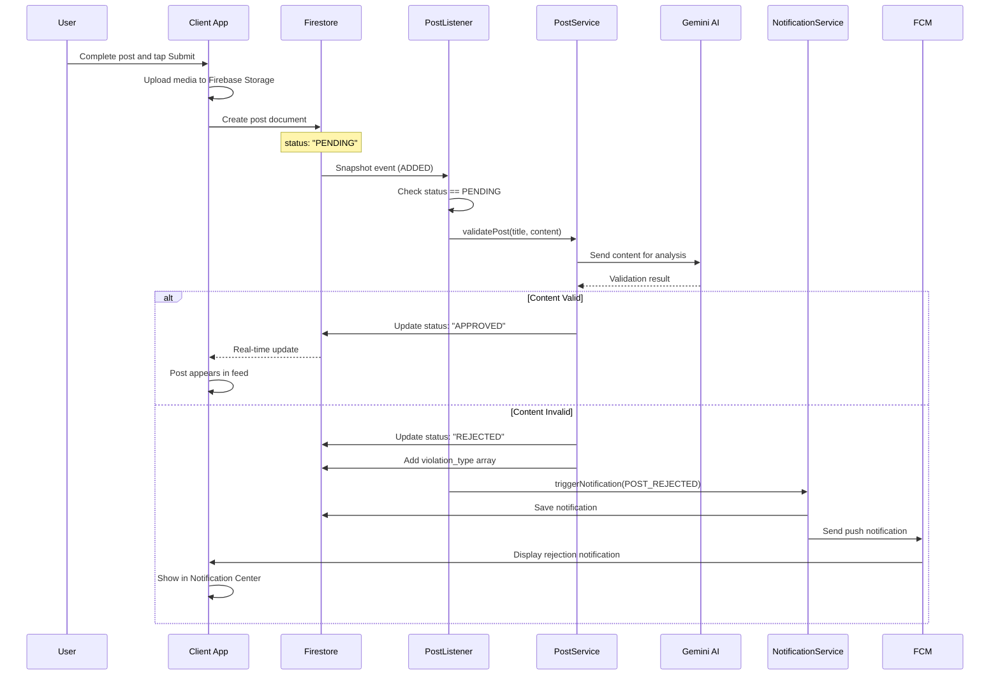

### API Endpoints

| Endpoint | Method | Trigger | Description |
|----------|--------|---------|-------------|
| (Automatic) | - | Firestore Listener | PostListener detects new PENDING posts |
| `/api/notifications` | POST | Internal | Triggered on rejection |

### Firestore Changes

| Collection | Document | Action | Fields Changed |
|------------|----------|--------|----------------|
| `posts` | `{postId}` | UPDATE | status (PENDING → APPROVED/REJECTED), violation_type |
| `users/{uid}/notifications` | `{notificationId}` | CREATE | type, previewText, rejectionReason, isRead |

---

## Flow 6: AI Post Summary Generation

**Apps Involved:** Client → Backend (Gemini AI + Cache) → Client

**Description:**  
User requests an AI-generated summary of a post. The backend uses intelligent caching to avoid redundant API calls.

### Sequence Diagram

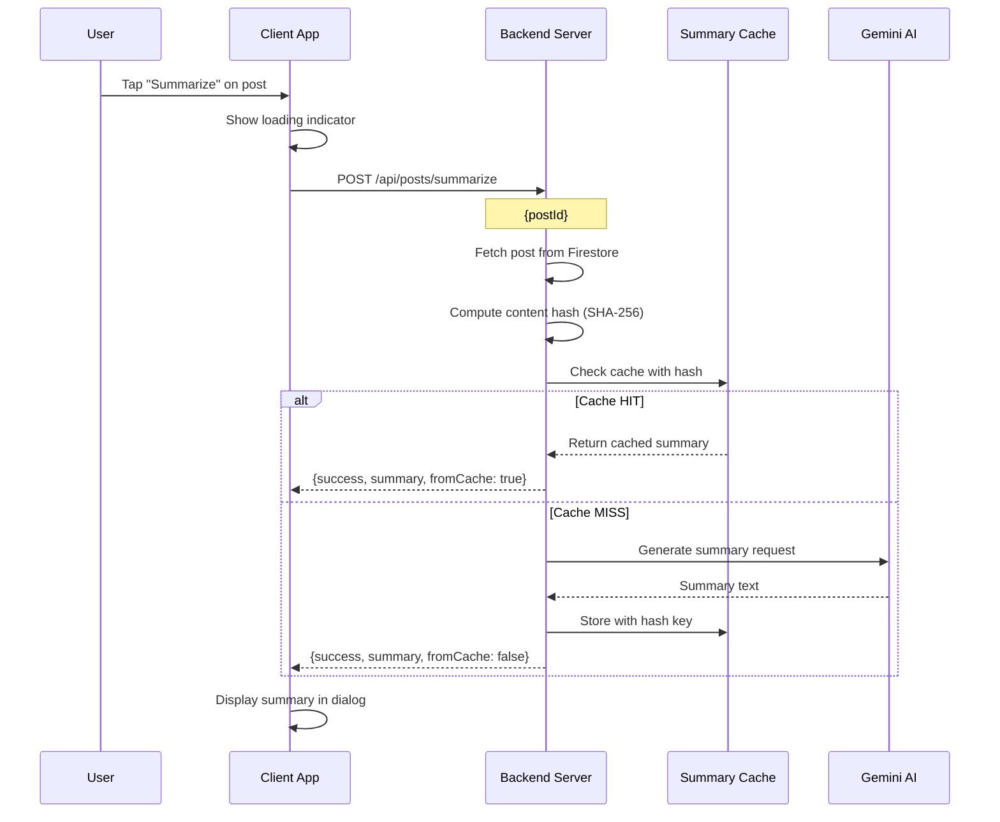

### API Endpoints

| Endpoint | Method | Request Body | Response |
|----------|--------|--------------|----------|
| `/api/posts/summarize` | POST | `{postId}` | `{success, summary, fromCache, contentHash, generatedAt}` |

---

# Phase 3: User Interactions

## Flow 7: Upvote/Comment/Reply Push Notifications

**Apps Involved:** Client (Sender) → Backend → FCM → Client (Recipient)

**Description:**  
When a user upvotes a post, comments, or replies, the system sends a push notification to the content owner.

### Sequence Diagram

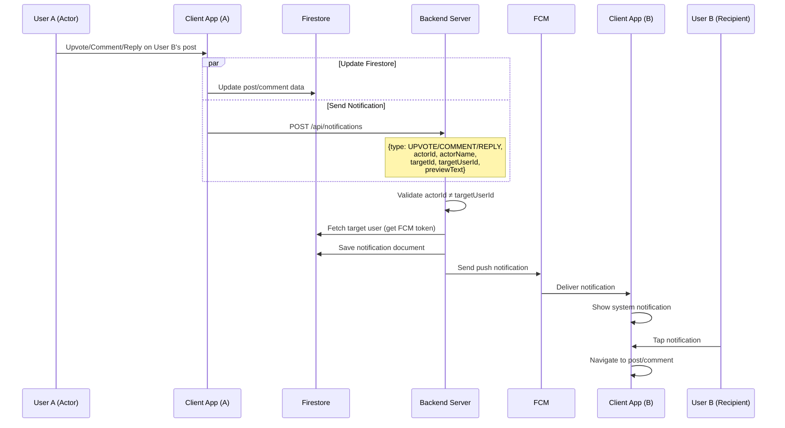

### API Endpoints

| Endpoint | Method | Request Body | Response |
|----------|--------|--------------|----------|
| `/api/notifications` | POST | `{type, actorId, actorName, targetId, targetUserId, previewText}` | `"Notification triggered successfully"` |

### Notification Types

| Type | Title | Body Template |
|------|-------|---------------|
| UPVOTE | New Upvote | {actorName} upvoted your post: {previewText} |
| COMMENT | New Comment | {actorName} commented on your post: {previewText} |
| REPLY | New Reply | {actorName} replied to your comment: {previewText} |

### Firestore Changes

| Collection | Document | Action | Fields |
|------------|----------|--------|--------|
| `users/{targetUserId}/notifications` | `{notificationId}` | CREATE | type, actorId, actorName, targetId, previewText, createdAt, isRead |

---

## Flow 8: Chat Message Push Notification

**Apps Involved:** Client (Sender) → Backend → FCM → Client (Recipient)

**Description:**  
When a user sends a chat message, the recipient receives a real-time push notification even when the app is in background.

### Sequence Diagram

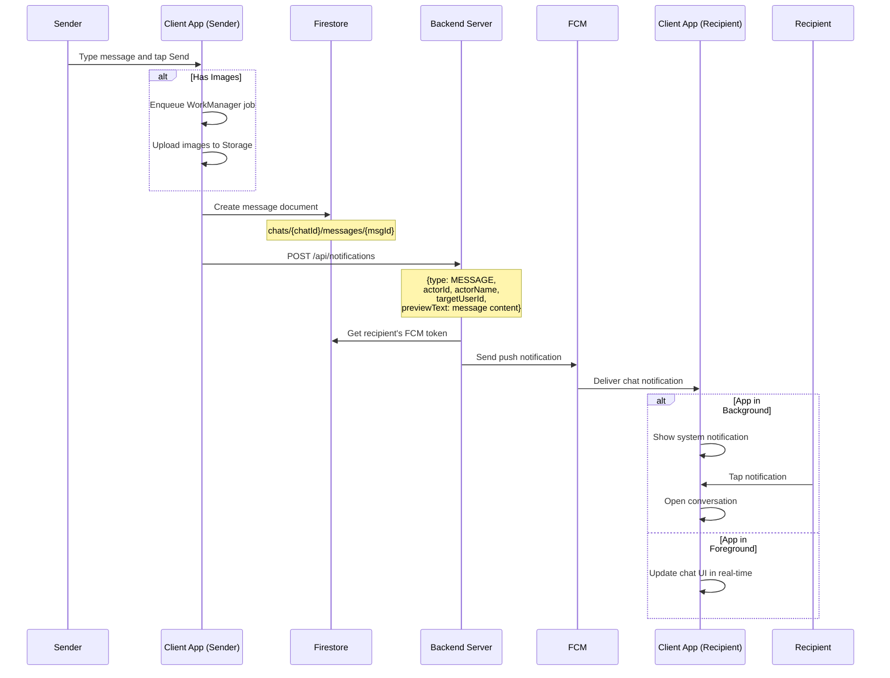

### API Endpoints

| Endpoint | Method | Request Body | Response |
|----------|--------|--------------|----------|
| `/api/notifications` | POST | `{type: "MESSAGE", actorId, actorName, targetUserId, previewText}` | `"Notification triggered successfully"` |

### Firestore Changes

| Collection | Document | Action | Fields |
|------------|----------|--------|--------|
| `chats/{chatId}/messages` | `{messageId}` | CREATE | content, senderId, timestamp, type, imageUrls |

---

## Flow 9: Share Post via Direct Message

**Apps Involved:** Client (Sender) → Firestore → Client (Recipient)

**Description:**  
User shares a post with another user through direct message. The shared post renders as a clickable preview card in the chat.

### Sequence Diagram

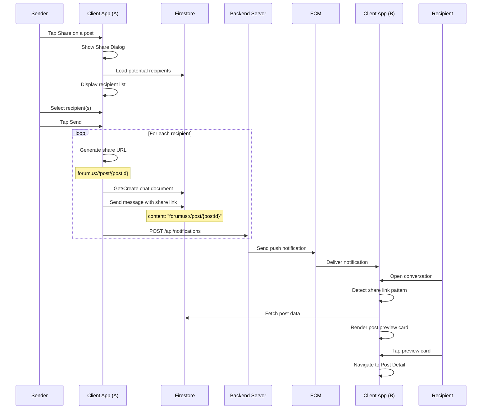

### Firestore Changes

| Collection | Document | Action | Fields |
|------------|----------|--------|--------|
| `chats/{chatId}/messages` | `{messageId}` | CREATE | content (share URL), senderId, timestamp, type: TEXT |

---

# Phase 4: Content Moderation

## Flow 10: User Reports Post → Admin Reviews

**Apps Involved:** Client → Firestore → Admin

**Description:**  
User reports a post for violating community guidelines. The report appears in the Admin app's Reported Posts screen for review.

### Sequence Diagram

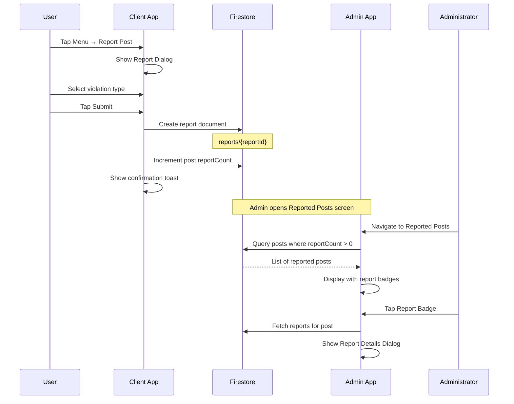

### Firestore Changes

| Collection | Document | Action | Fields |
|------------|----------|--------|--------|
| `reports` | `{reportId}` | CREATE | postId, authorId, nameViolation, descriptionViolation |
| `posts` | `{postId}` | UPDATE | reportCount (increment) |

---

## Flow 11: Admin AI Override (Approve/Reject Post)

**Apps Involved:** Admin → Backend → FCM → Client

**Description:**  
Administrator reviews AI-moderated posts and overrides the AI decision. Actions trigger notifications to the post author.

### Sequence Diagram

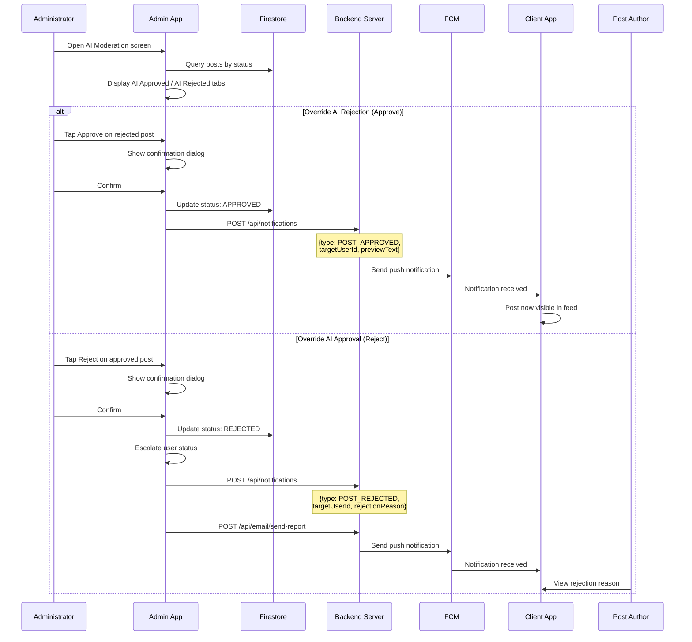

### API Endpoints

| Endpoint | Method | Purpose |
|----------|--------|---------|
| `/api/notifications` | POST | Send push notification to author |
| `/api/email/send-report` | POST | Send email about status change |

### Firestore Changes

| Collection | Document | Action | Fields Changed |
|------------|----------|--------|----------------|
| `posts` | `{postId}` | UPDATE | status |
| `users` | `{authorId}` | UPDATE | status (on rejection with escalation) |
| `users/{authorId}/notifications` | `{notificationId}` | CREATE | type, previewText, rejectionReason |

---

## Flow 12: Admin Deletes Reported Post & User Status Escalation

**Apps Involved:** Admin → Backend → Email + FCM → Client

**Description:**  
Administrator deletes a reported post. The system automatically escalates the author's account status and sends both email and push notifications.

### Sequence Diagram

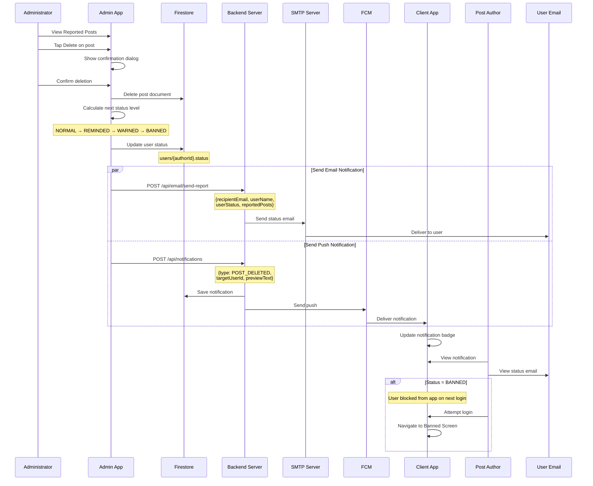

### API Endpoints

| Endpoint | Method | Request Body | Purpose |
|----------|--------|--------------|---------|
| `/api/email/send-report` | POST | `{recipientEmail, userName, userStatus, reportedPosts}` | Send status change email |
| `/api/notifications` | POST | `{type: POST_DELETED, targetUserId, previewText}` | Send push notification |

### Status Escalation Levels

| Current Status | Next Status | Description |
|----------------|-------------|-------------|
| NORMAL | REMINDED | First violation - reminder issued |
| REMINDED | WARNED | Second violation - formal warning |
| WARNED | BANNED | Third violation - account suspended |
| BANNED | BANNED | Already maximum level |

### Firestore Changes

| Collection | Document | Action | Fields Changed |
|------------|----------|--------|----------------|
| `posts` | `{postId}` | DELETE | - |
| `users` | `{authorId}` | UPDATE | status |
| `users/{authorId}/notifications` | `{notificationId}` | CREATE | type, previewText |

---

# Phase 5: User Account Management

## Flow 13: Admin Updates User Status (Blacklist Management)

**Apps Involved:** Admin → Backend → Email + FCM → Client

**Description:**  
Administrator manually changes a user's account status from the Blacklist Management screen. Both email and push notifications are sent to inform the user.

### Sequence Diagram

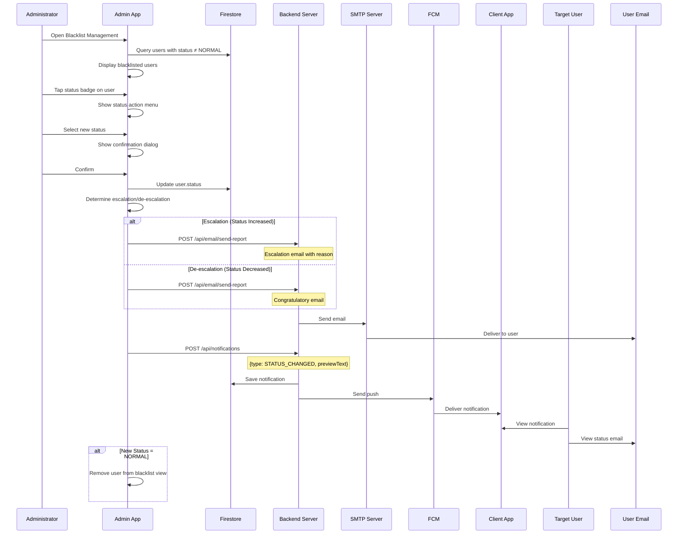

### API Endpoints

| Endpoint | Method | Request Body | Purpose |
|----------|--------|--------------|---------|
| `/api/email/send-report` | POST | `{recipientEmail, userName, userStatus, reportedPosts}` | Send status notification email |
| `/api/notifications` | POST | `{type: STATUS_CHANGED, targetUserId, previewText}` | Send push notification |

### Firestore Changes

| Collection | Document | Action | Fields Changed |
|------------|----------|--------|----------------|
| `users` | `{userId}` | UPDATE | status |
| `users/{userId}/notifications` | `{notificationId}` | CREATE | type, previewText, createdAt |

---

# Summary: Cross-App Flow Index

## By User Journey Phase

| Phase | Flow # | Flow Name | Apps |
|-------|--------|-----------|------|
| **Onboarding** | 1 | Registration with OTP | Client → Backend → Email |
| | 2 | Welcome Email | Client → Backend → Email |
| | 3 | Forgot Password | Client → Backend → Firebase Auth |
| **Content Creation** | 4 | AI Topic Suggestions | Client → Backend (AI) |
| | 5 | Post Validation | Client → Firestore → Backend (Listener + AI) → Client |
| | 6 | AI Post Summary | Client → Backend (AI + Cache) |
| **Interactions** | 7 | Upvote/Comment/Reply Notifications | Client → Backend → FCM → Client |
| | 8 | Chat Push Notification | Client → Backend → FCM → Client |
| | 9 | Share Post via DM | Client → Firestore → Client |
| **Moderation** | 10 | User Reports Post | Client → Firestore → Admin |
| | 11 | Admin AI Override | Admin → Backend → FCM → Client |
| | 12 | Admin Deletes Post + Escalation | Admin → Backend → Email + FCM → Client |
| **Account Management** | 13 | Admin Updates User Status | Admin → Backend → Email + FCM → Client |

## By Trigger Source

| Trigger | Flows |
|---------|-------|
| **User Action (Client)** | 1, 2, 3, 4, 6, 7, 8, 9, 10 |
| **Automatic (Backend Listener)** | 5 |
| **Admin Action (Admin App)** | 11, 12, 13 |

## By Notification Type

| Notification | Flows | Delivery Method |
|--------------|-------|-----------------|
| OTP Code | 1, 3 | Email |
| Welcome | 2 | Email |
| Status Report | 11, 12, 13 | Email + Push |
| Post Approved | 5, 11 | Push |
| Post Rejected | 5, 11 | Push |
| Post Deleted | 12 | Push |
| Upvote/Comment/Reply | 7 | Push |
| Chat Message | 8 | Push |

---

## Technology Stack Summary

| Component | Technology | Used In |
|-----------|------------|---------|
| **Client App** | Android Kotlin, MVVM, Firebase | All user-facing flows |
| **Admin App** | Android Kotlin, MVVM, Firebase | Moderation flows (10-13) |
| **Backend Server** | Spring Boot, Java 17 | AI, Email, Notifications |
| **AI Service** | Google Gemini 2.5 Flash | Flows 4, 5, 6 |
| **Email** | JavaMailSender, SMTP | Flows 1, 2, 3, 11, 12, 13 |
| **Push Notifications** | Firebase Cloud Messaging | Flows 5, 7, 8, 11, 12, 13 |
| **Database** | Cloud Firestore | All flows |
| **Authentication** | Firebase Auth | Flows 1, 3 |
| **Storage** | Firebase Storage | Flow 5 (media upload) |

---

**Document Version:** 1.0  
**Last Updated:** January 2026  
**Total Cross-App Flows:** 13
